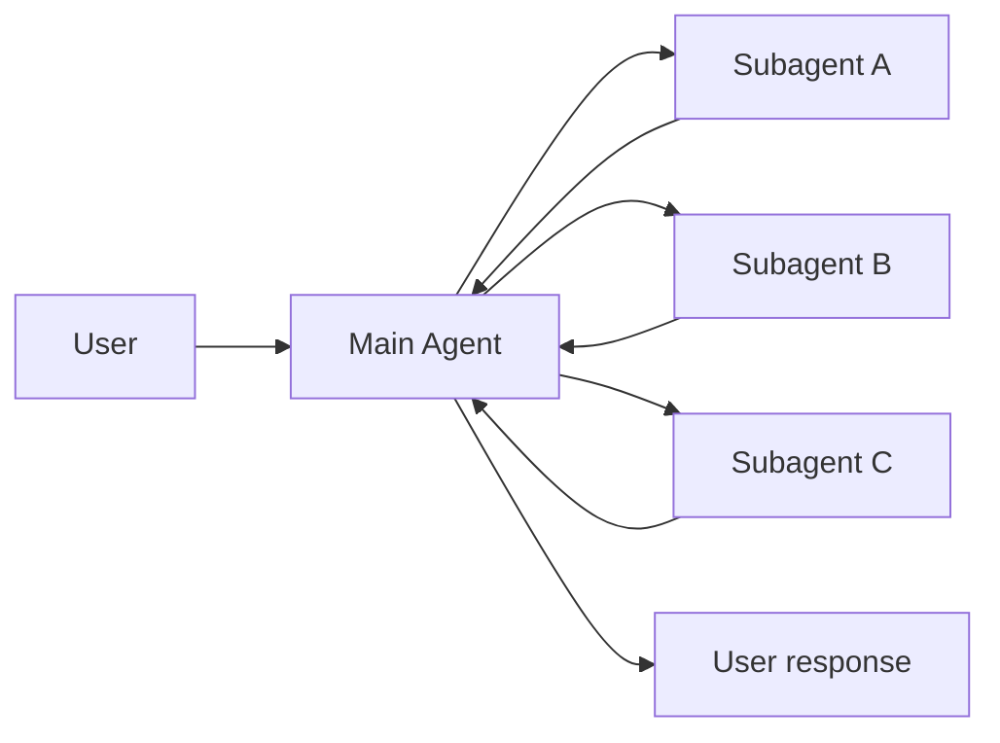
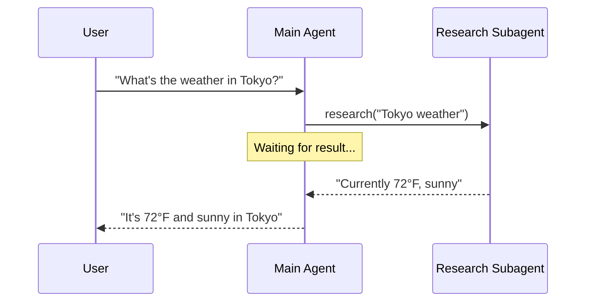
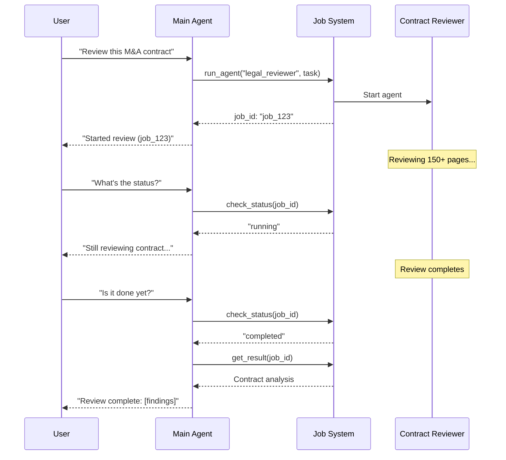
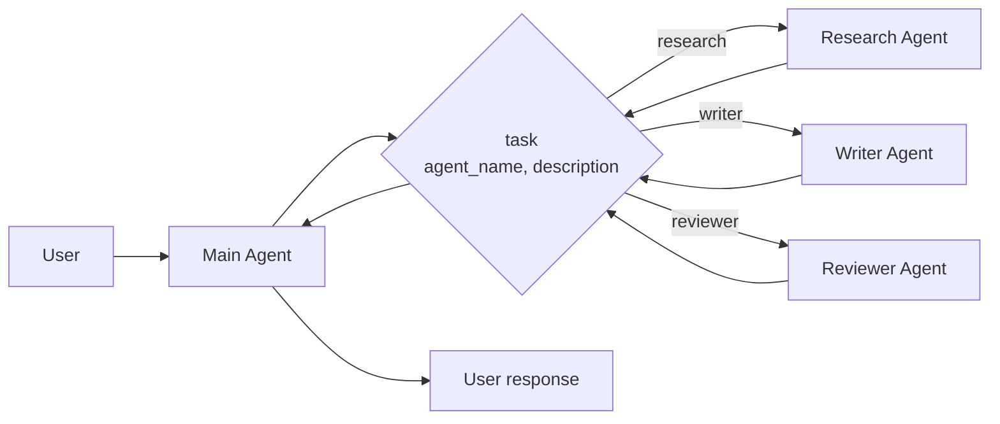
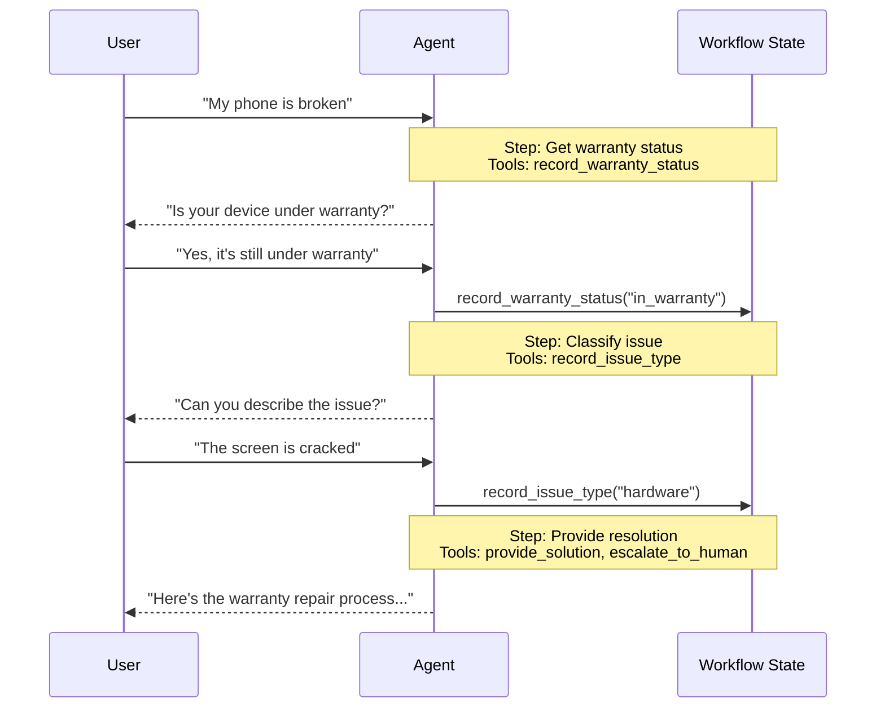
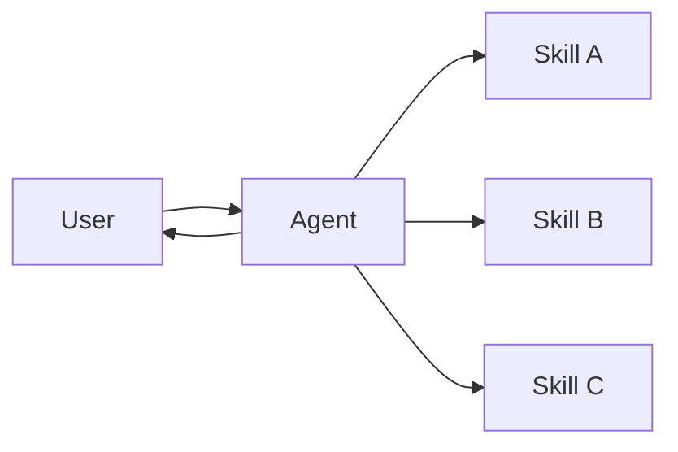
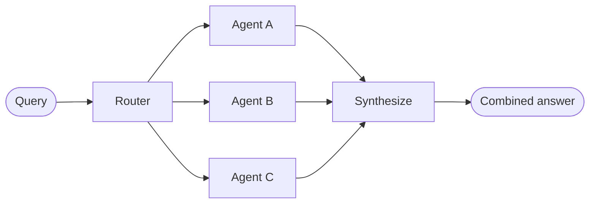
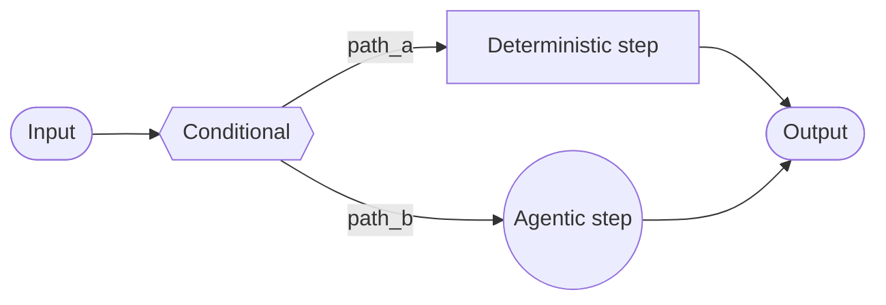

# Multi-agent

Multi-agent systems coordinate specialized components to tackle complex workflows. However, not every complex task requires this approach — a single agent with the right (sometimes dynamic) tools and prompt can often achieve similar results.

## Why multi-agent?

When developers say they need "multi-agent," they're usually looking for one or more of these capabilities:

* <Icon icon="brain" /> **Context management**: Provide specialized knowledge without overwhelming the model's context window. If context were infinite and latency zero, you could dump all knowledge into a single prompt — but since it's not, you need patterns to selectively surface relevant information.
* <Icon icon="users" /> **Distributed development**: Allow different teams to develop and maintain capabilities independently, composing them into a larger system with clear boundaries.
* <Icon icon="code-branch" /> **Parallelization**: Spawn specialized workers for subtasks and execute them concurrently for faster results.

Multi-agent patterns are particularly valuable when a single agent has too many [tools](/oss/javascript/langchain/tools) and makes poor decisions about which to use, when tasks require specialized knowledge with extensive context (long prompts and domain-specific tools), or when you need to enforce sequential constraints that unlock capabilities only after certain conditions are met.

<Tip>
  At the center of multi-agent design is **[context engineering](/oss/javascript/langchain/context-engineering)**—deciding what information each agent sees. The quality of your system depends on ensuring each agent has access to the right data for its task.
</Tip>

## Patterns

Here are the main patterns for building multi-agent systems, each suited to different use cases:

| Pattern                                                                      | How it works                                                                                                                                                                                        |
| ---------------------------------------------------------------------------- | --------------------------------------------------------------------------------------------------------------------------------------------------------------------------------------------------- |
| [**Subagents**](/oss/javascript/langchain/multi-agent/subagents)             | A main agent coordinates subagents as tools. All routing passes through the main agent, which decides when and how to invoke each subagent.                                                         |
| [**Handoffs**](/oss/javascript/langchain/multi-agent/handoffs)               | Behavior changes dynamically based on state. Tool calls update a state variable that triggers routing or configuration changes, switching agents or adjusting the current agent's tools and prompt. |
| [**Skills**](/oss/javascript/langchain/multi-agent/skills)                   | Specialized prompts and knowledge loaded on-demand. A single agent stays in control while loading context from skills as needed.                                                                    |
| [**Router**](/oss/javascript/langchain/multi-agent/router)                   | A routing step classifies input and directs it to one or more specialized agents. Results are synthesized into a combined response.                                                                 |
| [**Custom workflow**](/oss/javascript/langchain/multi-agent/custom-workflow) | Build bespoke execution flows with [LangGraph](/oss/javascript/langgraph/overview), mixing deterministic logic and agentic behavior. Embed other patterns as nodes in your workflow.                |

### Choosing a pattern

Use this table to match your requirements to the right pattern:

<div className="compact-first-col">
  | Pattern                                                          | Distributed development | Parallelization | Multi-hop | Direct user interaction |
  | ---------------------------------------------------------------- | :---------------------: | :-------------: | :-------: | :---------------------: |
  | [**Subagents**](/oss/javascript/langchain/multi-agent/subagents) |          ⭐⭐⭐⭐⭐          |      ⭐⭐⭐⭐⭐      |   ⭐⭐⭐⭐⭐   |            ⭐            |
  | [**Handoffs**](/oss/javascript/langchain/multi-agent/handoffs)   |            —            |        —        |   ⭐⭐⭐⭐⭐   |          ⭐⭐⭐⭐⭐          |
  | [**Skills**](/oss/javascript/langchain/multi-agent/skills)       |          ⭐⭐⭐⭐⭐          |       ⭐⭐⭐       |   ⭐⭐⭐⭐⭐   |          ⭐⭐⭐⭐⭐          |
  | [**Router**](/oss/javascript/langchain/multi-agent/router)       |           ⭐⭐⭐           |      ⭐⭐⭐⭐⭐      |     —     |           ⭐⭐⭐           |
</div>

* **Distributed development**: Can different teams maintain components independently?
* **Parallelization**: Can multiple agents execute concurrently?
* **Multi-hop**: Does the pattern support calling multiple subagents in series?
* **Direct user interaction**: Can subagents converse directly with the user?

<Tip>
  You can mix patterns! For example, a **subagents** architecture can invoke tools that invoke custom workflows or router agents. Subagents can even use the **skills** pattern to load context on-demand. The possibilities are endless!
</Tip>

### Visual overview

<Tabs>
  <Tab title="Subagents">
    A main agent coordinates subagents as tools. All routing passes through the main agent.

    <Frame>
      
    </Frame>
  </Tab>

  <Tab title="Handoffs">
    Agents transfer control to each other via tool calls. Each agent can hand off to others or respond directly to the user.

    <Frame>
      
    </Frame>
  </Tab>

  <Tab title="Skills">
    A single agent loads specialized prompts and knowledge on-demand while staying in control.

    <Frame>
      
    </Frame>
  </Tab>

  <Tab title="Router">
    A routing step classifies input and directs it to specialized agents. Results are synthesized.

    <Frame>
      
    </Frame>
  </Tab>
</Tabs>

## Performance comparison

Different patterns have different performance characteristics. Understanding these tradeoffs helps you choose the right pattern for your latency and cost requirements.

**Key metrics:**

* **Model calls**: Number of LLM invocations. More calls = higher latency (especially if sequential) and higher per-request API costs.
* **Tokens processed**: Total [context window](/oss/javascript/langchain/context-engineering) usage across all calls. More tokens = higher processing costs and potential context limits.

### One-shot request

> **User:** "Buy coffee"

A specialized coffee agent/skill can call a `buy_coffee` tool.

| Pattern                                                          | Model calls | Best fit |
| ---------------------------------------------------------------- | :---------: | :------: |
| [**Subagents**](/oss/javascript/langchain/multi-agent/subagents) |      4      |          |
| [**Handoffs**](/oss/javascript/langchain/multi-agent/handoffs)   |      3      |     ✅    |
| [**Skills**](/oss/javascript/langchain/multi-agent/skills)       |      3      |     ✅    |
| [**Router**](/oss/javascript/langchain/multi-agent/router)       |      3      |     ✅    |

<Tabs>
  <Tab title="Subagents">
    **4 model calls:**

    <Frame>
      
    </Frame>
  </Tab>

  <Tab title="Handoffs">
    **3 model calls:**

    <Frame>
      
    </Frame>
  </Tab>

  <Tab title="Skills">
    **3 model calls:**

    <Frame>
      
    </Frame>
  </Tab>

  <Tab title="Router">
    **3 model calls:**

    <Frame>
      
    </Frame>
  </Tab>
</Tabs>

**Key insight:** Handoffs, Skills, and Router are most efficient for single tasks (3 calls each). Subagents adds one extra call because results flow back through the main agent—this overhead provides centralized control.

### Repeat request

> **Turn 1:** "Buy coffee"
> **Turn 2:** "Buy coffee again"

The user repeats the same request in the same conversation.

<div className="compact-first-col">
  | Pattern                                                          | Turn 2 calls | Total (both turns) | Best fit |
  | ---------------------------------------------------------------- | :----------: | :----------------: | :------: |
  | [**Subagents**](/oss/javascript/langchain/multi-agent/subagents) |       4      |          8         |          |
  | [**Handoffs**](/oss/javascript/langchain/multi-agent/handoffs)   |       2      |          5         |     ✅    |
  | [**Skills**](/oss/javascript/langchain/multi-agent/skills)       |       2      |          5         |     ✅    |
  | [**Router**](/oss/javascript/langchain/multi-agent/router)       |       3      |          6         |          |
</div>

<Tabs>
  <Tab title="Subagents">
    **4 calls again → 8 total**

    * Subagents are **stateless by design**—each invocation follows the same flow
    * The main agent maintains conversation context, but subagents start fresh each time
    * This provides strong context isolation but repeats the full flow
  </Tab>

  <Tab title="Handoffs">
    **2 calls → 5 total**

    * The coffee agent is **still active** from turn 1 (state persists)
    * No handoff needed—agent directly calls `buy_coffee` tool (call 1)
    * Agent responds to user (call 2)
    * **Saves 1 call by skipping the handoff**
  </Tab>

  <Tab title="Skills">
    **2 calls → 5 total**

    * The skill context is **already loaded** in conversation history
    * No need to reload—agent directly calls `buy_coffee` tool (call 1)
    * Agent responds to user (call 2)
    * **Saves 1 call by reusing loaded skill**
  </Tab>

  <Tab title="Router">
    **3 calls again → 6 total**

    * Routers are **stateless**—each request requires an LLM routing call
    * Turn 2: Router LLM call (1) → Milk agent calls buy\_coffee (2) → Milk agent responds (3)
    * Can be optimized by wrapping as a tool in a stateful agent
  </Tab>
</Tabs>

**Key insight:** Stateful patterns (Handoffs, Skills) save 40-50% of calls on repeat requests. Subagents maintain consistent cost per request—this stateless design provides strong context isolation but at the cost of repeated model calls.

### Multi-domain

> **User:** "Compare Python, JavaScript, and Rust for web development"

Each language agent/skill contains \~2000 tokens of documentation. All patterns can make parallel tool calls.

| Pattern                                                          | Model calls | Total tokens | Best fit |
| ---------------------------------------------------------------- | :---------: | :----------: | :------: |
| [**Subagents**](/oss/javascript/langchain/multi-agent/subagents) |      5      |     \~9K     |     ✅    |
| [**Handoffs**](/oss/javascript/langchain/multi-agent/handoffs)   |      7+     |    \~14K+    |          |
| [**Skills**](/oss/javascript/langchain/multi-agent/skills)       |      3      |     \~15K    |          |
| [**Router**](/oss/javascript/langchain/multi-agent/router)       |      5      |     \~9K     |     ✅    |

<Tabs>
  <Tab title="Subagents">
    **5 calls, \~9K tokens**

    <Frame>
      
    </Frame>

    Each subagent works in **isolation** with only its relevant context. Total: **9K tokens**.
  </Tab>

  <Tab title="Handoffs">
    **7+ calls, \~14K+ tokens**

    <Frame>
      
    </Frame>

    Handoffs executes **sequentially**—can't research all three languages in parallel. Growing conversation history adds overhead. Total: **\~14K+ tokens**.
  </Tab>

  <Tab title="Skills">
    **3 calls, \~15K tokens**

    <Frame>
      
    </Frame>

    After loading, **every subsequent call processes all 6K tokens of skill documentation**. Subagents processes 67% fewer tokens overall due to context isolation. Total: **15K tokens**.
  </Tab>

  <Tab title="Router">
    **5 calls, \~9K tokens**

    <Frame>
      
    </Frame>

    Router uses an **LLM for routing**, then invokes agents in parallel. Similar to Subagents but with explicit routing step. Total: **9K tokens**.
  </Tab>
</Tabs>

**Key insight:** For multi-domain tasks, patterns with parallel execution (Subagents, Router) are most efficient. Skills has fewer calls but high token usage due to context accumulation. Handoffs is inefficient here—it must execute sequentially and can't leverage parallel tool calling for consulting multiple domains simultaneously.

### Summary

Here's how patterns compare across all three scenarios:

<div className="compact-first-col">
  | Pattern                                                          | One-shot | Repeat request |      Multi-domain     |
  | ---------------------------------------------------------------- | :------: | :------------: | :-------------------: |
  | [**Subagents**](/oss/javascript/langchain/multi-agent/subagents) |  4 calls |  8 calls (4+4) |   5 calls, 9K tokens  |
  | [**Handoffs**](/oss/javascript/langchain/multi-agent/handoffs)   |  3 calls |  5 calls (3+2) | 7+ calls, 14K+ tokens |
  | [**Skills**](/oss/javascript/langchain/multi-agent/skills)       |  3 calls |  5 calls (3+2) |  3 calls, 15K tokens  |
  | [**Router**](/oss/javascript/langchain/multi-agent/router)       |  3 calls |  6 calls (3+3) |   5 calls, 9K tokens  |
</div>

**Choosing a pattern:**

<div className="compact-first-col">
  | Optimize for          | [Subagents](/oss/javascript/langchain/multi-agent/subagents) | [Handoffs](/oss/javascript/langchain/multi-agent/handoffs) | [Skills](/oss/javascript/langchain/multi-agent/skills) | [Router](/oss/javascript/langchain/multi-agent/router) |
  | --------------------- | :----------------------------------------------------------: | :--------------------------------------------------------: | :----------------------------------------------------: | :----------------------------------------------------: |
  | Single requests       |                                                              |                              ✅                             |                            ✅                           |                            ✅                           |
  | Repeat requests       |                                                              |                              ✅                             |                            ✅                           |                                                        |
  | Parallel execution    |                               ✅                              |                                                            |                                                        |                            ✅                           |
  | Large-context domains |                               ✅                              |                                                            |                                                        |                            ✅                           |
  | Simple, focused tasks |                                                              |                                                            |                            ✅                           |                                                        |
</div>

***

<Callout icon="pen-to-square" iconType="regular">
  [Edit this page on GitHub](https://github.com/langchain-ai/docs/edit/main/src/oss/langchain/multi-agent/index.mdx) or [file an issue](https://github.com/langchain-ai/docs/issues/new/choose).
</Callout>

<Tip icon="terminal" iconType="regular">
  [Connect these docs](/use-these-docs) to Claude, VSCode, and more via MCP for real-time answers.
</Tip>


---

> To find navigation and other pages in this documentation, fetch the llms.txt file at: https://docs.langchain.com/llms.txt

# Subagents

In the **subagents** architecture, a central main [agent](/oss/javascript/langchain/agents) (often referred to as a **supervisor**) coordinates subagents by calling them as [tools](/oss/javascript/langchain/tools). The main agent decides which subagent to invoke, what input to provide, and how to combine results. Subagents are stateless—they don't remember past interactions, with all conversation memory maintained by the main agent. This provides [context](/oss/javascript/langchain/context-engineering) isolation: each subagent invocation works in a clean context window, preventing context bloat in the main conversation.



## Key characteristics

* Centralized control: All routing passes through the main agent
* No direct user interaction: Subagents return results to the main agent, not the user (though you can use [interrupts](/oss/javascript/langgraph/human-in-the-loop#interrupt) within a subagent to allow user interaction)
* Subagents via tools: Subagents are invoked via tools
* Parallel execution: The main agent can invoke multiple subagents in a single turn

<Note>
  **Supervisor vs. Router**: A supervisor agent (this pattern) is different from a [router](/oss/javascript/langchain/multi-agent/router). The supervisor is a full agent that maintains conversation context and dynamically decides which subagents to call across multiple turns. A router is typically a single classification step that dispatches to agents without maintaining ongoing conversation state.
</Note>

## When to use

Use the subagents pattern when you have multiple distinct domains (e.g., calendar, email, CRM, database), subagents don't need to converse directly with users, or you want centralized workflow control. For simpler cases with just a few [tools](/oss/javascript/langchain/tools), use a [single agent](/oss/javascript/langchain/agents).

<Tip>
  **Need user interaction within a subagent?** While subagents typically return results to the main agent rather than conversing directly with users, you can use [interrupts](/oss/javascript/langgraph/human-in-the-loop#interrupt) within a subagent to pause execution and gather user input. This is useful when a subagent needs clarification or approval before proceeding. The main agent remains the orchestrator, but the subagent can collect information from the user mid-task.
</Tip>

## Basic implementation

The core mechanism wraps a subagent as a tool that the main agent can call:

```typescript  theme={null}
import { createAgent, tool } from "langchain";
import { z } from "zod";

// Create a subagent
const subagent = createAgent({ model: "anthropic:claude-sonnet-4-20250514", tools: [...] });

// Wrap it as a tool
const callResearchAgent = tool(
  async ({ query }) => {
    const result = await subagent.invoke({
      messages: [{ role: "user", content: query }]
    });
    return result.messages.at(-1)?.content;
  },
  {
    name: "research",
    description: "Research a topic and return findings",
    schema: z.object({ query: z.string() })
  }
);

// Main agent with subagent as a tool
const mainAgent = createAgent({ model: "anthropic:claude-sonnet-4-20250514", tools: [callResearchAgent] });
```

<Card title="Tutorial: Build a personal assistant with subagents" icon="sitemap" href="/oss/javascript/langchain/multi-agent/subagents-personal-assistant" arrow cta="Learn more">
  Learn how to build a personal assistant using the subagents pattern, where a central main agent (supervisor) coordinates specialized worker agents.
</Card>

## Design decisions

When implementing the subagents pattern, you'll make several key design choices. This table summarizes the options—each is covered in detail in the sections below.

| Decision                                  | Options                                      |
| ----------------------------------------- | -------------------------------------------- |
| [**Sync vs. async**](#sync-vs-async)      | Sync (blocking) vs. async (background)       |
| [**Tool patterns**](#tool-patterns)       | Tool per agent vs. single dispatch tool      |
| [**Subagent inputs**](#subagent-inputs)   | Query only vs. full context                  |
| [**Subagent outputs**](#subagent-outputs) | Subagent result vs full conversation history |

## Sync vs. async

Subagent execution can be **synchronous** (blocking) or **asynchronous** (background). Your choice depends on whether the main agent needs the result to continue.

| Mode      | Main agent behavior                         | Best for                               | Tradeoff                            |
| --------- | ------------------------------------------- | -------------------------------------- | ----------------------------------- |
| **Sync**  | Waits for subagent to complete              | Main agent needs result to continue    | Simple, but blocks the conversation |
| **Async** | Continues while subagent runs in background | Independent tasks, user shouldn't wait | Responsive, but more complex        |

<Tip>
  Not to be confused with Python's `async`/`await`. Here, "async" means the main agent kicks off a background job (typically in a separate process or service) and continues without blocking.
</Tip>

### Synchronous (default)

By default, subagent calls are **synchronous**—the main agent waits for each subagent to complete before continuing. Use sync when the main agent's next action depends on the subagent's result.



**When to use sync:**

* Main agent needs the subagent's result to formulate its response
* Tasks have order dependencies (e.g., fetch data → analyze → respond)
* Subagent failures should block the main agent's response

**Tradeoffs:**

* Simple implementation—just call and wait
* User sees no response until all subagents complete
* Long-running tasks freeze the conversation

### Asynchronous

Use **asynchronous execution** when the subagent's work is independent—the main agent doesn't need the result to continue conversing with the user. The main agent kicks off a background job and remains responsive.



**When to use async:**

* Subagent work is independent of the main conversation flow
* Users should be able to continue chatting while work happens
* You want to run multiple independent tasks in parallel

**Three-tool pattern:**

1. **Start job**: Kicks off the background task, returns a job ID
2. **Check status**: Returns current state (pending, running, completed, failed)
3. **Get result**: Retrieves the completed result

**Handling job completion:** When a job finishes, your application needs to notify the user. One approach: surface a notification that, when clicked, sends a `HumanMessage` like "Check job\_123 and summarize the results."

## Tool patterns

There are two main ways to expose subagents as tools:

| Pattern                                           | Best for                                                      | Trade-off                                         |
| ------------------------------------------------- | ------------------------------------------------------------- | ------------------------------------------------- |
| [**Tool per agent**](#tool-per-agent)             | Fine-grained control over each subagent's input/output        | More setup, but more customization                |
| [**Single dispatch tool**](#single-dispatch-tool) | Many agents, distributed teams, convention over configuration | Simpler composition, less per-agent customization |

### Tool per agent


The key idea is wrapping subagents as tools that the main agent can call:

```typescript  theme={null}
import { createAgent, tool } from "langchain";
import * as z from "zod";

// Create a sub-agent
const subagent = createAgent({...});  // [!code highlight]

// Wrap it as a tool  // [!code highlight]
const callSubagent = tool(  // [!code highlight]
  async ({ query }) => {  // [!code highlight]
    const result = await subagent.invoke({
      messages: [{ role: "user", content: query }]
    });
    return result.messages.at(-1)?.text;
  },
  {
    name: "subagent_name",
    description: "subagent_description",
    schema: z.object({
      query: z.string().describe("The query to send to subagent")
    })
  }
);

// Main agent with subagent as a tool  // [!code highlight]
const mainAgent = createAgent({ model, tools: [callSubagent] });  // [!code highlight]
```

The main agent invokes the subagent tool when it decides the task matches the subagent's description, receives the result, and continues orchestration. See [Context engineering](#context-engineering) for fine-grained control.

### Single dispatch tool

An alternative approach uses a single parameterized tool to invoke ephemeral sub-agents for independent tasks. Unlike the [tool per agent](#tool-per-agent) approach where each sub-agent is wrapped as a separate tool, this uses a convention-based approach with a single `task` tool: the task description is passed as a human message to the sub-agent, and the sub-agent's final message is returned as the tool result.

Use this approach when you want to distribute agent development across multiple teams, need to isolate complex tasks into separate context windows, need a scalable way to add new agents without modifying the coordinator, or prefer convention over customization. This approach trades flexibility in context engineering for simplicity in agent composition and strong context isolation.



**Key characteristics:**

* Single task tool: One parameterized tool that can invoke any registered sub-agent by name
* Convention-based invocation: Agent selected by name, task passed as human message, final message returned as tool result
* Team distribution: Different teams can develop and deploy agents independently
* Agent discovery: Sub-agents can be discovered via system prompt (listing available agents) or through [progressive disclosure](/oss/javascript/langchain/multi-agent/skills-sql-assistant) (loading agent information on-demand via tools)

<Tip>
  An interesting aspect of this approach is that sub-agents may have the exact same capabilities as the main agent. In such cases, invoking a sub-agent is **really about context isolation** as the primary reason—allowing complex, multi-step tasks to run in isolated context windows without bloating the main agent's conversation history. The sub-agent completes its work autonomously and returns only a concise summary, keeping the main thread focused and efficient.
</Tip>

<Accordion title="Agent registry with task dispatcher">
  ```typescript  theme={null}
  import { tool, createAgent } from "langchain";
  import * as z from "zod";

  // Sub-agents developed by different teams
  const researchAgent = createAgent({
    model: "gpt-4o",
    prompt: "You are a research specialist...",
  });

  const writerAgent = createAgent({
    model: "gpt-4o",
    prompt: "You are a writing specialist...",
  });

  // Registry of available sub-agents
  const SUBAGENTS = {
    research: researchAgent,
    writer: writerAgent,
  };

  const task = tool(
    async ({ agentName, description }) => {
      const agent = SUBAGENTS[agentName];
      const result = await agent.invoke({
        messages: [
          { role: "user", content: description }
        ],
      });
      return result.messages.at(-1)?.content;
    },
    {
      name: "task",
      description: `Launch an ephemeral subagent.

  Available agents:
  - research: Research and fact-finding
  - writer: Content creation and editing`,
      schema: z.object({
        agentName: z
          .string()
          .describe("Name of agent to invoke"),
        description: z
          .string()
          .describe("Task description"),
      }),
    }
  );

  // Main coordinator agent
  const mainAgent = createAgent({
    model: "gpt-4o",
    tools: [task],
    prompt: (
      "You coordinate specialized sub-agents. " +
      "Available: research (fact-finding), " +
      "writer (content creation). " +
      "Use the task tool to delegate work."
    ),
  });
  ```
</Accordion>

## Context engineering

Control how context flows between the main agent and its subagents:

| Category                                  | Purpose                                                  | Impacts                      |
| ----------------------------------------- | -------------------------------------------------------- | ---------------------------- |
| [**Subagent specs**](#subagent-specs)     | Ensure subagents are invoked when they should be         | Main agent routing decisions |
| [**Subagent inputs**](#subagent-inputs)   | Ensure subagents can execute well with optimized context | Subagent performance         |
| [**Subagent outputs**](#subagent-outputs) | Ensure the supervisor can act on subagent results        | Main agent performance       |

See also our comprehensive guide on [context engineering](/oss/javascript/langchain/context-engineering) for agents.

### Subagent specs

The **names** and **descriptions** associated with subagents are the primary way the main agent knows which subagents to invoke.
These are prompting levers—choose them carefully.

* **Name**: How the main agent refers to the sub-agent. Keep it clear and action-oriented (e.g., `research_agent`, `code_reviewer`).
* **Description**: What the main agent knows about the sub-agent's capabilities. Be specific about what tasks it handles and when to use it.

For the [single dispatch tool](#single-dispatch-tool) design, the main agent needs to call the `task` tool with the name of the subagent to invoke. The available tools can be provided to the main agent via one of the following methods:

* **System prompt enumeration**: List available agents in the system prompt.
* **Enum constraint on dispatch tool**: For small agent lists, add an enum to the `agent_name` field.
* **Tool-based discovery**: For large or dynamic agent registries, provide a separate tool (e.g., `list_agents` or `search_agents`) that returns available agents.

### Subagent inputs

Customize what context the subagent receives to execute its task. Add input that isn't practical to capture in a static prompt—full message history, prior results, or task metadata—by pulling from the agent's state.

```typescript Subagent inputs example expandable theme={null}
import { createAgent, tool, AgentState, ToolMessage } from "langchain";
import { Command } from "@langchain/langgraph";
import * as z from "zod";

// Example of passing the full conversation history to the sub agent via the state.
const callSubagent1 = tool(
  async ({query}) => {
    const state = getCurrentTaskInput<AgentState>();
    // Apply any logic needed to transform the messages into a suitable input
    const subAgentInput = someLogic(query, state.messages);
    const result = await subagent1.invoke({
      messages: subAgentInput,
      // You could also pass other state keys here as needed.
      // Make sure to define these in both the main and subagent's
      // state schemas.
      exampleStateKey: state.exampleStateKey
    });
    return result.messages.at(-1)?.content;
  },
  {
    name: "subagent1_name",
    description: "subagent1_description",
  }
);
```

### Subagent outputs

Customize what the main agent receives back so it can make good decisions. Two strategies:

1. **Prompt the sub-agent**: Specify exactly what should be returned. A common failure mode is that the sub-agent performs tool calls or reasoning but doesn't include results in its final message—remind it that the supervisor only sees the final output.
2. **Format in code**: Adjust or enrich the response before returning it. For example, pass specific state keys back in addition to the final text using a [`Command`](/oss/javascript/langgraph/graph-api#command).

```typescript Subagent outputs example expandable theme={null}
import { tool, ToolMessage } from "langchain";
import { Command } from "@langchain/langgraph";
import * as z from "zod";

const callSubagent1 = tool(
  async ({ query }, config) => {
    const result = await subagent1.invoke({
      messages: [{ role: "user", content: query }]
    });

    // Return a Command to update multiple state keys
    return new Command({
      update: {
        // Pass back additional state from the subagent
        exampleStateKey: result.exampleStateKey,
        messages: [
          new ToolMessage({
            content: result.messages.at(-1)?.text,
            tool_call_id: config.toolCall?.id!
          })
        ]
      }
    });
  },
  {
    name: "subagent1_name",
    description: "subagent1_description",
    schema: z.object({
      query: z.string().describe("The query to send to subagent1")
    })
  }
);
```

***

<Callout icon="pen-to-square" iconType="regular">
  [Edit this page on GitHub](https://github.com/langchain-ai/docs/edit/main/src/oss/langchain/multi-agent/subagents.mdx) or [file an issue](https://github.com/langchain-ai/docs/issues/new/choose).
</Callout>

<Tip icon="terminal" iconType="regular">
  [Connect these docs](/use-these-docs) to Claude, VSCode, and more via MCP for real-time answers.
</Tip>


---

> To find navigation and other pages in this documentation, fetch the llms.txt file at: https://docs.langchain.com/llms.txt

# Handoffs

In the **handoffs** architecture, behavior changes dynamically based on state. The core mechanism: [tools](/oss/javascript/langchain/tools) update a state variable (e.g., `current_step` or `active_agent`) that persists across turns, and the system reads this variable to adjust behavior—either applying different configuration (system prompt, tools) or routing to a different [agent](/oss/javascript/langchain/agents). This pattern supports both handoffs between distinct agents and dynamic configuration changes within a single agent.

<Tip>
  The term **handoffs** was coined by [OpenAI](https://openai.github.io/openai-agents-python/handoffs/) for using tool calls (e.g., `transfer_to_sales_agent`) to transfer control between agents or states.
</Tip>



## Key characteristics

* State-driven behavior: Behavior changes based on a state variable (e.g., `current_step` or `active_agent`)
* Tool-based transitions: Tools update the state variable to move between states
* Direct user interaction: Each state's configuration handles user messages directly
* Persistent state: State survives across conversation turns

## When to use

Use the handoffs pattern when you need to enforce sequential constraints (unlock capabilities only after preconditions are met), the agent needs to converse directly with the user across different states, or you're building multi-stage conversational flows. This pattern is particularly valuable for customer support scenarios where you need to collect information in a specific sequence — for example, collecting a warranty ID before processing a refund.

## Basic implementation

The core mechanism is a [tool](/oss/javascript/langchain/tools) that returns a [`Command`](/oss/javascript/langgraph/graph-api#command) to update state, triggering a transition to a new step or agent:

```typescript  theme={null}
import { tool, ToolMessage, type ToolRuntime } from "langchain";
import { Command } from "@langchain/langgraph";
import { z } from "zod";

const transferToSpecialist = tool(
  async (_, config: ToolRuntime<typeof StateSchema>) => {
    return new Command({
      update: {
        messages: [
          new ToolMessage({  // [!code highlight]
            content: "Transferred to specialist",
            tool_call_id: config.toolCallId  // [!code highlight]
          })
        ],
        currentStep: "specialist"  // Triggers behavior change
      }
    });
  },
  {
    name: "transfer_to_specialist",
    description: "Transfer to the specialist agent.",
    schema: z.object({})
  }
);
```

<Note>
  **Why include a `ToolMessage`?** When an LLM calls a tool, it expects a response. The `ToolMessage` with matching `tool_call_id` completes this request-response cycle—without it, the conversation history becomes malformed. This is required whenever your handoff tool updates messages.
</Note>

For a complete implementation, see the tutorial below.

<Card title="Tutorial: Build customer support with handoffs" icon="people-arrows" href="/oss/javascript/langchain/multi-agent/handoffs-customer-support" arrow cta="Learn more">
  Learn how to build a customer support agent using the handoffs pattern, where a single agent transitions between different configurations.
</Card>

## Implementation approaches

There are two ways to implement handoffs: **[single agent with middleware](#single-agent-with-middleware)** (one agent with dynamic configuration) or **[multiple agent subgraphs](#multiple-agent-subgraphs)** (distinct agents as graph nodes).

### Single agent with middleware

A single agent changes its behavior based on state. Middleware intercepts each model call and dynamically adjusts the system prompt and available tools. Tools update the state variable to trigger transitions:

```typescript  theme={null}
import { tool, ToolMessage, type ToolRuntime } from "langchain";
import { Command } from "@langchain/langgraph";
import { z } from "zod";

const recordWarrantyStatus = tool(
  async ({ status }, config: ToolRuntime<typeof StateSchema>) => {
    return new Command({
      update: {
        messages: [
          new ToolMessage({
            content: `Warranty status recorded: ${status}`,
            tool_call_id: config.toolCallId,
          }),
        ],
        warrantyStatus: status,
        currentStep: "specialist", // Update state to trigger transition
      },
    });
  },
  {
    name: "record_warranty_status",
    description: "Record warranty status and transition to next step.",
    schema: z.object({
      status: z.string(),
    }),
  }
);
```

<Accordion title="Complete example: Customer support with middleware">
  ```typescript  theme={null}
  import {
    createAgent,
    createMiddleware,
    tool,
    ToolMessage,
    type ToolRuntime,
  } from "langchain";
  import { Command, MemorySaver } from "@langchain/langgraph";
  import { z } from "zod";

  // 1. Define state with current_step tracker
  const SupportState = z.object({ // [!code highlight]
    currentStep: z.string().default("triage"), // [!code highlight]
    warrantyStatus: z.string().optional(),
  });

  // 2. Tools update currentStep via Command
  const recordWarrantyStatus = tool(
    async ({ status }, config: ToolRuntime<typeof SupportState>) => {
      return new Command({ // [!code highlight]
        update: { // [!code highlight]
          messages: [ // [!code highlight]
            new ToolMessage({
              content: `Warranty status recorded: ${status}`,
              tool_call_id: config.toolCallId,
            }),
          ],
          warrantyStatus: status,
          // Transition to next step
          currentStep: "specialist", // [!code highlight]
        },
      });
    },
    {
      name: "record_warranty_status",
      description: "Record warranty status and transition",
      schema: z.object({ status: z.string() }),
    }
  );

  // 3. Middleware applies dynamic configuration based on currentStep
  const applyStepConfig = createMiddleware({
    name: "applyStepConfig",
    stateSchema: SupportState, // [!code highlight]
    wrapModelCall: async (request, handler) => {
      const step = request.state.currentStep || "triage"; // [!code highlight]

      // Map steps to their configurations
      const configs = {
        triage: {
          prompt: "Collect warranty information...",
          tools: [recordWarrantyStatus],
        },
        specialist: {
          prompt: `Provide solutions based on warranty: ${request.state.warrantyStatus}`,
          tools: [provideSolution, escalate],
        },
      };

      const config = configs[step as keyof typeof configs];
      return handler({
        ...request,
        systemPrompt: config.prompt,
        tools: config.tools,
      });
    },
  });

  // 4. Create agent with middleware
  const agent = createAgent({
    model,
    tools: [recordWarrantyStatus, provideSolution, escalate],
    middleware: [applyStepConfig], // [!code highlight]
    checkpointer: new MemorySaver(), // Persist state across turns  // [!code highlight]
  });
  ```
</Accordion>

### Multiple agent subgraphs

Multiple distinct agents exist as separate nodes in a graph. Handoff tools navigate between agent nodes using `Command.PARENT` to specify which node to execute next.

<Warning>
  Subgraph handoffs require careful **[context engineering](/oss/javascript/langchain/context-engineering)**. Unlike single-agent middleware (where message history flows naturally), you must explicitly decide what messages pass between agents. Get this wrong and agents receive malformed conversation history or bloated context. See [Context engineering](#context-engineering) below.
</Warning>

```typescript  theme={null}
import {
  tool,
  BaseMessage,
  ToolMessage,
  AIMessage,
  type ToolRuntime,
} from "langchain";
import { Command } from "@langchain/langgraph";
import { z } from "zod";

const stateSchema = z.object({
  messages: z.array(z.instanceof(BaseMessage)),
});

const transferToSales = tool(
  async (_, runtime: ToolRuntime<typeof stateSchema>) => {
    const lastAiMessage = runtime.state.messages // [!code highlight]
      .reverse() // [!code highlight]
      .find(AIMessage.isInstance); // [!code highlight]

    const transferMessage = new ToolMessage({ // [!code highlight]
      content: "Transferred to sales agent", // [!code highlight]
      tool_call_id: runtime.toolCallId, // [!code highlight]
    }); // [!code highlight]
    return new Command({
      goto: "sales_agent",
      update: {
        activeAgent: "sales_agent",
        messages: [lastAiMessage, transferMessage].filter(Boolean), // [!code highlight]
      },
      graph: Command.PARENT,
    });
  },
  {
    name: "transfer_to_sales",
    description: "Transfer to the sales agent.",
    schema: z.object({}),
  }
);
```

<Accordion title="Complete example: Sales and support with handoffs">
  This example shows a multi-agent system with separate sales and support agents. Each agent is a separate graph node, and handoff tools allow agents to transfer conversations to each other.

  ```typescript  theme={null}
  import {
    StateGraph,
    START,
    END,
    MessagesZodState,
    Command,
  } from "@langchain/langgraph";
  import { createAgent, AIMessage, ToolMessage } from "langchain";
  import { tool, ToolRuntime } from "@langchain/core/tools";
  import { z } from "zod/v4";

  // 1. Define state with active_agent tracker
  const MultiAgentState = MessagesZodState.extend({
    activeAgent: z.string().optional(),
  });

  // 2. Create handoff tools
  const transferToSales = tool(
    async (_, runtime: ToolRuntime<typeof MultiAgentState>) => {
      const lastAiMessage = [...runtime.state.messages] // [!code highlight]
        .reverse() // [!code highlight]
        .find(AIMessage.isInstance); // [!code highlight]
      const transferMessage = new ToolMessage({ // [!code highlight]
        content: "Transferred to sales agent from support agent", // [!code highlight]
        tool_call_id: runtime.toolCallId, // [!code highlight]
      }); // [!code highlight]
      return new Command({
        goto: "sales_agent",
        update: {
          activeAgent: "sales_agent",
          messages: [lastAiMessage, transferMessage].filter(Boolean), // [!code highlight]
        },
        graph: Command.PARENT,
      });
    },
    {
      name: "transfer_to_sales",
      description: "Transfer to the sales agent.",
      schema: z.object({}),
    }
  );

  const transferToSupport = tool(
    async (_, runtime: ToolRuntime<typeof MultiAgentState>) => {
      const lastAiMessage = [...runtime.state.messages] // [!code highlight]
        .reverse() // [!code highlight]
        .find(AIMessage.isInstance); // [!code highlight]
      const transferMessage = new ToolMessage({ // [!code highlight]
        content: "Transferred to support agent from sales agent", // [!code highlight]
        tool_call_id: runtime.toolCallId, // [!code highlight]
      }); // [!code highlight]
      return new Command({
        goto: "support_agent",
        update: {
          activeAgent: "support_agent",
          messages: [lastAiMessage, transferMessage].filter(Boolean), // [!code highlight]
        },
        graph: Command.PARENT,
      });
    },
    {
      name: "transfer_to_support",
      description: "Transfer to the support agent.",
      schema: z.object({}),
    }
  );

  // 3. Create agents with handoff tools
  const salesAgent = createAgent({
    model: "anthropic:claude-sonnet-4-20250514",
    tools: [transferToSupport],
    systemPrompt:
      "You are a sales agent. Help with sales inquiries. If asked about technical issues or support, transfer to the support agent.",
  });

  const supportAgent = createAgent({
    model: "anthropic:claude-sonnet-4-20250514",
    tools: [transferToSales],
    systemPrompt:
      "You are a support agent. Help with technical issues. If asked about pricing or purchasing, transfer to the sales agent.",
  });

  // 4. Create agent nodes that invoke the agents
  const callSalesAgent = async (
    state: z.infer<typeof MultiAgentState>
  ) => {
    const response = await salesAgent.invoke(state);
    return response;
  };

  const callSupportAgent = async (
    state: z.infer<typeof MultiAgentState>
  ) => {
    const response = await supportAgent.invoke(state);
    return response;
  };

  // 5. Create router that checks if we should end or continue
  const routeAfterAgent = (
    state: z.infer<typeof MultiAgentState>
  ): "sales_agent" | "support_agent" | "__end__" => {
    const messages = state.messages ?? [];

    // Check the last message - if it's an AIMessage without tool calls, we're done
    if (messages.length > 0) {
      const lastMsg = messages[messages.length - 1];
      if (lastMsg instanceof AIMessage && !lastMsg.tool_calls?.length) { // [!code highlight]
        return "__end__"; // [!code highlight]
      } // [!code highlight]
    }

    // Otherwise route to the active agent
    const active = state.activeAgent ?? "sales_agent";
    return active as "sales_agent" | "support_agent";
  };

  const routeInitial = (
    state: z.infer<typeof MultiAgentState>
  ): "sales_agent" | "support_agent" => {
    // Route to the active agent based on state, default to sales agent
    return (state.activeAgent ?? "sales_agent") as
      | "sales_agent"
      | "support_agent";
  };

  // 6. Build the graph
  const builder = new StateGraph(MultiAgentState)
    .addNode("sales_agent", callSalesAgent)
    .addNode("support_agent", callSupportAgent);
    // Start with conditional routing based on initial activeAgent
    .addConditionalEdges(START, routeInitial, [
      "sales_agent",
      "support_agent",
    ])
    // After each agent, check if we should end or route to another agent
    .addConditionalEdges("sales_agent", routeAfterAgent, [
      "sales_agent",
      "support_agent",
      END,
    ]);
    builder.addConditionalEdges("support_agent", routeAfterAgent, [
      "sales_agent",
      "support_agent",
      END,
    ]);

  const graph = builder.compile();
  const result = await graph.invoke({
    messages: [
      {
        role: "user",
        content: "Hi, I'm having trouble with my account login. Can you help?",
      },
    ],
  });

  for (const msg of result.messages) {
    console.log(msg.content);
  }
  ```
</Accordion>

<Tip>
  Use **single agent with middleware** for most handoffs use cases—it's simpler. Only use **multiple agent subgraphs** when you need bespoke agent implementations (e.g., a node that's itself a complex graph with reflection or retrieval steps).
</Tip>

#### Context engineering

With subgraph handoffs, you control exactly what messages flow between agents. This precision is essential for maintaining valid conversation history and avoiding context bloat that could confuse downstream agents. For more on this topic, see [context engineering](/oss/javascript/langchain/context-engineering).

**Handling context during handoffs**

When handing off between agents, you need to ensure the conversation history remains valid. LLMs expect tool calls to be paired with their responses, so when using `Command.PARENT` to hand off to another agent, you must include both:

1. **The `AIMessage` containing the tool call** (the message that triggered the handoff)
2. **A `ToolMessage` acknowledging the handoff** (the artificial response to that tool call)

Without this pairing, the receiving agent will see an incomplete conversation and may produce errors or unexpected behavior.

The example below assumes only the handoff tool was called (no parallel tool calls):

```typescript  theme={null}
const transferToSales = tool(
  async (_, runtime: ToolRuntime<typeof MultiAgentState>) => {
    // Get the AI message that triggered this handoff
    const lastAiMessage = runtime.state.messages.at(-1);

    // Create an artificial tool response to complete the pair
    const transferMessage = new ToolMessage({
      content: "Transferred to sales agent",
      tool_call_id: runtime.toolCallId,
    });

    return new Command({
      goto: "sales_agent",
      update: {
        activeAgent: "sales_agent",
        // Pass only these two messages, not the full subagent history
        messages: [lastAiMessage, transferMessage],
      },
      graph: Command.PARENT,
    });
  },
  {
    name: "transfer_to_sales",
    description: "Transfer to the sales agent.",
    schema: z.object({}),
  }
);
```

<Note>
  **Why not pass all subagent messages?** While you could include the full subagent conversation in the handoff, this often creates problems. The receiving agent may become confused by irrelevant internal reasoning, and token costs increase unnecessarily. By passing only the handoff pair, you keep the parent graph's context focused on high-level coordination. If the receiving agent needs additional context, consider summarizing the subagent's work in the ToolMessage content instead of passing raw message history.
</Note>

**Returning control to the user**

When returning control to the user (ending the agent's turn), ensure the final message is an `AIMessage`. This maintains valid conversation history and signals to the user interface that the agent has finished its work.

## Implementation considerations

As you design your multi-agent system, consider:

* **Context filtering strategy**: Will each agent receive full conversation history, filtered portions, or summaries? Different agents may need different context depending on their role.
* **Tool semantics**: Clarify whether handoff tools only update routing state or also perform side effects. For example, should `transfer_to_sales()` also create a support ticket, or should that be a separate action?
* **Token efficiency**: Balance context completeness against token costs. Summarization and selective context passing become more important as conversations grow longer.

***

<Callout icon="pen-to-square" iconType="regular">
  [Edit this page on GitHub](https://github.com/langchain-ai/docs/edit/main/src/oss/langchain/multi-agent/handoffs.mdx) or [file an issue](https://github.com/langchain-ai/docs/issues/new/choose).
</Callout>

<Tip icon="terminal" iconType="regular">
  [Connect these docs](/use-these-docs) to Claude, VSCode, and more via MCP for real-time answers.
</Tip>


---

> To find navigation and other pages in this documentation, fetch the llms.txt file at: https://docs.langchain.com/llms.txt

# Skills

In the **skills** architecture, specialized capabilities are packaged as invokable "skills" that augment an [agent's](/oss/javascript/langchain/agents) behavior. Skills are primarily prompt-driven specializations that an agent can invoke on-demand.

<Tip>
  This pattern is conceptually identical to [llms.txt](https://llmstxt.org/) (introduced by Jeremy Howard), which uses tool calling for progressive disclosure of documentation. The skills pattern applies the same approach to specialized prompts and domain knowledge rather than just documentation pages.
</Tip>



## Key characteristics

* Prompt-driven specialization: Skills are primarily defined by specialized prompts
* Progressive disclosure: Skills become available based on context or user needs
* Team distribution: Different teams can develop and maintain skills independently
* Lightweight composition: Skills are simpler than full sub-agents

## When to use

Use the skills pattern when you want a single [agent](/oss/javascript/langchain/agents) with many possible specializations, you don't need to enforce specific constraints between skills, or different teams need to develop capabilities independently. Common examples include coding assistants (skills for different languages or tasks), knowledge bases (skills for different domains), and creative assistants (skills for different formats).

## Basic implementation

```typescript  theme={null}
import { tool, createAgent } from "langchain";
import * as z from "zod";

const loadSkill = tool(
  async ({ skillName }) => {
    // Load skill content from file/database
    return "";
  },
  {
    name: "load_skill",
    description: `Load a specialized skill.

Available skills:
- write_sql: SQL query writing expert
- review_legal_doc: Legal document reviewer

Returns the skill's prompt and context.`,
    schema: z.object({
      skillName: z
        .string()
        .describe("Name of skill to load")
    })
  }
);

const agent = createAgent({
  model: "gpt-4o",
  tools: [loadSkill],
  systemPrompt: (
    "You are a helpful assistant. " +
    "You have access to two skills: " +
    "write_sql and review_legal_doc. " +
    "Use load_skill to access them."
  ),
});
```

For a complete implementation, see the tutorial below.

<Card title="Tutorial: Build a SQL assistant with on-demand skills" icon="wand-magic-sparkles" href="/oss/javascript/langchain/multi-agent/skills-sql-assistant" arrow cta="Learn more">
  Learn how to implement skills with progressive disclosure, where the agent loads specialized prompts and schemas on-demand rather than upfront.
</Card>

## Extending the pattern

When writing custom implementations, you can extend the basic skills pattern in several ways:

* **Dynamic tool registration**: Combine progressive disclosure with state management to register new [tools](/oss/javascript/langchain/tools) as skills load. For example, loading a "database\_admin" skill could both add specialized context and register database-specific tools (backup, restore, migrate). This uses the same tool-and-state mechanisms used across multi-agent patterns—tools updating state to dynamically change agent capabilities.

* **Hierarchical skills**: Skills can define other skills in a tree structure, creating nested specializations. For instance, loading a "data\_science" skill might make available sub-skills like "pandas\_expert", "visualization", and "statistical\_analysis". Each sub-skill can be loaded independently as needed, allowing for fine-grained progressive disclosure of domain knowledge. This hierarchical approach helps manage large knowledge bases by organizing capabilities into logical groupings that can be discovered and loaded on-demand.

***

<Callout icon="pen-to-square" iconType="regular">
  [Edit this page on GitHub](https://github.com/langchain-ai/docs/edit/main/src/oss/langchain/multi-agent/skills.mdx) or [file an issue](https://github.com/langchain-ai/docs/issues/new/choose).
</Callout>

<Tip icon="terminal" iconType="regular">
  [Connect these docs](/use-these-docs) to Claude, VSCode, and more via MCP for real-time answers.
</Tip>


---

> To find navigation and other pages in this documentation, fetch the llms.txt file at: https://docs.langchain.com/llms.txt

# Router

In the **router** architecture, a routing step classifies input and directs it to specialized [agents](/oss/javascript/langchain/agents). This is useful when you have distinct **verticals**—separate knowledge domains that each require their own agent.



## Key characteristics

* Router decomposes the query
* Zero or more specialized agents are invoked in parallel
* Results are synthesized into a coherent response

## When to use

Use the router pattern when you have distinct verticals (separate knowledge domains that each require their own agent), need to query multiple sources in parallel, and want to synthesize results into a combined response.

## Basic implementation

The router classifies the query and directs it to the appropriate agent(s). Use [`Command`](/oss/javascript/langgraph/graph-api#command) for single-agent routing or [`Send`](/oss/javascript/langgraph/graph-api#send) for parallel fan-out to multiple agents.

<Tabs>
  <Tab title="Single agent">
    Use `Command` to route to a single specialized agent:

    ```typescript  theme={null}
    import { z } from "zod";
    import { Command } from "@langchain/langgraph";

    const ClassificationResult = z.object({
      query: z.string(),
      agent: z.string(),
    });

    function classifyQuery(query: string): z.infer<typeof ClassificationResult> {
      // Use LLM to classify query and determine the appropriate agent
      // Classification logic here
      ...
    }

    function routeQuery(state: z.infer<typeof ClassificationResult>) {
      const classification = classifyQuery(state.query);

      // Route to the selected agent
      return new Command({ goto: classification.agent });
    }
    ```
  </Tab>

  <Tab title="Multiple agents (parallel)">
    Use `Send` to fan out to multiple specialized agents in parallel:

    ```typescript  theme={null}
    import { z } from "zod";
    import { Command } from "@langchain/langgraph";

    const ClassificationResult = z.object({
      query: z.string(),
      agent: z.string(),
    });

    function classifyQuery(query: string): z.infer<typeof ClassificationResult>[] {
      // Use LLM to classify query and determine the appropriate agent
      // Classification logic here
      ...
    }

    function routeQuery(state: typeof State.State) {
      const classifications = classifyQuery(state.query);

      // Fan out to selected agents in parallel
      return classifications.map(
        (c) => new Send(c.agent, { query: c.query })
      );
    }
    ```
  </Tab>
</Tabs>

For a complete implementation, see the tutorial below.

<Card title="Tutorial: Build a multi-source knowledge base with routing" icon="book" href="/oss/javascript/langchain/multi-agent/router-knowledge-base">
  Build a router that queries GitHub, Notion, and Slack in parallel, then synthesizes results into a coherent answer. Covers state definition, specialized agents, parallel execution with `Send`, and result synthesis.
</Card>

## Stateless vs. stateful

Two approaches:

* [**Stateless routers**](#stateless) address each request independently
* [**Stateful routers**](#stateful) maintain conversation history across requests

## Stateless

Each request is routed independently—no memory between calls. For multi-turn conversations, see [Stateful routers](#stateful).

<Tip>
  **Router vs. Subagents**: Both patterns can dispatch work to multiple agents, but they differ in how routing decisions are made:

  * **Router**: A dedicated routing step (often a single LLM call or rule-based logic) that classifies the input and dispatches to agents. The router itself typically doesn't maintain conversation history or perform multi-turn orchestration—it's a preprocessing step.
  * **Subagents**: An main supervisor agent dynamically decides which [subagents](/oss/javascript/langchain/multi-agent/subagents) to call as part of an ongoing conversation. The main agent maintains context, can call multiple subagents across turns, and orchestrates complex multi-step workflows.

  Use a **router** when you have clear input categories and want deterministic or lightweight classification. Use a **supervisor** when you need flexible, conversation-aware orchestration where the LLM decides what to do next based on evolving context.
</Tip>

## Stateful

For multi-turn conversations, you need to maintain context across invocations.

### Tool wrapper

The simplest approach: wrap the stateless router as a tool that a conversational agent can call. The conversational agent handles memory and context; the router stays stateless. This avoids the complexity of managing conversation history across multiple parallel agents.

```typescript  theme={null}
const searchDocs = tool(
  async ({ query }) => {
    const result = await workflow.invoke({ query }); // [!code highlight]
    return result.finalAnswer;
  },
  {
    name: "search_docs",
    description: "Search across multiple documentation sources",
    schema: z.object({
      query: z.string().describe("The search query"),
    }),
  }
);

// Conversational agent uses the router as a tool
const conversationalAgent = createAgent({
  model,
  tools: [searchDocs],
  systemPrompt: "You are a helpful assistant. Use search_docs to answer questions.",
});
```

### Full persistence

If you need the router itself to maintain state, use [persistence](/oss/javascript/langchain/short-term-memory) to store message history. When routing to an agent, fetch previous messages from state and selectively include them in the agent's context—this is a lever for [context engineering](/oss/javascript/langchain/context-engineering).

<Warning>
  **Stateful routers require custom history management.** If the router switches between agents across turns, conversations may not feel fluid to end users when agents have different tones or prompts. With parallel invocation, you'll need to maintain history at the router level (inputs and synthesized outputs) and leverage this history in routing logic. Consider the [handoffs pattern](/oss/javascript/langchain/multi-agent/handoffs) or [subagents pattern](/oss/javascript/langchain/multi-agent/subagents) instead—both provide clearer semantics for multi-turn conversations.
</Warning>

***

<Callout icon="pen-to-square" iconType="regular">
  [Edit this page on GitHub](https://github.com/langchain-ai/docs/edit/main/src/oss/langchain/multi-agent/router.mdx) or [file an issue](https://github.com/langchain-ai/docs/issues/new/choose).
</Callout>

<Tip icon="terminal" iconType="regular">
  [Connect these docs](/use-these-docs) to Claude, VSCode, and more via MCP for real-time answers.
</Tip>


---

> To find navigation and other pages in this documentation, fetch the llms.txt file at: https://docs.langchain.com/llms.txt

# Custom workflow

In the **custom workflow** architecture, you define your own bespoke execution flow using [LangGraph](/oss/javascript/langgraph/overview). You have complete control over the graph structure—including sequential steps, conditional branches, loops, and parallel execution.



## Key characteristics

* Complete control over graph structure
* Mix deterministic logic with agentic behavior
* Support for sequential steps, conditional branches, loops, and parallel execution
* Embed other patterns as nodes in your workflow

## When to use

Use custom workflows when standard patterns (subagents, skills, etc.) don't fit your requirements, you need to mix deterministic logic with agentic behavior, or your use case requires complex routing or multi-stage processing.

Each node in your workflow can be a simple function, an LLM call, or an entire [agent](/oss/javascript/langchain/agents) with [tools](/oss/javascript/langchain/tools). You can also compose other architectures within a custom workflow—for example, embedding a multi-agent system as a single node.

For a complete example of a custom workflow, see the tutorial below.

<Card title="Tutorial: Build a multi-source knowledge base with routing" icon="book" href="/oss/javascript/langchain/multi-agent/router-knowledge-base" arrow cta="Learn more">
  The [router pattern](/oss/javascript/langchain/multi-agent/router) is an example of a custom workflow. This tutorial walks through building a router that queries GitHub, Notion, and Slack in parallel, then synthesizes results.

  >
</Card>

## Basic implementation

The core insight is that you can call a LangChain agent directly inside any LangGraph node, combining the flexibility of custom workflows with the convenience of pre-built agents:

```typescript  theme={null}
import { z } from "zod";
import { createAgent } from "langchain";
import { StateGraph, START, END, MessagesZodState } from "@langchain/langgraph";

const agent = createAgent({ model: "openai:gpt-4o", tools: [...] });
const State = MessagesZodState.extend({
  query: z.string(),
});

async function agentNode(state: z.infer<typeof State>) {
  // A LangGraph node that invokes a LangChain agent
  const result = await agent.invoke({
    messages: [{ role: "user", content: state.query }]
  });
  return { answer: result.messages.at(-1)?.content };
}

// Build a simple workflow
const workflow = new StateGraph(State)
  .addNode("agent", agentNode)
  .addEdge(START, "agent")
  .addEdge("agent", END)
  .compile();
```

## Example: RAG pipeline

A common use case is combining [retrieval](/oss/javascript/langchain/retrieval) with an agent. This example builds a WNBA stats assistant that retrieves from a knowledge base and can fetch live news.

<Accordion title="Custom RAG workflow">
  The workflow demonstrates three types of nodes:

  * **Model node** (Rewrite): Rewrites the user query for better retrieval using [structured output](/oss/javascript/langchain/structured-output).
  * **Deterministic node** (Retrieve): Performs vector similarity search — no LLM involved.
  * **Agent node** (Agent): Reasons over retrieved context and can fetch additional information via tools.

  ```mermaid  theme={null}
  graph LR
      A([Query]) --> B{{Rewrite}}
      B --> C[(Retrieve)]
      C --> D((Agent))
      D --> E([Response])
  ```

  <Tip>
    You can use LangGraph state to pass information between workflow steps. This allows each part of your workflow to read and update structured fields, making it easy to share data and context across nodes.
  </Tip>

  ```typescript  theme={null}
  import { StateGraph, Annotation, START, END } from "@langchain/langgraph";
  import { createAgent, tool } from "langchain";
  import { ChatOpenAI, OpenAIEmbeddings } from "@langchain/openai";
  import { MemoryVectorStore } from "@langchain/classic/vectorstores/memory";
  import * as z from "zod";

  const State = Annotation.Root({
    question: Annotation<string>(),
    rewrittenQuery: Annotation<string>(),
    documents: Annotation<string[]>(),
    answer: Annotation<string>(),
  });

  // WNBA knowledge base with rosters, game results, and player stats
  const embeddings = new OpenAIEmbeddings();
  const vectorStore = await MemoryVectorStore.fromTexts(
    [
      // Rosters
      "New York Liberty 2024 roster: Breanna Stewart, Sabrina Ionescu, Jonquel Jones, Courtney Vandersloot.",
      "Las Vegas Aces 2024 roster: A'ja Wilson, Kelsey Plum, Jackie Young, Chelsea Gray.",
      "Indiana Fever 2024 roster: Caitlin Clark, Aliyah Boston, Kelsey Mitchell, NaLyssa Smith.",
      // Game results
      "2024 WNBA Finals: New York Liberty defeated Minnesota Lynx 3-2 to win the championship.",
      "June 15, 2024: Indiana Fever 85, Chicago Sky 79. Caitlin Clark had 23 points and 8 assists.",
      "August 20, 2024: Las Vegas Aces 92, Phoenix Mercury 84. A'ja Wilson scored 35 points.",
      // Player stats
      "A'ja Wilson 2024 season stats: 26.9 PPG, 11.9 RPG, 2.6 BPG. Won MVP award.",
      "Caitlin Clark 2024 rookie stats: 19.2 PPG, 8.4 APG, 5.7 RPG. Won Rookie of the Year.",
      "Breanna Stewart 2024 stats: 20.4 PPG, 8.5 RPG, 3.5 APG.",
    ],
    [{}, {}, {}, {}, {}, {}, {}, {}, {}],
    embeddings
  );
  const retriever = vectorStore.asRetriever({ k: 5 });

  const getLatestNews = tool(
    async ({ query }) => {
      // Your news API here
      return "Latest: The WNBA announced expanded playoff format for 2025...";
    },
    {
      name: "get_latest_news",
      description: "Get the latest WNBA news and updates",
      schema: z.object({ query: z.string() }),
    }
  );

  const agent = createAgent({
    model: "openai:gpt-4o",
    tools: [getLatestNews],
  });

  const model = new ChatOpenAI({ model: "gpt-4o" });

  const RewrittenQuery = z.object({ query: z.string() });

  async function rewriteQuery(state: typeof State.State) {
    const systemPrompt = `Rewrite this query to retrieve relevant WNBA information.
  The knowledge base contains: team rosters, game results with scores, and player statistics (PPG, RPG, APG).
  Focus on specific player names, team names, or stat categories mentioned.`;
    const response = await model.withStructuredOutput(RewrittenQuery).invoke([
      { role: "system", content: systemPrompt },
      { role: "user", content: state.question },
    ]);
    return { rewrittenQuery: response.query };
  }

  async function retrieve(state: typeof State.State) {
    const docs = await retriever.invoke(state.rewrittenQuery);
    return { documents: docs.map((doc) => doc.pageContent) };
  }

  async function callAgent(state: typeof State.State) {
    const context = state.documents.join("\n\n");
    const prompt = `Context:\n${context}\n\nQuestion: ${state.question}`;
    const response = await agent.invoke({
      messages: [{ role: "user", content: prompt }],
    });
    return { answer: response.messages.at(-1)?.contentBlocks };
  }

  const workflow = new StateGraph(State)
    .addNode("rewrite", rewriteQuery)
    .addNode("retrieve", retrieve)
    .addNode("agent", callAgent)
    .addEdge(START, "rewrite")
    .addEdge("rewrite", "retrieve")
    .addEdge("retrieve", "agent")
    .addEdge("agent", END)
    .compile();

  const result = await workflow.invoke({
    question: "Who won the 2024 WNBA Championship?",
  });
  console.log(result.answer);
  ```
</Accordion>

***

<Callout icon="pen-to-square" iconType="regular">
  [Edit this page on GitHub](https://github.com/langchain-ai/docs/edit/main/src/oss/langchain/multi-agent/custom-workflow.mdx) or [file an issue](https://github.com/langchain-ai/docs/issues/new/choose).
</Callout>

<Tip icon="terminal" iconType="regular">
  [Connect these docs](/use-these-docs) to Claude, VSCode, and more via MCP for real-time answers.
</Tip>


---

> To find navigation and other pages in this documentation, fetch the llms.txt file at: https://docs.langchain.com/llms.txt

