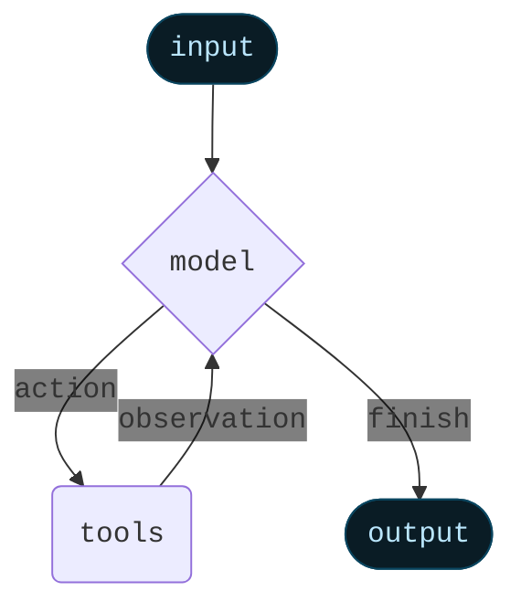
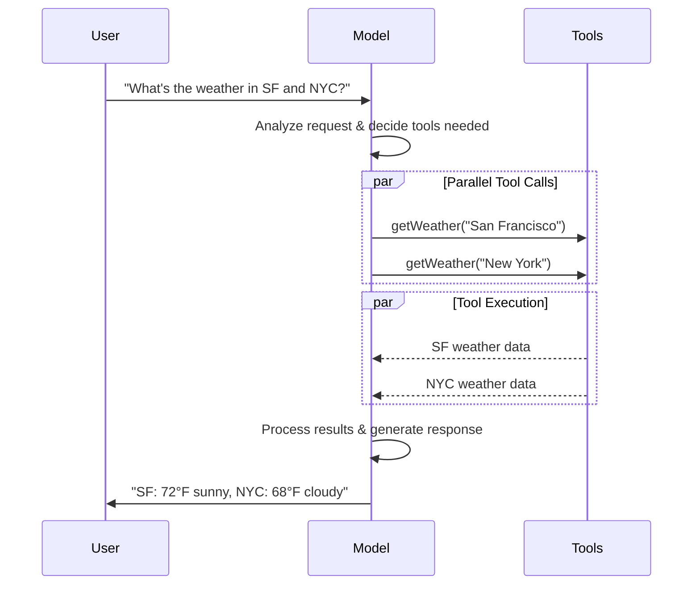

LangChain v1.1.0 与 LangGraph v1.0.4 中文使用说明

LangChain 与 LangGraph 是围绕大型语言模型（LLM）的开源框架。LangChain 强调“从 0 到 1 的快速构建”，提供统一的代理（agent）接口以及大量集成；LangGraph 则是更底层的状态机框架，支持长期运行、持久化和人类介入等高级能力。两者相辅相成，最新版 LangChain（1.1.0，发布于 2025 年 11 月 24 日 ）在内部使用 LangGraph 1.0.4（发布于 2025 年 11 月 25 日 ），因此只要使用 LangChain 即可自动获得 LangGraph 提供的持久化、流式输出、人类介入和时间旅行等功能。

一、LangChain 代理框架概览

1. 核心理念：create_agent

在 v1 中，create_agent 是唯一推荐的代理创建方式。它封装了“代理循环”：调用模型让其决定下一步工具，执行工具，然后继续循环直至模型返回最终回答 。

下面的示例展示了如何创建一个可以自动调用工具的代理。tools 是由开发者提供的可调用函数，模型通过自然语言推理决定何时调用哪个工具：

from langchain.agents import create_agent

# 假设已经实现了 search_web、analyze_data、send_email 等 Python 函数
agent = create_agent(
    model="claude-sonnet-4-5-20250929",  # 可替换为 openai:gpt-4o 等
    tools=[search_web, analyze_data, send_email],
    system_prompt="你是一名乐于助人的研究助手"
)

result = agent.invoke({
    "messages": [
        {"role": "user", "content": "查询 AI 安全领域的最新趋势，并把结果发邮件给我"}
    ]
})

通过将工具列表传入代理，模型会自行分析用户意图，决定是否调用 search_web 获取信息、用 analyze_data 处理结果，最后通过 send_email 发送邮件。整个过程无需写繁琐的工具选择逻辑，这就是“自动调用工具”能力的核心。

2. 中间件机制

create_agent 允许通过中间件（middleware）修改代理的行为。中间件是一种可插拔的钩子系统，在代理每一步执行前后触发，用于动态调整提示、过滤敏感信息、限制调用次数或引入人工审核。文档将中间件定位为上下文工程、动态提示、对话摘要、选择性工具访问和安全护栏的组合 。

预置中间件
LangChain v1 内置了多种中间件，可对代理施加限制或增强功能，常用的包括 ：
类型
作用与示例
Summarization
自动在对话接近上下文限制时总结历史记录 。例如：`
SummarizationMiddleware(model=“gpt-4o-mini”, trigger={“tokens”:4000}, keep={“messages”:20})
`
Human‑in‑the‑Loop
在敏感工具调用前暂停，要求人类批准 。适用于需要审核的发送邮件、订单支付等操作。
PII Detection
检测并处理个人敏感信息，例如自动遮蔽电话号码或邮箱 。可自定义检测正则与处理策略。
Model / Tool Call Limit
限制模型调用次数防止“无限循环”，限制工具调用次数以控制成本 。可设置线程级（跨多轮）和单次调用级别的限制。
Model Fallback
当主模型出错或超时时自动切换到备选模型 。可指定多级备用模型。
LLM Tool Selector
在真正调用工具前，用轻量模型先判断是否需要调用某个工具，提高效率（详情见文档）。
Tool Retry / Model Retry
对工具或模型的调用失败自动重试，并支持指数退避策略。

使用预置中间件只需在创建代理时传入 middleware 参数。例如以下示例同时使用了 PII 检测、摘要和人工审核中间件 ：

from langchain.agents.middleware import PIIMiddleware, SummarizationMiddleware, HumanInTheLoopMiddleware

agent = create_agent(
    model="claude-sonnet-4-5-20250929",
    tools=[read_email, send_email],
    middleware=[
        # 自动遮蔽电子邮件地址
        PIIMiddleware("email", strategy="redact", apply_to_input=True),
        # 自定义正则检测电话号码并阻止发送
        PIIMiddleware(
            "phone_number",
            detector=(
                r"(?:\+?\d{1,3}[\s.-]?)?"  # 国际区号
                r"(?:\(?\d{2,4}\)?[\s.-]?)?"  # 运营商号段
                r"\d{3,4}[\s.-]?\d{4}"
            ),
            strategy="block"
        ),
        # 会话过长时自动压缩
        SummarizationMiddleware(model="claude-sonnet-4-5-20250929", trigger={"tokens":500}),
        # 发送邮件前必须人工审批
        HumanInTheLoopMiddleware(interrupt_on={"send_email": {"allowed_decisions": ["approve", "edit", "reject"]}}),
    ]
)


自定义中间件
如果内置中间件不能满足需求，可以通过继承 AgentMiddleware 类来自定义逻辑。中间件提供多个钩子，在不同阶段插入处理，例如 ：

钩子
调用时机
用途示例
before_agent
调用代理前
载入记忆、校验输入等
before_model
每次 LLM 调用前
更新提示、裁剪消息
wrap_model_call
包围模型调用
修改模型或工具列表，如下例所示
wrap_tool_call
包围工具调用
拦截并修改工具执行
after_model
每次 LLM 调用后
校验模型输出、应用护栏
after_agent
代理完成后
保存结果、清理资源


下面的例子根据用户的专业水平动态选择模型和可用工具 ：
from dataclasses import dataclass
from typing import Callable
from langchain_openai import ChatOpenAI
from langchain.agents.middleware import AgentMiddleware, ModelRequest, ModelResponse

@dataclass
class Context:
    user_expertise: str = "beginner"

class ExpertiseBasedToolMiddleware(AgentMiddleware):
    def wrap_model_call(self, request: ModelRequest, handler: Callable[[ModelRequest], ModelResponse]) -> ModelResponse:
        user_level = request.runtime.context.user_expertise
        if user_level == "expert":
            # 更强大的模型，可使用高级工具
            model = ChatOpenAI(model="gpt-5")
            tools = [advanced_search, data_analysis]
        else:
            # 较小模型，只允许基础工具
            model = ChatOpenAI(model="gpt-5-nano")
            tools = [simple_search, basic_calculator]
        return handler(request.override(model=model, tools=tools))

agent = create_agent(
    model="claude-sonnet-4-5-20250929",
    tools=[simple_search, advanced_search, basic_calculator, data_analysis],
    middleware=[ExpertiseBasedToolMiddleware()],
    context_schema=Context
)

该中间件在模型调用前检查用户专业级别，根据需要替换模型和工具列表。这种方式可以让一个代理在不同场景下自适应行为。

结构化输出
create_agent 还支持将工具输出映射为 Pydantic 模型，并在主循环中直接生成结构化结果，无需额外调用模型 。示例：

from langchain.agents import create_agent
from langchain.agents.structured_output import ToolStrategy
from pydantic import BaseModel

class Weather(BaseModel):
    temperature: float
    condition: str

def weather_tool(city: str) -> str:
    return "晴朗，摄氏 21 度"

agent = create_agent(
    model="gpt-4o-mini",
    tools=[weather_tool],
    response_format=ToolStrategy(Weather)
)

result = agent.invoke({
    "messages": [{"role": "user", "content": "北京天气如何？"}]
})
print(result["structured_response"])  # Weather(temperature=21.0, condition='晴朗')

结构化输出保证了类型安全，并降低额外的模型调用成本。

标准内容块
LangChain v1 引入了统一的内容块（content blocks）API，将模型回应分为推理、文本、工具调用等类型。通过遍历 response.content_blocks 可以获得模型的推理过程、引用和工具调用参数 。例如：

from langchain_anthropic import ChatAnthropic

model = ChatAnthropic(model="claude-sonnet-4-5-20250929")
response = model.invoke("巴黎是法国的首都吗？")
for block in response.content_blocks:
    if block["type"] == "reasoning":
        print("模型推理：", block["reasoning"])
    elif block["type"] == "text":
        print("回答：", block["text"])
    elif block["type"] == "tool_call":
        print(f"调用工具：{block['name']}({block['args']})")


该机制对不同 LLM 提供商具有统一的语法，并提供完整的类型提示。

3. 包结构与兼容性

LangChain v1 精简了包结构，只暴露与代理构建相关的核心模块，如 langchain.agents、langchain.messages、langchain.tools 等 。旧版本中的链式组合、索引检索等功能已迁移至 langchain-classic。如果需要使用旧 API，可以通过安装 langchain-classic 并调整导入路径来继续兼容 。

二、LangGraph 能力解析

LangGraph 是支持 LangChain 代理的底层框架，旨在为长时间运行的、状态化的 LLM 应用提供可靠的执行环境。其核心特性包括持久化状态、耐用执行、流式输出、人类介入、时间旅行和记忆管理等。使用 create_agent 时这些功能都自动启用 ；若需要更细粒度的控制，可直接使用 LangGraph 构建工作流。

1. 持久化与检查点 (Persistence)

LangGraph 内置了持久化层，通过 checkpointer 在每一个“超级步骤”保存图状态的快照 。这些快照保存在 线程 (thread) 中，每个线程用唯一的 thread_id 标识，支持跨会话访问和恢复 。
	•	线程与检查点：每当图执行一个节点后，checkpointer 会将当前状态、下一要执行的节点等信息保存为一个 StateSnapshot 。
	•	恢复执行：通过 graph.get_state(config) 或 graph.get_state_history(config) 可以获取最新或历史状态 。指定 checkpoint_id 可恢复到某一历史节点继续执行，实现“时间旅行”。
	•	示例：下面的例子创建一个简单图并使用 InMemorySaver 保存检查点 :

from langgraph.graph import StateGraph, START, END
from langgraph.checkpoint.memory import InMemorySaver
from langchain_core.runnables import RunnableConfig
from typing import TypedDict
from typing_extensions import Annotated
from operator import add

class State(TypedDict):
    foo: str
    bar: Annotated[list[str], add]

# 定义两个节点
def node_a(state: State): return {"foo": "a", "bar": ["a"]}
def node_b(state: State): return {"foo": "b", "bar": ["b"]}

workflow = StateGraph(State)
workflow.add_node(node_a)
workflow.add_node(node_b)
workflow.add_edge(START, "node_a")
workflow.add_edge("node_a", "node_b")
workflow.add_edge("node_b", END)

checkpointer = InMemorySaver()
graph = workflow.compile(checkpointer=checkpointer)
config = {"configurable": {"thread_id": "1"}}
graph.invoke({"foo": ""}, config)


执行后将生成四个检查点，分别记录开始状态、经过 node_a 的状态、经过 node_b 的状态等 。

2. 耐用执行 (Durable Execution)

耐用执行意味着流程在关键点保存进度，允许停顿后从相同状态继续运行，非常适合需要人工介入或长时间任务的场景。LangGraph 依赖持久化层提供耐用执行 。要使用该功能需要：
	1.	为工作流启用持久化，即指定 checkpointer ；
	2.	在调用图时提供 thread_id ；
	3.	对所有非确定性操作（如随机数、文件写入、外部 API 调用）使用 task 包装，确保恢复时读取先前结果 。

3. 流式输出 (Streaming)

流式输出现实时更新，提升用户体验。LangGraph 提供多种流模式：
	•	values：每个步骤后流式输出完整状态；
	•	updates：仅输出状态增量；
	•	messages：输出 LLM 生成的 token 及元信息；
	•	custom：在工具或节点中自定义输出；
	•	debug：输出尽可能详细的调试信息 。

可通过同步 graph.stream() 或异步 graph.astream() 接口选择一种或多种模式 。下例演示了使用 updates 模式流式打印状态更新 ：

from typing import TypedDict
from langgraph.graph import StateGraph, START, END

class State(TypedDict):
    topic: str
    joke: str

def refine_topic(state: State):
    return {"topic": state["topic"] + " 和猫"}

def generate_joke(state: State):
    return {"joke": f"这是关于 {state['topic']} 的笑话"}

graph = (StateGraph(State)
         .add_node(refine_topic)
         .add_node(generate_joke)
         .add_edge(START, "refine_topic")
         .add_edge("refine_topic", "generate_joke")
         .add_edge("generate_joke", END)
         .compile())

for chunk in graph.stream({"topic": "冰激凌"}, stream_mode="updates"):
    print(chunk)
# 输出：{'refine_topic': {'topic': '冰激凌 和猫'}}
#       {'generate_joke': {'joke': '这是关于 冰激凌 和猫 的笑话'}}

4. 人类介入与中断 (Interrupts)

中断允许在图执行过程中任意位置暂停，等待外部输入。调用 interrupt(value) 会保存图状态并返回给调用者，直到再次调用 invoke(Command(resume=value)) 才继续执行。该机制使代理可实现人工审批等交互场景：
	•	interrupt() 会返回 __interrupt__ 字段，指示等待的内容 ；
	•	恢复时必须使用相同的 thread_id ；
	•	调用 interrupt() 的节点必须保证中断点之前的副作用可重试 。

示例：

from langgraph.types import interrupt, Command

# 假设 State 包含需要批准的操作

def approval_node(state: State):
    # 暂停并请求批准
    approved = interrupt("是否批准该操作？")
    return {"approved": approved}

# 第一次调用，触发中断
config = {"configurable": {"thread_id": "thread-1"}}
result = graph.invoke({"input": "数据"}, config=config)
print(result["__interrupt__"])  # ['是否批准该操作？']

# 恢复执行，返回用户的批准结果
graph.invoke(Command(resume=True), config=config)

5. 时间旅行 (Time Travel)

Checkpointer 允许“时间旅行”——在执行历史中选择任意检查点，查看或修改状态后继续运行 。使用步骤：
	1.	运行图并生成历史检查点；
	2.	通过 graph.get_state_history 找到想要回溯的 checkpoint_id；
	3.	如有需要，用 graph.update_state 修改状态；
	4.	重新调用 graph.invoke，传入 thread_id 和 checkpoint_id，即可从该点继续执行。

时间旅行适用于分析代理的推理路径、调试错误或探索不同决策分支。

6. 记忆系统 (Memory)

LangGraph 将记忆分为两类 ：
	•	短期记忆：线程级记忆，用于跟踪单次会话的历史。短期记忆存储在图的状态中，通过 checkpointer 持久化，因此可以在会话之间恢复 。添加短期记忆只需传入 InMemorySaver（或其他持久化存储）并在调用时指定 thread_id 。
	•	长期记忆：跨会话或跨用户的记忆，用于保存知识库、用户档案等。长期记忆通常使用向量数据库或键值存储，并通过检索或搜索组件加载到代理。

示例：

from langgraph.checkpoint.memory import InMemorySaver
from langgraph.graph import StateGraph

checkpointer = InMemorySaver()
builder = StateGraph(...)

# 编译时指定 checkpointer
graph = builder.compile(checkpointer=checkpointer)

# 调用时指定 thread_id，系统将自动维护短期记忆
graph.invoke(
    {"messages": [{"role": "user", "content": "你好，我叫小明"}]},
    {"configurable": {"thread_id": "1"}}
)

在生产环境中可使用 Postgres、MongoDB 等持久化 checkpointer 来保存记忆，支持并发和长期存储。

长期记忆的实现方式比较灵活，常见的做法是将检索器或向量存储作为工具，结合 LangChain 的检索中间件，让代理根据上下文检索知识库。

三、建议的实践
	1.	使用最新版本：确保安装 langchain==1.1.0 和 langgraph==1.0.4，这些版本对 API 做了简化，默认集成了持久化和流式功能  。
	2.	优先使用 create_agent：该接口已经包含最优的代理循环和中间件机制，适合快速迭代。只有在需要高度自定义工作流时才直接使用 LangGraph。
	3.	利用中间件控制行为：根据应用场景选择合适的预置中间件，如 Summarization、Human‑in‑the‑Loop、PII Detection、Call Limit 等，也可按需实现自定义中间件。
	4.	充分利用持久化功能：为每个对话指定唯一 thread_id，并根据需要保存检查点，以便会话恢复、时间旅行和错误回滚。确保将随机行为包裹在任务中，避免重复副作用。
	5.	结合 LangSmith 调试：LangGraph 与 LangSmith 的深度集成可用于跟踪执行历史、分析模型调用、评估代理性能，建议在开发与生产环境中开启。

通过掌握以上概念和示例，开发者可以在最新版 LangChain 与 LangGraph 中快速构建具备自动工具调用、可控流程、持久化和人类介入能力的智能代理。


# LangChain overview

> LangChain is an open source framework with a pre-built agent architecture and integrations for any model or tool — so you can build agents that adapt as fast as the ecosystem evolves

LangChain is the easiest way to start building agents and applications powered by LLMs. With under 10 lines of code, you can connect to OpenAI, Anthropic, Google, and [more](/oss/javascript/integrations/providers/overview). LangChain provides a pre-built agent architecture and model integrations to help you get started quickly and seamlessly incorporate LLMs into your agents and applications.

We recommend you use LangChain if you want to quickly build agents and autonomous applications. Use [LangGraph](/oss/javascript/langgraph/overview), our low-level agent orchestration framework and runtime, when you have more advanced needs that require a combination of deterministic and agentic workflows, heavy customization, and carefully controlled latency.

LangChain [agents](/oss/javascript/langchain/agents) are built on top of LangGraph in order to provide durable execution, streaming, human-in-the-loop, persistence, and more. You do not need to know LangGraph for basic LangChain agent usage.

## <Icon icon="wand-magic-sparkles" /> Create an agent

```ts  theme={null}
import * as z from "zod";
// npm install @langchain/anthropic to call the model
import { createAgent, tool } from "langchain";

const getWeather = tool(
  ({ city }) => `It's always sunny in ${city}!`,
  {
    name: "get_weather",
    description: "Get the weather for a given city",
    schema: z.object({
      city: z.string(),
    }),
  },
);

const agent = createAgent({
  model: "claude-sonnet-4-5-20250929",
  tools: [getWeather],
});

console.log(
  await agent.invoke({
    messages: [{ role: "user", content: "What's the weather in Tokyo?" }],
  })
);
```

See the [Installation instructions](/oss/javascript/langchain/install) and [Quickstart guide](/oss/javascript/langchain/quickstart) to get started building your own agents and applications with LangChain.

## <Icon icon="star" size={20} /> Core benefits

<Columns cols={2}>
  <Card title="Standard model interface" icon="arrows-rotate" href="/oss/javascript/langchain/models" arrow cta="Learn more">
    Different providers have unique APIs for interacting with models, including the format of responses. LangChain standardizes how you interact with models so that you can seamlessly swap providers and avoid lock-in.
  </Card>

  <Card title="Easy to use, highly flexible agent" icon="wand-magic-sparkles" href="/oss/javascript/langchain/agents" arrow cta="Learn more">
    LangChain's agent abstraction is designed to be easy to get started with, letting you build a simple agent in under 10 lines of code. But it also provides enough flexibility to allow you to do all the context engineering your heart desires.
  </Card>

  <Card title="Built on top of LangGraph" icon="circle-nodes" href="/oss/javascript/langgraph/overview" arrow cta="Learn more">
    LangChain's agents are built on top of LangGraph. This allows us to take advantage of LangGraph's durable execution, human-in-the-loop support, persistence, and more.
  </Card>

  <Card title="Debug with LangSmith" icon="eye" href="/langsmith/home" arrow cta="Learn more">
    Gain deep visibility into complex agent behavior with visualization tools that trace execution paths, capture state transitions, and provide detailed runtime metrics.
  </Card>
</Columns>

***

<Callout icon="pen-to-square" iconType="regular">
  [Edit this page on GitHub](https://github.com/langchain-ai/docs/edit/main/src/oss/langchain/overview.mdx) or [file an issue](https://github.com/langchain-ai/docs/issues/new/choose).
</Callout>

<Tip icon="terminal" iconType="regular">
  [Connect these docs](/use-these-docs) to Claude, VSCode, and more via MCP for real-time answers.
</Tip>


---

> To find navigation and other pages in this documentation, fetch the llms.txt file at: https://docs.langchain.com/llms.txt

# Agents

Agents combine language models with [tools](/oss/javascript/langchain/tools) to create systems that can reason about tasks, decide which tools to use, and iteratively work towards solutions.

`createAgent()` provides a production-ready agent implementation.

[An LLM Agent runs tools in a loop to achieve a goal](https://simonwillison.net/2025/Sep/18/agents/).
An agent runs until a stop condition is met - i.e., when the model emits a final output or an iteration limit is reached.



<Info>
  `createAgent()` builds a **graph**-based agent runtime using [LangGraph](/oss/javascript/langgraph/overview). A graph consists of nodes (steps) and edges (connections) that define how your agent processes information. The agent moves through this graph, executing nodes like the model node (which calls the model), the tools node (which executes tools), or middleware.

  Learn more about the [Graph API](/oss/javascript/langgraph/graph-api).
</Info>

## Core components

### Model

The [model](/oss/javascript/langchain/models) is the reasoning engine of your agent. It can be specified in multiple ways, supporting both static and dynamic model selection.

#### Static model

Static models are configured once when creating the agent and remain unchanged throughout execution. This is the most common and straightforward approach.

To initialize a static model from a <Tooltip tip="A string that follows the format `provider:model` (e.g. openai:gpt-5)" cta="See mappings" href="https://reference.langchain.com/python/langchain/models/#langchain.chat_models.init_chat_model(model)">model identifier string</Tooltip>:

```ts wrap theme={null}
import { createAgent } from "langchain";

const agent = createAgent({
  model: "openai:gpt-5",
  tools: []
});
```

Model identifier strings use the format `provider:model` (e.g. `"openai:gpt-5"`). You may want more control over the model configuration, in which case you can initialize a model instance directly using the provider package:

```ts wrap theme={null}
import { createAgent } from "langchain";
import { ChatOpenAI } from "@langchain/openai";

const model = new ChatOpenAI({
  model: "gpt-4o",
  temperature: 0.1,
  maxTokens: 1000,
  timeout: 30
});

const agent = createAgent({
  model,
  tools: []
});
```

Model instances give you complete control over configuration. Use them when you need to set specific parameters like `temperature`, `max_tokens`, `timeouts`, or configure API keys, `base_url`, and other provider-specific settings. Refer to the [API reference](/oss/javascript/integrations/providers/) to see available params and methods on your model.

#### Dynamic model

Dynamic models are selected at <Tooltip tip="The execution environment of your agent, containing immutable configuration and contextual data that persists throughout the agent's execution (e.g., user IDs, session details, or application-specific configuration).">runtime</Tooltip> based on the current <Tooltip tip="The data that flows through your agent's execution, including messages, custom fields, and any information that needs to be tracked and potentially modified during processing (e.g., user preferences or tool usage stats).">state</Tooltip> and context. This enables sophisticated routing logic and cost optimization.

To use a dynamic model, create middleware with `wrapModelCall` that modifies the model in the request:

```ts  theme={null}
import { ChatOpenAI } from "@langchain/openai";
import { createAgent, createMiddleware } from "langchain";

const basicModel = new ChatOpenAI({ model: "gpt-4o-mini" });
const advancedModel = new ChatOpenAI({ model: "gpt-4o" });

const dynamicModelSelection = createMiddleware({
  name: "DynamicModelSelection",
  wrapModelCall: (request, handler) => {
    // Choose model based on conversation complexity
    const messageCount = request.messages.length;

    return handler({
        ...request,
        model: messageCount > 10 ? advancedModel : basicModel,
    });
  },
});

const agent = createAgent({
  model: "gpt-4o-mini", // Base model (used when messageCount ≤ 10)
  tools,
  middleware: [dynamicModelSelection],
});
```

For more details on middleware and advanced patterns, see the [middleware documentation](/oss/javascript/langchain/middleware).

<Tip>
  For model configuration details, see [Models](/oss/javascript/langchain/models). For dynamic model selection patterns, see [Dynamic model in middleware](/oss/javascript/langchain/middleware#dynamic-model).
</Tip>

### Tools

Tools give agents the ability to take actions. Agents go beyond simple model-only tool binding by facilitating:

* Multiple tool calls in sequence (triggered by a single prompt)
* Parallel tool calls when appropriate
* Dynamic tool selection based on previous results
* Tool retry logic and error handling
* State persistence across tool calls

For more information, see [Tools](/oss/javascript/langchain/tools).

#### Defining tools

Pass a list of tools to the agent.

```ts wrap theme={null}
import * as z from "zod";
import { createAgent, tool } from "langchain";

const search = tool(
  ({ query }) => `Results for: ${query}`,
  {
    name: "search",
    description: "Search for information",
    schema: z.object({
      query: z.string().describe("The query to search for"),
    }),
  }
);

const getWeather = tool(
  ({ location }) => `Weather in ${location}: Sunny, 72°F`,
  {
    name: "get_weather",
    description: "Get weather information for a location",
    schema: z.object({
      location: z.string().describe("The location to get weather for"),
    }),
  }
);

const agent = createAgent({
  model: "gpt-4o",
  tools: [search, getWeather],
});
```

If an empty tool list is provided, the agent will consist of a single LLM node without tool-calling capabilities.

#### Tool error handling

To customize how tool errors are handled, use the `wrapToolCall` hook in a custom middleware:

```ts wrap theme={null}
import { createAgent, createMiddleware, ToolMessage } from "langchain";

const handleToolErrors = createMiddleware({
  name: "HandleToolErrors",
  wrapToolCall: async (request, handler) => {
    try {
      return await handler(request);
    } catch (error) {
      // Return a custom error message to the model
      return new ToolMessage({
        content: `Tool error: Please check your input and try again. (${error})`,
        tool_call_id: request.toolCall.id!,
      });
    }
  },
});

const agent = createAgent({
  model: "gpt-4o",
  tools: [
    /* ... */
  ],
  middleware: [handleToolErrors],
});
```

The agent will return a [`ToolMessage`](https://reference.langchain.com/javascript/classes/_langchain_core.messages.ToolMessage.html) with the custom error message when a tool fails.

#### Tool use in the ReAct loop

Agents follow the ReAct ("Reasoning + Acting") pattern, alternating between brief reasoning steps with targeted tool calls and feeding the resulting observations into subsequent decisions until they can deliver a final answer.

<Accordion title="Example of ReAct loop">
  **Prompt:** Identify the current most popular wireless headphones and verify availability.

  ```
  ================================ Human Message =================================

  Find the most popular wireless headphones right now and check if they're in stock
  ```

  * **Reasoning**: "Popularity is time-sensitive, I need to use the provided search tool."
  * **Acting**: Call `search_products("wireless headphones")`

  ```
  ================================== Ai Message ==================================
  Tool Calls:
    search_products (call_abc123)
   Call ID: call_abc123
    Args:
      query: wireless headphones
  ```

  ```
  ================================= Tool Message =================================

  Found 5 products matching "wireless headphones". Top 5 results: WH-1000XM5, ...
  ```

  * **Reasoning**: "I need to confirm availability for the top-ranked item before answering."
  * **Acting**: Call `check_inventory("WH-1000XM5")`

  ```
  ================================== Ai Message ==================================
  Tool Calls:
    check_inventory (call_def456)
   Call ID: call_def456
    Args:
      product_id: WH-1000XM5
  ```

  ```
  ================================= Tool Message =================================

  Product WH-1000XM5: 10 units in stock
  ```

  * **Reasoning**: "I have the most popular model and its stock status. I can now answer the user's question."
  * **Acting**: Produce final answer

  ```
  ================================== Ai Message ==================================

  I found wireless headphones (model WH-1000XM5) with 10 units in stock...
  ```
</Accordion>

<Tip>
  To learn more about tools, see [Tools](/oss/javascript/langchain/tools).
</Tip>

### System prompt

You can shape how your agent approaches tasks by providing a prompt. The `systemPrompt` parameter can be provided as a string:

```ts wrap theme={null}
const agent = createAgent({
  model,
  tools,
  systemPrompt: "You are a helpful assistant. Be concise and accurate.",
});
```

When no `systemPrompt` is provided, the agent will infer its task from the messages directly.

The `systemPrompt` parameter accepts either a `string` or a `SystemMessage`. Using a `SystemMessage` gives you more control over the prompt structure, which is useful for provider-specific features like [Anthropic's prompt caching](/oss/javascript/integrations/chat/anthropic#prompt-caching):

```ts wrap theme={null}
import { createAgent } from "langchain";
import { SystemMessage, HumanMessage } from "@langchain/core/messages";

const literaryAgent = createAgent({
  model: "anthropic:claude-sonnet-4-5",
  systemPrompt: new SystemMessage({
    content: [
      {
        type: "text",
        text: "You are an AI assistant tasked with analyzing literary works.",
      },
      {
        type: "text",
        text: "<the entire contents of 'Pride and Prejudice'>",
        cache_control: { type: "ephemeral" }
      }
    ]
  })
});

const result = await literaryAgent.invoke({
  messages: [new HumanMessage("Analyze the major themes in 'Pride and Prejudice'.")]
});
```

The `cache_control` field with `{ type: "ephemeral" }` tells Anthropic to cache that content block, reducing latency and costs for repeated requests that use the same system prompt.

#### Dynamic system prompt

For more advanced use cases where you need to modify the system prompt based on runtime context or agent state, you can use [middleware](/oss/javascript/langchain/middleware).

```typescript wrap theme={null}
import * as z from "zod";
import { createAgent, dynamicSystemPromptMiddleware } from "langchain";

const contextSchema = z.object({
  userRole: z.enum(["expert", "beginner"]),
});

const agent = createAgent({
  model: "gpt-4o",
  tools: [/* ... */],
  contextSchema,
  middleware: [
    dynamicSystemPromptMiddleware<z.infer<typeof contextSchema>>((state, runtime) => {
      const userRole = runtime.context.userRole || "user";
      const basePrompt = "You are a helpful assistant.";

      if (userRole === "expert") {
        return `${basePrompt} Provide detailed technical responses.`;
      } else if (userRole === "beginner") {
        return `${basePrompt} Explain concepts simply and avoid jargon.`;
      }
      return basePrompt;
    }),
  ],
});

// The system prompt will be set dynamically based on context
const result = await agent.invoke(
  { messages: [{ role: "user", content: "Explain machine learning" }] },
  { context: { userRole: "expert" } }
);
```

<Tip>
  For more details on message types and formatting, see [Messages](/oss/javascript/langchain/messages). For comprehensive middleware documentation, see [Middleware](/oss/javascript/langchain/middleware).
</Tip>

## Invocation

You can invoke an agent by passing an update to its [`State`](/oss/javascript/langgraph/graph-api#state). All agents include a [sequence of messages](/oss/javascript/langgraph/use-graph-api#messagesstate) in their state; to invoke the agent, pass a new message:

```typescript  theme={null}
await agent.invoke({
  messages: [{ role: "user", content: "What's the weather in San Francisco?" }],
})
```

For streaming steps and / or tokens from the agent, refer to the [streaming](/oss/javascript/langchain/streaming) guide.

Otherwise, the agent follows the LangGraph [Graph API](/oss/javascript/langgraph/use-graph-api) and supports all associated methods, such as `stream` and `invoke`.

## Advanced concepts

### Structured output

In some situations, you may want the agent to return an output in a specific format. LangChain provides a simple, universal way to do this with the `responseFormat` parameter.

```ts wrap theme={null}
import * as z from "zod";
import { createAgent } from "langchain";

const ContactInfo = z.object({
  name: z.string(),
  email: z.string(),
  phone: z.string(),
});

const agent = createAgent({
  model: "gpt-4o",
  responseFormat: ContactInfo,
});

const result = await agent.invoke({
  messages: [
    {
      role: "user",
      content: "Extract contact info from: John Doe, john@example.com, (555) 123-4567",
    },
  ],
});

console.log(result.structuredResponse);
// {
//   name: 'John Doe',
//   email: 'john@example.com',
//   phone: '(555) 123-4567'
// }
```

<Tip>
  To learn about structured output, see [Structured output](/oss/javascript/langchain/structured-output).
</Tip>

### Memory

Agents maintain conversation history automatically through the message state. You can also configure the agent to use a custom state schema to remember additional information during the conversation.

Information stored in the state can be thought of as the [short-term memory](/oss/javascript/langchain/short-term-memory) of the agent:

```ts wrap theme={null}
import { z } from "zod/v4";
import { StateSchema, MessagesValue } from "@langchain/langgraph";
import { createAgent } from "langchain";

const CustomAgentState = new StateSchema({
  messages: MessagesValue,
  userPreferences: z.record(z.string(), z.string()),
});

const customAgent = createAgent({
  model: "gpt-4o",
  tools: [],
  stateSchema: CustomAgentState,
});
```

<Tip>
  To learn more about memory, see [Memory](/oss/javascript/concepts/memory). For information on implementing long-term memory that persists across sessions, see [Long-term memory](/oss/javascript/langchain/long-term-memory).
</Tip>

### Streaming

We've seen how the agent can be called with `invoke` to get a final response. If the agent executes multiple steps, this may take a while. To show intermediate progress, we can stream back messages as they occur.

```ts  theme={null}
const stream = await agent.stream(
  {
    messages: [{
      role: "user",
      content: "Search for AI news and summarize the findings"
    }],
  },
  { streamMode: "values" }
);

for await (const chunk of stream) {
  // Each chunk contains the full state at that point
  const latestMessage = chunk.messages.at(-1);
  if (latestMessage?.content) {
    console.log(`Agent: ${latestMessage.content}`);
  } else if (latestMessage?.tool_calls) {
    const toolCallNames = latestMessage.tool_calls.map((tc) => tc.name);
    console.log(`Calling tools: ${toolCallNames.join(", ")}`);
  }
}
```

<Tip>
  For more details on streaming, see [Streaming](/oss/javascript/langchain/streaming).
</Tip>

### Middleware

[Middleware](/oss/javascript/langchain/middleware) provides powerful extensibility for customizing agent behavior at different stages of execution. You can use middleware to:

* Process state before the model is called (e.g., message trimming, context injection)
* Modify or validate the model's response (e.g., guardrails, content filtering)
* Handle tool execution errors with custom logic
* Implement dynamic model selection based on state or context
* Add custom logging, monitoring, or analytics

Middleware integrates seamlessly into the agent's execution, allowing you to intercept and modify data flow at key points without changing the core agent logic.

<Tip>
  For comprehensive middleware documentation including hooks like `beforeModel`, `afterModel`, and `wrapToolCall`, see [Middleware](/oss/javascript/langchain/middleware).
</Tip>

***

<Callout icon="pen-to-square" iconType="regular">
  [Edit this page on GitHub](https://github.com/langchain-ai/docs/edit/main/src/oss/langchain/agents.mdx) or [file an issue](https://github.com/langchain-ai/docs/issues/new/choose).
</Callout>

<Tip icon="terminal" iconType="regular">
  [Connect these docs](/use-these-docs) to Claude, VSCode, and more via MCP for real-time answers.
</Tip>


---

> To find navigation and other pages in this documentation, fetch the llms.txt file at: https://docs.langchain.com/llms.txt

# Models

[LLMs](https://en.wikipedia.org/wiki/Large_language_model) are powerful AI tools that can interpret and generate text like humans. They're versatile enough to write content, translate languages, summarize, and answer questions without needing specialized training for each task.

In addition to text generation, many models support:

* <Icon icon="hammer" size={16} /> [Tool calling](#tool-calling) - calling external tools (like databases queries or API calls) and use results in their responses.
* <Icon icon="shapes" size={16} /> [Structured output](#structured-output) - where the model's response is constrained to follow a defined format.
* <Icon icon="image" size={16} /> [Multimodality](#multimodal) - process and return data other than text, such as images, audio, and video.
* <Icon icon="brain" size={16} /> [Reasoning](#reasoning) - models perform multi-step reasoning to arrive at a conclusion.

Models are the reasoning engine of [agents](/oss/javascript/langchain/agents). They drive the agent's decision-making process, determining which tools to call, how to interpret results, and when to provide a final answer.

The quality and capabilities of the model you choose directly impact your agent's baseline reliability and performance. Different models excel at different tasks - some are better at following complex instructions, others at structured reasoning, and some support larger context windows for handling more information.

LangChain's standard model interfaces give you access to many different provider integrations, which makes it easy to experiment with and switch between models to find the best fit for your use case.

<Info>
  For provider-specific integration information and capabilities, see the provider's [chat model page](/oss/javascript/integrations/chat).
</Info>

## Basic usage

Models can be utilized in two ways:

1. **With agents** - Models can be dynamically specified when creating an [agent](/oss/javascript/langchain/agents#model).
2. **Standalone** - Models can be called directly (outside of the agent loop) for tasks like text generation, classification, or extraction without the need for an agent framework.

The same model interface works in both contexts, which gives you the flexibility to start simple and scale up to more complex agent-based workflows as needed.

### Initialize a model

The easiest way to get started with a standalone model in LangChain is to use `initChatModel` to initialize one from a [chat model provider](/oss/javascript/integrations/chat) of your choice (examples below):

<Tabs>
  <Tab title="OpenAI">
    👉 Read the [OpenAI chat model integration docs](/oss/javascript/integrations/chat/openai/)

    <CodeGroup>
      ```bash npm theme={null}
      npm install @langchain/openai
      ```

      ```bash pnpm theme={null}
      pnpm install @langchain/openai
      ```

      ```bash yarn theme={null}
      yarn add @langchain/openai
      ```

      ```bash bun theme={null}
      bun add @langchain/openai
      ```
    </CodeGroup>

    <CodeGroup>
      ```typescript initChatModel theme={null}
      import { initChatModel } from "langchain";

      process.env.OPENAI_API_KEY = "your-api-key";

      const model = await initChatModel("gpt-4.1");
      ```

      ```typescript Model Class theme={null}
      import { ChatOpenAI } from "@langchain/openai";

      const model = new ChatOpenAI({
        model: "gpt-4.1",
        apiKey: "your-api-key"
      });
      ```
    </CodeGroup>
  </Tab>

  <Tab title="Anthropic">
    👉 Read the [Anthropic chat model integration docs](/oss/javascript/integrations/chat/anthropic/)

    <CodeGroup>
      ```bash npm theme={null}
      npm install @langchain/anthropic
      ```

      ```bash pnpm theme={null}
      pnpm install @langchain/anthropic
      ```

      ```bash yarn theme={null}
      yarn add @langchain/anthropic
      ```

      ```bash pnpm theme={null}
      pnpm add @langchain/anthropic
      ```
    </CodeGroup>

    <CodeGroup>
      ```typescript initChatModel theme={null}
      import { initChatModel } from "langchain";

      process.env.ANTHROPIC_API_KEY = "your-api-key";

      const model = await initChatModel("claude-sonnet-4-5-20250929");
      ```

      ```typescript Model Class theme={null}
      import { ChatAnthropic } from "@langchain/anthropic";

      const model = new ChatAnthropic({
        model: "claude-sonnet-4-5-20250929",
        apiKey: "your-api-key"
      });
      ```
    </CodeGroup>
  </Tab>

  <Tab title="Azure">
    👉 Read the [Azure chat model integration docs](/oss/javascript/integrations/chat/azure/)

    <CodeGroup>
      ```bash npm theme={null}
      npm install @langchain/azure
      ```

      ```bash pnpm theme={null}
      pnpm install @langchain/azure
      ```

      ```bash yarn theme={null}
      yarn add @langchain/azure
      ```

      ```bash bun theme={null}
      bun add @langchain/azure
      ```
    </CodeGroup>

    <CodeGroup>
      ```typescript initChatModel theme={null}
      import { initChatModel } from "langchain";

      process.env.AZURE_OPENAI_API_KEY = "your-api-key";
      process.env.AZURE_OPENAI_ENDPOINT = "your-endpoint";
      process.env.OPENAI_API_VERSION = "your-api-version";

      const model = await initChatModel("azure_openai:gpt-4.1");
      ```

      ```typescript Model Class theme={null}
      import { AzureChatOpenAI } from "@langchain/openai";

      const model = new AzureChatOpenAI({
        model: "gpt-4.1",
        azureOpenAIApiKey: "your-api-key",
        azureOpenAIApiEndpoint: "your-endpoint",
        azureOpenAIApiVersion: "your-api-version"
      });
      ```
    </CodeGroup>
  </Tab>

  <Tab title="Google Gemini">
    👉 Read the [Google GenAI chat model integration docs](/oss/javascript/integrations/chat/google_generative_ai/)

    <CodeGroup>
      ```bash npm theme={null}
      npm install @langchain/google-genai
      ```

      ```bash pnpm theme={null}
      pnpm install @langchain/google-genai
      ```

      ```bash yarn theme={null}
      yarn add @langchain/google-genai
      ```

      ```bash bun theme={null}
      bun add @langchain/google-genai
      ```
    </CodeGroup>

    <CodeGroup>
      ```typescript initChatModel theme={null}
      import { initChatModel } from "langchain";

      process.env.GOOGLE_API_KEY = "your-api-key";

      const model = await initChatModel("google-genai:gemini-2.5-flash-lite");
      ```

      ```typescript Model Class theme={null}
      import { ChatGoogleGenerativeAI } from "@langchain/google-genai";

      const model = new ChatGoogleGenerativeAI({
        model: "gemini-2.5-flash-lite",
        apiKey: "your-api-key"
      });
      ```
    </CodeGroup>
  </Tab>

  <Tab title="Bedrock Converse">
    👉 Read the [AWS Bedrock chat model integration docs](/oss/javascript/integrations/chat/bedrock_converse/)

    <CodeGroup>
      ```bash npm theme={null}
      npm install @langchain/aws
      ```

      ```bash pnpm theme={null}
      pnpm install @langchain/aws
      ```

      ```bash yarn theme={null}
      yarn add @langchain/aws
      ```

      ```bash bun theme={null}
      bun add @langchain/aws
      ```
    </CodeGroup>

    <CodeGroup>
      ```typescript initChatModel theme={null}
      import { initChatModel } from "langchain";

      // Follow the steps here to configure your credentials:
      // https://docs.aws.amazon.com/bedrock/latest/userguide/getting-started.html

      const model = await initChatModel("bedrock:gpt-4.1");
      ```

      ```typescript Model Class theme={null}
      import { ChatBedrockConverse } from "@langchain/aws";

      // Follow the steps here to configure your credentials:
      // https://docs.aws.amazon.com/bedrock/latest/userguide/getting-started.html

      const model = new ChatBedrockConverse({
        model: "gpt-4.1",
        region: "us-east-2"
      });
      ```
    </CodeGroup>
  </Tab>
</Tabs>

```typescript  theme={null}
const response = await model.invoke("Why do parrots talk?");
```

See [`initChatModel`](https://reference.langchain.com/javascript/functions/langchain.chat_models_universal.initChatModel.html) for more detail, including information on how to pass model [parameters](#parameters).

### Supported models

LangChain supports all major model providers, including OpenAI, Anthropic, Google, Azure, AWS Bedrock, and more. Each provider offers a variety of models with different capabilities. For a full list of supported models in LangChain, see the [integrations page](/oss/javascript/integrations/providers/overview).

### Key methods

<Card title="Invoke" href="#invoke" icon="paper-plane" arrow="true" horizontal>
  The model takes messages as input and outputs messages after generating a complete response.
</Card>

<Card title="Stream" href="#stream" icon="tower-broadcast" arrow="true" horizontal>
  Invoke the model, but stream the output as it is generated in real-time.
</Card>

<Card title="Batch" href="#batch" icon="grip" arrow="true" horizontal>
  Send multiple requests to a model in a batch for more efficient processing.
</Card>

<Info>
  In addition to chat models, LangChain provides support for other adjacent technologies, such as embedding models and vector stores. See the [integrations page](/oss/javascript/integrations/providers/overview) for details.
</Info>

## Parameters

A chat model takes parameters that can be used to configure its behavior. The full set of supported parameters varies by model and provider, but standard ones include:

<ParamField body="model" type="string" required>
  The name or identifier of the specific model you want to use with a provider. You can also specify both the model and its provider in a single argument using the '{model_provider}:{model}' format, for example, 'openai:o1'.
</ParamField>

<ParamField body="apiKey" type="string">
  The key required for authenticating with the model's provider. This is usually issued when you sign up for access to the model. Often accessed by setting an <Tooltip tip="A variable whose value is set outside the program, typically through functionality built into the operating system or microservice.">environment variable</Tooltip>.
</ParamField>

<ParamField body="temperature" type="number">
  Controls the randomness of the model's output. A higher number makes responses more creative; lower ones make them more deterministic.
</ParamField>

<ParamField body="maxTokens" type="number">
  Limits the total number of <Tooltip tip="The basic unit that a model reads and generates. Providers may define them differently, but in general, they can represent a whole or part of word.">tokens</Tooltip> in the response, effectively controlling how long the output can be.
</ParamField>

<ParamField body="timeout" type="number">
  The maximum time (in seconds) to wait for a response from the model before canceling the request.
</ParamField>

<ParamField body="maxRetries" type="number">
  The maximum number of attempts the system will make to resend a request if it fails due to issues like network timeouts or rate limits.
</ParamField>

Using `initChatModel`, pass these parameters as inline parameters:

```typescript Initialize using model parameters theme={null}
const model = await initChatModel(
    "claude-sonnet-4-5-20250929",
    { temperature: 0.7, timeout: 30, max_tokens: 1000 }
)
```

<Info>
  Each chat model integration may have additional params used to control provider-specific functionality.

  For example, [`ChatOpenAI`](https://reference.langchain.com/javascript/classes/_langchain_openai.ChatOpenAI.html) has `use_responses_api` to dictate whether to use the OpenAI Responses or Completions API.

  To find all the parameters supported by a given chat model, head to the [chat model integrations](/oss/javascript/integrations/chat) page.
</Info>

***

## Invocation

A chat model must be invoked to generate an output. There are three primary invocation methods, each suited to different use cases.

### Invoke

The most straightforward way to call a model is to use [`invoke()`](https://reference.langchain.com/javascript/classes/_langchain_core.language_models_chat_models.BaseChatModel.html#invoke) with a single message or a list of messages.

```typescript Single message theme={null}
const response = await model.invoke("Why do parrots have colorful feathers?");
console.log(response);
```

A list of messages can be provided to a chat model to represent conversation history. Each message has a role that models use to indicate who sent the message in the conversation.

See the [messages](/oss/javascript/langchain/messages) guide for more detail on roles, types, and content.

```typescript Object format theme={null}
const conversation = [
  { role: "system", content: "You are a helpful assistant that translates English to French." },
  { role: "user", content: "Translate: I love programming." },
  { role: "assistant", content: "J'adore la programmation." },
  { role: "user", content: "Translate: I love building applications." },
];

const response = await model.invoke(conversation);
console.log(response);  // AIMessage("J'adore créer des applications.")
```

```typescript Message objects theme={null}
import { HumanMessage, AIMessage, SystemMessage } from "langchain";

const conversation = [
  new SystemMessage("You are a helpful assistant that translates English to French."),
  new HumanMessage("Translate: I love programming."),
  new AIMessage("J'adore la programmation."),
  new HumanMessage("Translate: I love building applications."),
];

const response = await model.invoke(conversation);
console.log(response);  // AIMessage("J'adore créer des applications.")
```

<Info>
  If the return type of your invocation is a string, ensure that you are using a chat model as opposed to a LLM. Legacy, text-completion LLMs return strings directly. LangChain chat models are prefixed with "Chat", e.g., [`ChatOpenAI`](https://reference.langchain.com/javascript/classes/_langchain_openai.ChatOpenAI.html)(/oss/integrations/chat/openai).
</Info>

### Stream

Most models can stream their output content while it is being generated. By displaying output progressively, streaming significantly improves user experience, particularly for longer responses.

Calling [`stream()`](https://reference.langchain.com/javascript/classes/_langchain_core.language_models_chat_models.BaseChatModel.html#stream) returns an <Tooltip tip="An object that progressively provides access to each item of a collection, in order.">iterator</Tooltip> that yields output chunks as they are produced. You can use a loop to process each chunk in real-time:

<CodeGroup>
  ```typescript Basic text streaming theme={null}
  const stream = await model.stream("Why do parrots have colorful feathers?");
  for await (const chunk of stream) {
    console.log(chunk.text)
  }
  ```

  ```typescript Stream tool calls, reasoning, and other content theme={null}
  const stream = await model.stream("What color is the sky?");
  for await (const chunk of stream) {
    for (const block of chunk.contentBlocks) {
      if (block.type === "reasoning") {
        console.log(`Reasoning: ${block.reasoning}`);
      } else if (block.type === "tool_call_chunk") {
        console.log(`Tool call chunk: ${block}`);
      } else if (block.type === "text") {
        console.log(block.text);
      } else {
        ...
      }
    }
  }
  ```
</CodeGroup>

As opposed to [`invoke()`](#invoke), which returns a single [`AIMessage`](https://reference.langchain.com/javascript/classes/_langchain_core.messages.AIMessage.html) after the model has finished generating its full response, `stream()` returns multiple [`AIMessageChunk`](https://reference.langchain.com/javascript/classes/_langchain_core.messages.AIMessageChunk.html) objects, each containing a portion of the output text. Importantly, each chunk in a stream is designed to be gathered into a full message via summation:

```typescript Construct AIMessage theme={null}
let full: AIMessageChunk | null = null;
for await (const chunk of stream) {
  full = full ? full.concat(chunk) : chunk;
  console.log(full.text);
}

// The
// The sky
// The sky is
// The sky is typically
// The sky is typically blue
// ...

console.log(full.contentBlocks);
// [{"type": "text", "text": "The sky is typically blue..."}]
```

The resulting message can be treated the same as a message that was generated with [`invoke()`](#invoke) – for example, it can be aggregated into a message history and passed back to the model as conversational context.

<Warning>
  Streaming only works if all steps in the program know how to process a stream of chunks. For instance, an application that isn't streaming-capable would be one that needs to store the entire output in memory before it can be processed.
</Warning>

<Accordion title="Advanced streaming topics">
  <Accordion title="Streaming events">
    LangChain chat models can also stream semantic events using
    \[`streamEvents()`]\[BaseChatModel.streamEvents].

    This simplifies filtering based on event types and other metadata, and will aggregate the full message in the background. See below for an example.

    ```typescript  theme={null}
    const stream = await model.streamEvents("Hello");
    for await (const event of stream) {
        if (event.event === "on_chat_model_start") {
            console.log(`Input: ${event.data.input}`);
        }
        if (event.event === "on_chat_model_stream") {
            console.log(`Token: ${event.data.chunk.text}`);
        }
        if (event.event === "on_chat_model_end") {
            console.log(`Full message: ${event.data.output.text}`);
        }
    }
    ```

    ```txt  theme={null}
    Input: Hello
    Token: Hi
    Token:  there
    Token: !
    Token:  How
    Token:  can
    Token:  I
    ...
    Full message: Hi there! How can I help today?
    ```

    See the [`streamEvents()`](https://reference.langchain.com/javascript/classes/_langchain_core.language_models_chat_models.BaseChatModel.html#streamEvents) reference for event types and other details.
  </Accordion>

  <Accordion title="&#x22;Auto-streaming&#x22; chat models">
    LangChain simplifies streaming from chat models by automatically enabling streaming mode in certain cases, even when you're not explicitly calling the streaming methods. This is particularly useful when you use the non-streaming invoke method but still want to stream the entire application, including intermediate results from the chat model.

    In [LangGraph agents](/oss/javascript/langchain/agents), for example, you can call `model.invoke()` within nodes, but LangChain will automatically delegate to streaming if running in a streaming mode.

    #### How it works

    When you `invoke()` a chat model, LangChain will automatically switch to an internal streaming mode if it detects that you are trying to stream the overall application. The result of the invocation will be the same as far as the code that was using invoke is concerned; however, while the chat model is being streamed, LangChain will take care of invoking [`on_llm_new_token`](https://reference.langchain.com/javascript/interfaces/_langchain_core.callbacks_base.BaseCallbackHandlerMethods.html#onLlmNewToken) events in LangChain's callback system.

    Callback events allow LangGraph `stream()` and `streamEvents()` to surface the chat model's output in real-time.
  </Accordion>
</Accordion>

### Batch

Batching a collection of independent requests to a model can significantly improve performance and reduce costs, as the processing can be done in parallel:

```typescript Batch theme={null}
const responses = await model.batch([
  "Why do parrots have colorful feathers?",
  "How do airplanes fly?",
  "What is quantum computing?",
  "Why do parrots have colorful feathers?",
  "How do airplanes fly?",
  "What is quantum computing?",
]);
for (const response of responses) {
  console.log(response);
}
```

<Tip>
  When processing a large number of inputs using `batch()`, you may want to control the maximum number of parallel calls. This can be done by setting the `maxConcurrency` attribute in the [`RunnableConfig`](https://reference.langchain.com/javascript/interfaces/_langchain_core.runnables.RunnableConfig.html) dictionary.

  ```typescript Batch with max concurrency theme={null}
  model.batch(
    listOfInputs,
    {
      maxConcurrency: 5,  // Limit to 5 parallel calls
    }
  )
  ```

  See the [`RunnableConfig`](https://reference.langchain.com/javascript/interfaces/_langchain_core.runnables.RunnableConfig.html) reference for a full list of supported attributes.
</Tip>

For more details on batching, see the [reference](https://reference.langchain.com/javascript/classes/_langchain_core.language_models_chat_models.BaseChatModel.html#batch).

***

## Tool calling

Models can request to call tools that perform tasks such as fetching data from a database, searching the web, or running code. Tools are pairings of:

1. A schema, including the name of the tool, a description, and/or argument definitions (often a JSON schema)
2. A function or <Tooltip tip="A method that can suspend execution and resume at a later time">coroutine</Tooltip> to execute.

<Note>
  You may hear the term "function calling". We use this interchangeably with "tool calling".
</Note>

Here's the basic tool calling flow between a user and a model:



To make tools that you have defined available for use by a model, you must bind them using [`bindTools`](https://reference.langchain.com/javascript/classes/_langchain_core.language_models_chat_models.BaseChatModel.html#bindTools). In subsequent invocations, the model can choose to call any of the bound tools as needed.

Some model providers offer <Tooltip tip="Tools that are executed server-side, such as web search and code interpreters">built-in tools</Tooltip> that can be enabled via model or invocation parameters (e.g. [`ChatOpenAI`](/oss/javascript/integrations/chat/openai), [`ChatAnthropic`](/oss/javascript/integrations/chat/anthropic)). Check the respective [provider reference](/oss/javascript/integrations/providers/overview) for details.

<Tip>
  See the [tools guide](/oss/javascript/langchain/tools) for details and other options for creating tools.
</Tip>

```typescript Binding user tools theme={null}
import { tool } from "langchain";
import * as z from "zod";
import { ChatOpenAI } from "@langchain/openai";

const getWeather = tool(
  (input) => `It's sunny in ${input.location}.`,
  {
    name: "get_weather",
    description: "Get the weather at a location.",
    schema: z.object({
      location: z.string().describe("The location to get the weather for"),
    }),
  },
);

const model = new ChatOpenAI({ model: "gpt-4o" });
const modelWithTools = model.bindTools([getWeather]);  // [!code highlight]

const response = await modelWithTools.invoke("What's the weather like in Boston?");
const toolCalls = response.tool_calls || [];
for (const tool_call of toolCalls) {
  // View tool calls made by the model
  console.log(`Tool: ${tool_call.name}`);
  console.log(`Args: ${tool_call.args}`);
}
```

When binding user-defined tools, the model's response includes a **request** to execute a tool. When using a model separately from an [agent](/oss/javascript/langchain/agents), it is up to you to execute the requested tool and return the result back to the model for use in subsequent reasoning. When using an [agent](/oss/javascript/langchain/agents), the agent loop will handle the tool execution loop for you.

Below, we show some common ways you can use tool calling.

<AccordionGroup>
  <Accordion title="Tool execution loop" icon="arrow-rotate-right">
    When a model returns tool calls, you need to execute the tools and pass the results back to the model. This creates a conversation loop where the model can use tool results to generate its final response. LangChain includes [agent](/oss/javascript/langchain/agents) abstractions that handle this orchestration for you.

    Here's a simple example of how to do this:

    ```typescript Tool execution loop theme={null}
    // Bind (potentially multiple) tools to the model
    const modelWithTools = model.bindTools([get_weather])

    // Step 1: Model generates tool calls
    const messages = [{"role": "user", "content": "What's the weather in Boston?"}]
    const ai_msg = await modelWithTools.invoke(messages)
    messages.push(ai_msg)

    // Step 2: Execute tools and collect results
    for (const tool_call of ai_msg.tool_calls) {
        // Execute the tool with the generated arguments
        const tool_result = await get_weather.invoke(tool_call)
        messages.push(tool_result)
    }

    // Step 3: Pass results back to model for final response
    const final_response = await modelWithTools.invoke(messages)
    console.log(final_response.text)
    // "The current weather in Boston is 72°F and sunny."
    ```

    Each [`ToolMessage`](https://reference.langchain.com/javascript/classes/_langchain_core.messages.ToolMessage.html) returned by the tool includes a `tool_call_id` that matches the original tool call, helping the model correlate results with requests.
  </Accordion>

  <Accordion title="Forcing tool calls" icon="asterisk">
    By default, the model has the freedom to choose which bound tool to use based on the user's input. However, you might want to force choosing a tool, ensuring the model uses either a particular tool or **any** tool from a given list:

    <CodeGroup>
      ```typescript Force use of any tool theme={null}
      const modelWithTools = model.bindTools([tool_1], { toolChoice: "any" })
      ```

      ```typescript Force use of specific tools theme={null}
      const modelWithTools = model.bindTools([tool_1], { toolChoice: "tool_1" })
      ```
    </CodeGroup>
  </Accordion>

  <Accordion title="Parallel tool calls" icon="layer-group">
    Many models support calling multiple tools in parallel when appropriate. This allows the model to gather information from different sources simultaneously.

    ```typescript Parallel tool calls theme={null}
    const modelWithTools = model.bind_tools([get_weather])

    const response = await modelWithTools.invoke(
        "What's the weather in Boston and Tokyo?"
    )


    // The model may generate multiple tool calls
    console.log(response.tool_calls)
    // [
    //   { name: 'get_weather', args: { location: 'Boston' }, id: 'call_1' },
    //   { name: 'get_time', args: { location: 'Tokyo' }, id: 'call_2' }
    // ]


    // Execute all tools (can be done in parallel with async)
    const results = []
    for (const tool_call of response.tool_calls || []) {
        if (tool_call.name === 'get_weather') {
            const result = await get_weather.invoke(tool_call)
            results.push(result)
        }
    }
    ```

    The model intelligently determines when parallel execution is appropriate based on the independence of the requested operations.

    <Tip>
      Most models supporting tool calling enable parallel tool calls by default. Some (including [OpenAI](/oss/javascript/integrations/chat/openai) and [Anthropic](/oss/javascript/integrations/chat/anthropic)) allow you to disable this feature. To do this, set `parallel_tool_calls=False`:

      ```python  theme={null}
      model.bind_tools([get_weather], parallel_tool_calls=False)
      ```
    </Tip>
  </Accordion>

  <Accordion title="Streaming tool calls" icon="rss">
    When streaming responses, tool calls are progressively built through [`ToolCallChunk`](https://reference.langchain.com/javascript/classes/_langchain_core.messages.ToolCallChunk.html). This allows you to see tool calls as they're being generated rather than waiting for the complete response.

    ```typescript Streaming tool calls theme={null}
    const stream = await modelWithTools.stream(
        "What's the weather in Boston and Tokyo?"
    )
    for await (const chunk of stream) {
        // Tool call chunks arrive progressively
        if (chunk.tool_call_chunks) {
            for (const tool_chunk of chunk.tool_call_chunks) {
            console.log(`Tool: ${tool_chunk.get('name', '')}`)
            console.log(`Args: ${tool_chunk.get('args', '')}`)
            }
        }
    }

    // Output:
    // Tool: get_weather
    // Args:
    // Tool:
    // Args: {"loc
    // Tool:
    // Args: ation": "BOS"}
    // Tool: get_time
    // Args:
    // Tool:
    // Args: {"timezone": "Tokyo"}
    ```

    You can accumulate chunks to build complete tool calls:

    ```typescript Accumulate tool calls theme={null}
    let full: AIMessageChunk | null = null
    const stream = await modelWithTools.stream("What's the weather in Boston?")
    for await (const chunk of stream) {
        full = full ? full.concat(chunk) : chunk
        console.log(full.contentBlocks)
    }
    ```
  </Accordion>
</AccordionGroup>

***

## Structured output

Models can be requested to provide their response in a format matching a given schema. This is useful for ensuring the output can be easily parsed and used in subsequent processing. LangChain supports multiple schema types and methods for enforcing structured output.

<Tip>
  To learn about structured output, see [Structured output](/oss/javascript/langchain/structured-output).
</Tip>

<Tabs>
  <Tab title="Zod">
    A [zod schema](https://zod.dev/) is the preferred method of defining an output schema. Note that when a zod schema is provided, the model output will also be validated against the schema using zod's parse methods.

    ```typescript  theme={null}
    import * as z from "zod";

    const Movie = z.object({
      title: z.string().describe("The title of the movie"),
      year: z.number().describe("The year the movie was released"),
      director: z.string().describe("The director of the movie"),
      rating: z.number().describe("The movie's rating out of 10"),
    });

    const modelWithStructure = model.withStructuredOutput(Movie);

    const response = await modelWithStructure.invoke("Provide details about the movie Inception");
    console.log(response);
    // {
    //   title: "Inception",
    //   year: 2010,
    //   director: "Christopher Nolan",
    //   rating: 8.8,
    // }
    ```
  </Tab>

  <Tab title="JSON Schema">
    For maximum control or interoperability, you can provide a raw JSON Schema.

    ```typescript  theme={null}
    const jsonSchema = {
      "title": "Movie",
      "description": "A movie with details",
      "type": "object",
      "properties": {
        "title": {
          "type": "string",
          "description": "The title of the movie",
        },
        "year": {
          "type": "integer",
          "description": "The year the movie was released",
        },
        "director": {
          "type": "string",
          "description": "The director of the movie",
        },
        "rating": {
          "type": "number",
          "description": "The movie's rating out of 10",
        },
      },
      "required": ["title", "year", "director", "rating"],
    }

    const modelWithStructure = model.withStructuredOutput(
      jsonSchema,
      { method: "jsonSchema" },
    )

    const response = await modelWithStructure.invoke("Provide details about the movie Inception")
    console.log(response)  // {'title': 'Inception', 'year': 2010, ...}
    ```
  </Tab>
</Tabs>

<Note>
  **Key considerations for structured output:**

  * **Method parameter**: Some providers support different methods (`'jsonSchema'`, `'functionCalling'`, `'jsonMode'`)
  * **Include raw**: Use [`includeRaw: true`](https://reference.langchain.com/javascript/classes/_langchain_core.language_models_chat_models.BaseChatModel.html#withStructuredOutput) to get both the parsed output and the raw [`AIMessage`](https://reference.langchain.com/javascript/classes/_langchain_core.messages.AIMessage.html)
  * **Validation**: Zod models provide automatic validation, while JSON Schema requires manual validation

  See your [provider's integration page](/oss/javascript/integrations/providers/overview) for supported methods and configuration options.
</Note>

<Accordion title="Example: Message output alongside parsed structure">
  It can be useful to return the raw [`AIMessage`](https://reference.langchain.com/javascript/classes/_langchain_core.messages.AIMessage.html) object alongside the parsed representation to access response metadata such as [token counts](#token-usage). To do this, set [`include_raw=True`](https://reference.langchain.com/javascript/classes/_langchain_core.language_models_chat_models.BaseChatModel.html#withStructuredOutput) when calling [`with_structured_output`](https://reference.langchain.com/javascript/classes/_langchain_core.language_models_chat_models.BaseChatModel.html#withStructuredOutput):

  ```typescript  theme={null}
  import * as z from "zod";

  const Movie = z.object({
    title: z.string().describe("The title of the movie"),
    year: z.number().describe("The year the movie was released"),
    director: z.string().describe("The director of the movie"),
    rating: z.number().describe("The movie's rating out of 10"),
    title: z.string().describe("The title of the movie"),
    year: z.number().describe("The year the movie was released"),
    director: z.string().describe("The director of the movie"),  // [!code highlight]
    rating: z.number().describe("The movie's rating out of 10"),
  });

  const modelWithStructure = model.withStructuredOutput(Movie, { includeRaw: true });

  const response = await modelWithStructure.invoke("Provide details about the movie Inception");
  console.log(response);
  // {
  //   raw: AIMessage { ... },
  //   parsed: { title: "Inception", ... }
  // }
  ```
</Accordion>

<Accordion title="Example: Nested structures">
  Schemas can be nested:

  ```typescript  theme={null}
  import * as z from "zod";

  const Actor = z.object({
    name: str
    role: z.string(),
  });

  const MovieDetails = z.object({
    title: z.string(),
    year: z.number(),
    cast: z.array(Actor),
    genres: z.array(z.string()),
    budget: z.number().nullable().describe("Budget in millions USD"),
  });

  const modelWithStructure = model.withStructuredOutput(MovieDetails);
  ```
</Accordion>

***

## Advanced topics

### Model profiles

<Info>
  Model profiles require `langchain>=1.1`.
</Info>

LangChain chat models can expose a dictionary of supported features and capabilities through a `.profile` property:

```typescript  theme={null}
model.profile;
// {
//   maxInputTokens: 400000,
//   imageInputs: true,
//   reasoningOutput: true,
//   toolCalling: true,
//   ...
// }
```

Refer to the full set of fields in the [API reference](https://reference.langchain.com/javascript/interfaces/_langchain_core.language_models_profile.ModelProfile.html).

Much of the model profile data is powered by the [models.dev](https://github.com/sst/models.dev) project, an open source initiative that provides model capability data. This data is augmented with additional fields for purposes of use with LangChain. These augmentations are kept aligned with the upstream project as it evolves.

Model profile data allow applications to work around model capabilities dynamically. For example:

1. [Summarization middleware](/oss/javascript/langchain/middleware/built-in#summarization) can trigger summarization based on a model's context window size.
2. [Structured output](/oss/javascript/langchain/structured-output) strategies in `createAgent` can be inferred automatically (e.g., by checking support for native structured output features).
3. Model inputs can be gated based on supported [modalities](#multimodal) and maximum input tokens.

<Accordion title="Modify profile data">
  Model profile data can be changed if it is missing, stale, or incorrect.

  **Option 1 (quick fix)**

  You can instantiate a chat model with any valid profile:

  ```typescript  theme={null}
  const customProfile = {
  maxInputTokens: 100_000,
  toolCalling: true,
  structuredOutput: true,
  // ...
  };
  const model = initChatModel("...", { profile: customProfile });
  ```

  **Option 2 (fix data upstream)**

  The primary source for the data is the [models.dev](https://models.dev/) project. These data are merged with additional fields and overrides in LangChain [integration packages](/oss/javascript/integrations/providers/overview) and are shipped with those packages.

  Model profile data can be updated through the following process:

  1. (If needed) update the source data at [models.dev](https://models.dev/) through a pull request to its [repository on GitHub](https://github.com/sst/models.dev).
  2. (If needed) update additional fields and overrides in `langchain-<package>/profiles.toml` through a pull request to the LangChain [integration package](/oss/javascript/integrations/providers/overview).
</Accordion>

<Warning>
  Model profiles are a beta feature. The format of a profile is subject to change.
</Warning>

### Multimodal

Certain models can process and return non-textual data such as images, audio, and video. You can pass non-textual data to a model by providing [content blocks](/oss/javascript/langchain/messages#message-content).

<Tip>
  All LangChain chat models with underlying multimodal capabilities support:

  1. Data in the cross-provider standard format (see [our messages guide](/oss/javascript/langchain/messages))
  2. OpenAI [chat completions](https://platform.openai.com/docs/api-reference/chat) format
  3. Any format that is native to that specific provider (e.g., Anthropic models accept Anthropic native format)
</Tip>

See the [multimodal section](/oss/javascript/langchain/messages#multimodal) of the messages guide for details.

<Tooltip tip="Not all LLMs are made equally!" cta="See reference" href="https://models.dev/">Some models</Tooltip> can return multimodal data as part of their response. If invoked to do so, the resulting [`AIMessage`](https://reference.langchain.com/javascript/classes/_langchain_core.messages.AIMessage.html) will have content blocks with multimodal types.

```typescript Multimodal output theme={null}
const response = await model.invoke("Create a picture of a cat");
console.log(response.contentBlocks);
// [
//   { type: "text", text: "Here's a picture of a cat" },
//   { type: "image", data: "...", mimeType: "image/jpeg" },
// ]
```

See the [integrations page](/oss/javascript/integrations/providers/overview) for details on specific providers.

### Reasoning

Many models are capable of performing multi-step reasoning to arrive at a conclusion. This involves breaking down complex problems into smaller, more manageable steps.

**If supported by the underlying model,** you can surface this reasoning process to better understand how the model arrived at its final answer.

<CodeGroup>
  ```typescript Stream reasoning output theme={null}
  const stream = model.stream("Why do parrots have colorful feathers?");
  for await (const chunk of stream) {
      const reasoningSteps = chunk.contentBlocks.filter(b => b.type === "reasoning");
      console.log(reasoningSteps.length > 0 ? reasoningSteps : chunk.text);
  }
  ```

  ```typescript Complete reasoning output theme={null}
  const response = await model.invoke("Why do parrots have colorful feathers?");
  const reasoningSteps = response.contentBlocks.filter(b => b.type === "reasoning");
  console.log(reasoningSteps.map(step => step.reasoning).join(" "));
  ```
</CodeGroup>

Depending on the model, you can sometimes specify the level of effort it should put into reasoning. Similarly, you can request that the model turn off reasoning entirely. This may take the form of categorical "tiers" of reasoning (e.g., `'low'` or `'high'`) or integer token budgets.

For details, see the [integrations page](/oss/javascript/integrations/providers/overview) or [reference](https://reference.langchain.com/python/integrations/) for your respective chat model.

### Local models

LangChain supports running models locally on your own hardware. This is useful for scenarios where either data privacy is critical, you want to invoke a custom model, or when you want to avoid the costs incurred when using a cloud-based model.

[Ollama](/oss/javascript/integrations/chat/ollama) is one of the easiest ways to run chat and embedding models locally.

### Prompt caching

Many providers offer prompt caching features to reduce latency and cost on repeat processing of the same tokens. These features can be **implicit** or **explicit**:

* **Implicit prompt caching:** providers will automatically pass on cost savings if a request hits a cache. Examples: [OpenAI](/oss/javascript/integrations/chat/openai) and [Gemini](/oss/javascript/integrations/chat/google_generative_ai).
* **Explicit caching:** providers allow you to manually indicate cache points for greater control or to guarantee cost savings. Examples:
  * [`ChatOpenAI`](https://reference.langchain.com/javascript/classes/_langchain_openai.ChatOpenAI.html) (via `prompt_cache_key`)
  * Anthropic's [`AnthropicPromptCachingMiddleware`](/oss/javascript/integrations/chat/anthropic#prompt-caching)
  * [Gemini](https://reference.langchain.com/python/integrations/langchain_google_genai/).
  * [AWS Bedrock](/oss/javascript/integrations/chat/bedrock#prompt-caching)

<Warning>
  Prompt caching is often only engaged above a minimum input token threshold. See [provider pages](/oss/javascript/integrations/chat) for details.
</Warning>

Cache usage will be reflected in the [usage metadata](/oss/javascript/langchain/messages#token-usage) of the model response.

### Server-side tool use

Some providers support server-side [tool-calling](#tool-calling) loops: models can interact with web search, code interpreters, and other tools and analyze the results in a single conversational turn.

If a model invokes a tool server-side, the content of the response message will include content representing the invocation and result of the tool. Accessing the [content blocks](/oss/javascript/langchain/messages#standard-content-blocks) of the response will return the server-side tool calls and results in a provider-agnostic format:

```typescript  theme={null}
import { initChatModel } from "langchain";

const model = await initChatModel("gpt-4.1-mini");
const modelWithTools = model.bindTools([{ type: "web_search" }])

const message = await modelWithTools.invoke("What was a positive news story from today?");
console.log(message.contentBlocks);
```

This represents a single conversational turn; there are no associated [ToolMessage](/oss/javascript/langchain/messages#tool-message) objects that need to be passed in as in client-side [tool-calling](#tool-calling).

See the [integration page](/oss/javascript/integrations/chat) for your given provider for available tools and usage details.

### Base URL or proxy

For many chat model integrations, you can configure the base URL for API requests, which allows you to use model providers that have OpenAI-compatible APIs or to use a proxy server.

<Accordion title="Base URL" icon="link">
  Many model providers offer OpenAI-compatible APIs (e.g., [Together AI](https://www.together.ai/), [vLLM](https://github.com/vllm-project/vllm)). You can use `initChatModel` with these providers by specifying the appropriate `base_url` parameter:

  ```python  theme={null}
  model = initChatModel(
      "MODEL_NAME",
      {
          modelProvider: "openai",
          baseUrl: "BASE_URL",
          apiKey: "YOUR_API_KEY",
      }
  )
  ```

  <Note>
    When using direct chat model class instantiation, the parameter name may vary by provider. Check the respective [reference](/oss/javascript/integrations/providers/overview) for details.
  </Note>
</Accordion>

### Log probabilities

Certain models can be configured to return token-level log probabilities representing the likelihood of a given token by setting the `logprobs` parameter when initializing the model:

```typescript  theme={null}
const model = new ChatOpenAI({
    model: "gpt-4o",
    logprobs: true,
});

const responseMessage = await model.invoke("Why do parrots talk?");

responseMessage.response_metadata.logprobs.content.slice(0, 5);
```

### Token usage

A number of model providers return token usage information as part of the invocation response. When available, this information will be included on the [`AIMessage`](https://reference.langchain.com/javascript/classes/_langchain_core.messages.AIMessage.html) objects produced by the corresponding model. For more details, see the [messages](/oss/javascript/langchain/messages) guide.

<Note>
  Some provider APIs, notably OpenAI and Azure OpenAI chat completions, require users opt-in to receiving token usage data in streaming contexts. See the [streaming usage metadata](/oss/javascript/integrations/chat/openai#streaming-usage-metadata) section of the integration guide for details.
</Note>

### Invocation config

When invoking a model, you can pass additional configuration through the `config` parameter using a [`RunnableConfig`](https://reference.langchain.com/javascript/interfaces/_langchain_core.runnables.RunnableConfig.html) object. This provides run-time control over execution behavior, callbacks, and metadata tracking.

Common configuration options include:

```typescript Invocation with config theme={null}
const response = await model.invoke(
    "Tell me a joke",
    {
        runName: "joke_generation",      // Custom name for this run
        tags: ["humor", "demo"],          // Tags for categorization
        metadata: {"user_id": "123"},     // Custom metadata
        callbacks: [my_callback_handler], // Callback handlers
    }
)
```

These configuration values are particularly useful when:

* Debugging with [LangSmith](https://docs.langchain.com/langsmith/home) tracing
* Implementing custom logging or monitoring
* Controlling resource usage in production
* Tracking invocations across complex pipelines

<Accordion title="Key configuration attributes">
  <ParamField body="runName" type="string">
    Identifies this specific invocation in logs and traces. Not inherited by sub-calls.
  </ParamField>

  <ParamField body="tags" type="string[]">
    Labels inherited by all sub-calls for filtering and organization in debugging tools.
  </ParamField>

  <ParamField body="metadata" type="object">
    Custom key-value pairs for tracking additional context, inherited by all sub-calls.
  </ParamField>

  <ParamField body="maxConcurrency" type="number">
    Controls the maximum number of parallel calls when using `batch()`.
  </ParamField>

  <ParamField body="callbacks" type="CallbackHandler[]">
    Handlers for monitoring and responding to events during execution.
  </ParamField>

  <ParamField body="recursion_limit" type="number">
    Maximum recursion depth for chains to prevent infinite loops in complex pipelines.
  </ParamField>
</Accordion>

<Tip>
  See full [`RunnableConfig`](https://reference.langchain.com/javascript/interfaces/_langchain_core.runnables.RunnableConfig.html) reference for all supported attributes.
</Tip>

***

<Callout icon="pen-to-square" iconType="regular">
  [Edit this page on GitHub](https://github.com/langchain-ai/docs/edit/main/src/oss/langchain/models.mdx) or [file an issue](https://github.com/langchain-ai/docs/issues/new/choose).
</Callout>

<Tip icon="terminal" iconType="regular">
  [Connect these docs](/use-these-docs) to Claude, VSCode, and more via MCP for real-time answers.
</Tip>


---

> To find navigation and other pages in this documentation, fetch the llms.txt file at: https://docs.langchain.com/llms.txt

