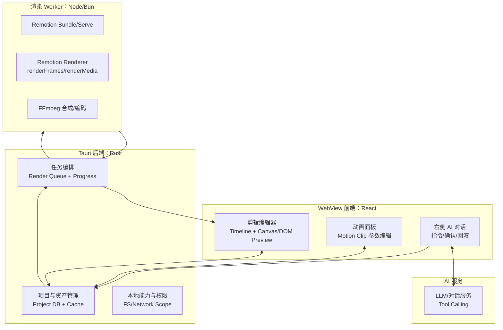
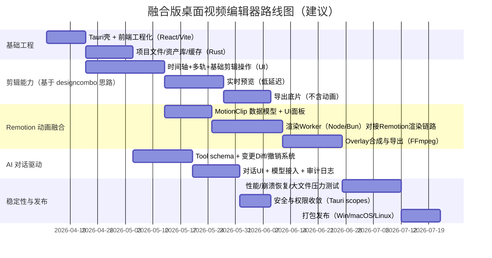

# Tauri + Rust 桌面端视频剪辑与 Remotion 动画融合应用工程方案

## 执行摘要

你要做的是一个 **桌面端（Tauri + Rust）“可视化视频剪辑 + 程序化动画（Remotion）+ 右侧 AI 对话驱动编辑与生成”** 的融合型 App。整体可行，但要“靠谱”地落地，关键在于把系统拆成三条稳定主链路，并在 MVP 阶段明确取舍：

- **编辑主链路（实时交互）**：以 `designcombo/react-video-editor` 这类 React 编辑器为核心，提供时间轴剪辑、多轨、转场/效果、实时预览与导出能力；该仓库 README 直接列出其特性：时间轴剪辑、效果与转场、多轨、导出选项、实时预览。citeturn46search0  
- **动画主链路（确定性渲染）**：以 Remotion 的“帧驱动渲染”作为动画表达与最终产出方式。Remotion 自述是用 React 编程方式创建视频；并且动画/集成层强调“所有动画必须由 `useCurrentFrame()` 驱动”。citeturn31view0turn41search6  
- **编排与系统能力（桌面端能力）**：以 Tauri 的 Rust 后端负责本地文件/缓存/长任务队列/权限隔离，并通过 WebView 承载 React UI。官方架构说明：Tauri 用 Rust + WebView（HTML）构建桌面应用，前端通过消息传递控制系统能力；Tauri 2 文档也明确提供 command 系统（web → Rust）并可配置权限/作用域。citeturn46search1turn46search17turn46search6  

**最重要的工程决策**是：  
- 在桌面 App 中，Remotion 的渲染端 `@remotion/renderer` 本质上运行在 Node/Bun 环境（包描述即如此），并且 `renderFrames()` 使用 Puppeteer、`stitchFramesToVideo()` 会组织 FFmpeg 命令并调用 `ffmpeg`。因此你需要一个可控的“渲染 Worker”（Node/Bun 侧）与 Rust 的任务编排层（或你未来完全自研替代）。citeturn36view1turn24search1turn37view3  
- 许可风险要提前纳入架构：Remotion 是“特殊许可证”，明确禁止“为销售/再许可你的衍生品而复制/修改 Remotion 代码”，并且免费许可的适用主体有规模限制；如果你打算把桌面 App 商业化出售/分发，必须把这一条当成 **产品级约束**。citeturn32view0turn31view0  

下面给出一个“工程上可落地”的融合方案：先做 **可控 MVP**（剪辑 + 动画片段插入 + 生成导出），再逐步演进到“剪辑与动画统一时间轴、统一预览与最终渲染”。

---

## 产品目标与用户流程

### 核心用户故事

1) 用户导入素材（视频/音频/图片），拖入时间轴完成剪辑（切分、裁剪、移动、对齐、多轨）。  
2) 用户在“动画轨道”插入一个 Remotion 动画片段（如标题条、转场动画、图表动画、字幕模板等），并可调参数。  
3) 用户在右侧 AI 对话框输入自然语言指令：  
- “把第 12 秒到 18 秒的片段剪掉，前后加一个淡入淡出。”  
- “给开头加一个 2 秒的标题动画：XX 公司年报。”  
- “把 BGM 降到 30%，旁白保持不变。”  
4) 预览无误后，一键导出（H.264 MP4 等），可选分辨率与帧率；导出在后台运行并显示进度。

### MVP 范围建议

MVP 必须与 `designcombo/react-video-editor` README 中声明的五项能力对齐：时间轴编辑、效果/转场、多轨、导出、实时预览。citeturn46search0  
此外，MVP 的“Remotion 动画融合”建议做成 **“动画片段（Motion Clip）”** 的概念：  
- Motion Clip 是一个可参数化模板（例如标题、角标、字幕条、LOGO 角落动画）。  
- UI 中它表现为时间轴上的一个片段（可拖动起止时间、可调整参数）。  
- 导出时通过 Remotion 渲染该片段（或渲染整段 overlay），再与底色视频合成。

---

## 融合架构总览

### 为什么推荐“分层 + Worker”的形态

- `designcombo/react-video-editor` 定位是在线 React 视频编辑器，并且其组织页面/仓库描述直接提到“using remotion”“Capcut and canva clone”，说明它本身就倾向“剪辑 UI + Remotion 渲染/表达”路线。citeturn46search2turn46search12  
- 但桌面端要“靠谱”，必须把 **交互预览** 与 **最终渲染** 分离：交互预览要求低延迟、允许近似；最终渲染要求确定性、可复现、资源完整。Remotion 的 renderer 文档与实现强调帧渲染（Puppeteer）与后续拼接（FFmpeg），天然更适合作为最终渲染/批处理。citeturn24search1turn37view3  
- Tauri 官方架构强调“WebView 前端 + Rust 后端 + 消息传递”，适合把耗时任务、文件 I/O、权限控制放到 Rust。citeturn46search1turn46search4  

### 推荐的系统框图



上述分层与通信契合 Tauri 的“Rust + WebView + 消息传递”模型；命令调用可通过 Tauri command 系统实现（前端调用 Rust）。citeturn46search1turn46search17  
Worker 侧之所以使用 Node/Bun，是因为 `@remotion/renderer` 的包描述即为“使用 Node.js 或 Bun 渲染 Remotion 视频”，且其渲染流程依赖 Puppeteer 与 FFmpeg。citeturn36view1turn24search1turn37view3  

### 三种“融合深度”路线对比

| 路线 | 预览体验 | 最终导出准确性 | 工程复杂度 | 推荐阶段 |
|---|---|---|---:|---|
| 分离式：剪辑引擎导出底片 + Remotion 渲染动画 overlay + FFmpeg 合成 | 好（剪辑预览快） | 高（Remotion 负责动画确定性） | 中 | **MVP 首选** |
| 一体式：把剪辑与动画都映射进一个 Remotion Composition，最终一次渲染输出 | 取决于你是否做“编辑态预览引擎” | 很高（单一真相） | 高 | 商用版/第二阶段 |
| 双引擎实时合成：编辑预览时实时叠加 Remotion Player/DOM 动画 | 最好 | 中-高（受预览引擎差异影响） | 很高 | 需要强交互时再做 |

MVP 建议走“分离式”，因为你能快速兑现 `designcombo/react-video-editor` 的时间轴剪辑特性，再把 Remotion 动画以 overlay 的形式引入，不必第一天就统一两套时间系统。citeturn46search0turn38search9  

---

## 数据模型与时间轴对齐策略

### 统一的时间基准：timeline time 与 frame time

- 编辑器通常以 **秒/毫秒**表达时间轴；  
- Remotion 的动画与渲染以 **帧号**为核心（`useCurrentFrame()` 驱动动画）。citeturn41search6turn12search0  

因此建议内部采用“双表示”但“单真相”策略：  
- **单真相**：项目存储以 `time_us`（微秒）为基础，避免多次换算累计误差。  
- **派生**：在需要 Remotion 驱动时，用 `frame = round(time_seconds * fps)` 得到帧号；在需要剪辑对齐时，frame 再反算 time 用于 UI 对齐（展示层可做吸附/对齐）。  

### Project 数据结构建议（可版本化、可回滚）

建议以一个稳定的 JSON Schema 做项目文件（`.dveproj`），核心实体：

- `Asset`: 本地媒体引用（路径、hash、时长、分辨率、音频采样率等）  
- `Track`: 多轨（video/audio/overlay/motion）  
- `Clip`: 剪辑片段（asset_id、in/out、timeline_start、speed、volume、transform）  
- `Effect`: 可选效果/转场（参数化）  
- `MotionClip`: 关键新增：Remotion 动画片段（composition_id、props_json、fps、duration、render_mode）  
- `RenderJob`: 渲染任务（状态、进度、输出路径、日志）

其中 “多轨支持/导出选项/实时预览” 要与 `designcombo/react-video-editor` 的 feature 集一致。citeturn46search0  

### MotionClip 的两种渲染语义

1) **Overlay 渲染**（推荐 MVP）  
- 对每个 MotionClip（或每条 motion track 的区间）调用 Remotion 渲染出一个中间视频（理想情况带 alpha；若 alpha 支持不在当前范围内则先不承诺：未指定），再用 FFmpeg 合成到底片上。  
- 优点：剪辑引擎与动画渲染完全解耦；失败隔离好。  
- 代价：中间文件多、磁盘占用与渲染耗时增加。

2) **全片渲染**（中后期演进）  
- 导出时将剪辑轨道（片段列表、裁切、变速、音量包络）作为 props 传给 Remotion Composition，由 Remotion 负责播放器/贴图/字幕/动画/合成，最后一次渲染输出。  
- 优点：单一渲染真相，导出一致性最好。  
- 代价：你需要在 Remotion composition 中实现一套“非线编播放逻辑”，复杂度显著提高（尤其是音频混音与视频随机访问）。

Remotion 的 SSR 文档概括了其“打包→渲染帧→拼接视频”的导出路径，很适合承接 Overlay 或全片渲染。citeturn38search9turn24search1turn24search3  

---

## AI 对话驱动的编辑与动画生成

### AI 交互原则：可解释、可回滚、可审计

右侧 AI 对话要“靠谱”，关键不在模型，而在 **约束 AI 的输出必须落到可验证的编辑操作（operations）**，并且每一步都能回滚：

- AI 不直接改工程文件，而是输出 `EditPlan`（结构化操作列表）。  
- App 执行 `EditPlan` 后生成 `Diff`（受影响的 clips/tracks/motionClips 列表 + 新旧区间），并在 UI 中可视化（高亮时间轴变化）。  
- 用户可一键“应用/撤销”。撤销基于 Project 版本链（event sourcing 或 snapshot）。  

### Tool Calling 设计：把 AI 变成“编辑器的指令编排器”

建议定义一组严格的工具（functions），让模型只能调用这些工具来实现剪辑与动画：

**剪辑类 tools（示例）**  
- `split_clip(track_id, clip_id, at_time_us)`  
- `trim_clip(clip_id, new_in_us, new_out_us)`  
- `move_clip(clip_id, new_timeline_start_us)`  
- `set_speed(clip_id, speed)`  
- `set_volume(clip_id, db)`  
- `add_transition(left_clip_id, right_clip_id, type, duration_us)`

**动画类 tools（示例）**  
- `add_motion_clip(track_id, composition_id, props_json, start_us, duration_us)`  
- `update_motion_props(motion_clip_id, patch_json)`  
- `render_motion_preview(motion_clip_id, frame_range)`（返回小图序列或低清 mp4 预览）

**渲染/导出 tools（示例）**  
- `enqueue_export(render_profile)`  
- `get_render_progress(job_id)`  
- `cancel_render(job_id)`

Tauri 2 的文档指出其 command 系统可以从 WebView 调用 Rust 命令，命令可接收参数、返回值、返回错误并可以 async；同时 Tauri 2.0 也强调权限/作用域系统可控制哪些 invoke 消息能触达命令函数。你应该把 AI 相关工具全部落到 Rust command 层做权限与参数校验，前端只做展示。citeturn46search17turn46search6  

### AI 生成“Remotion 动画”的工程化落点

不要让 AI 直接生成自由度极高的 React 代码并执行（难以审核/难以沙箱）。更“靠谱”的方式是：

- 预置一批 **Motion Template**（标题、字幕条、数据图表、LOGO 动画、转场），每个模板对应一个 composition_id 与可控 props schema（例如 `{title, subtitle, theme, enter_style, exit_style}`）。  
- AI 的职责是：选择模板 + 填充参数 + 放置到时间轴。  
- 如果未来要开放“AI 写代码生成模板”，建议放在“模板工坊”里，并有：静态检查、依赖白名单、渲染沙箱、签名与发布流程（这部分属于二期/三期能力）。

这一策略也符合 Remotion 官方关于“集成第三方动画需要同步 timing”的提醒：你把动画表达收敛在 Remotion 的 `useCurrentFrame()` 驱动范式内（模板内部遵循该范式），外部就只需要控制帧/时长与 props。citeturn41search6turn12search0  

---

## 工程里程碑、风险与工时估算

### 里程碑建议



该路线图的关键约束来自：  
- `designcombo/react-video-editor` 的编辑器能力边界（多轨/导出/实时预览等）；citeturn46search0turn46search12  
- Remotion 的渲染链路设计（Puppeteer 渲染帧 + FFmpeg 拼接）；citeturn24search1turn37view3turn38search9  
- Tauri 的架构与 command/权限模型。citeturn46search1turn46search17turn46search6  

### 主要工程风险与缓解措施

**渲染性能与资源占用风险（高）**  
- Remotion 渲染端会解析 concurrency，并在 `renderMedia()` 中基于可用内存判断是否启用并行编码；同时 `renderFrames()` 会打开浏览器、启动服务并并发渲染。桌面端若让用户“边编辑边导出”，容易出现内存尖峰与 UI 卡顿。citeturn23view0turn26view1  
缓解：  
- 后台渲染任务必须进入 Rust 的队列系统，严格限制并发（默认 concurrency=1，可在设置里调）。  
- 预览与导出分离：预览用轻量路径；导出走 Worker（可暂停/取消）。

**许可与分发风险（高）**  
- Remotion License：禁止为销售/再许可你的衍生品而复制/修改 Remotion 代码；并对免费许可适用对象做限制。桌面 App 若商业化分发，需要在商业模型与许可合规上做前置决策。citeturn32view0  
缓解：  
- 明确你的商业模式：是“内部工具”还是“对外售卖软件”。  
- 若要售卖且依赖 Remotion：尽早评估公司许可与合规路径；或走“自研动画渲染引擎”的替代路线（你上一轮需求的方向）。  

**安全与权限风险（中-高）**  
- Tauri 2.0 引入更完整权限/作用域体系，用于控制哪些前端 invoke 能触达后端 command。AI 对话功能会显著增加“批量操作系统能力”的风险面。citeturn46search6turn46search17  
缓解：  
- 所有 AI tool 最终映射为 Rust command，并在 Rust 层做参数校验、路径白名单、输出目录隔离。  
- 增加审计日志（每次 AI 操作记录 tool 调用与 diff）。

**剪辑与动画时间系统不一致（中）**  
- 编辑器以秒为基准，Remotion 以帧为基准并强调 useCurrentFrame 驱动动画。citeturn41search6turn12search0  
缓解：  
- 项目内部统一以微秒存储；导出时确定 fps 后一次性换算 frame，避免来回漂移。  
- 模板内部只依赖 frame（Remotion 范式），外部只管理起止时间与参数。

### 工时/人月粗中细估算（按 1人月≈20人日）

假设团队配置：  
- 2 名熟悉 React/视频编辑交互的前端工程师  
- 1 名熟悉 Rust/Tauri/多媒体管线（FFmpeg）的后端工程师  
- 目标质量：MVP 可商用试点（非大规模商业发行）；是否要强兼容 Remotion API：**不强兼容**（只做 MotionClip 模板层）  

| 模块 | 粗略（人日） | 详细（人日） | 含测试/文档（人日） | 备注 |
|---|---:|---:|---:|---|
| Tauri 壳 + 前后端通信（commands） | 8 | 12 | 16 | Tauri 架构与 command 系统是地基citeturn46search1turn46search17 |
| 资产管理/缓存/项目文件 | 10 | 18 | 25 | 大文件、hash、代理读取等 |
| 剪辑 UI：时间轴、多轨、基础操作 | 20 | 35 | 50 | 对齐 designcombo editor 的核心 feature 集citeturn46search0 |
| 实时预览管线 | 12 | 22 | 30 | 低延迟播放、对齐时间轴 |
| 导出底片（仅剪辑，不含动画） | 10 | 18 | 25 | FFmpeg/编码参数与平台差异 |
| MotionClip 模型 + UI 面板 | 10 | 18 | 24 | 动画模板参数化 |
| Remotion 渲染 Worker 对接（bundle/render/stitch） | 18 | 30 | 42 | 依赖 Puppeteer + FFmpeg 渲染链路citeturn24search1turn37view3turn38search9 |
| Overlay 合成与导出（动画叠加） | 12 | 22 | 30 | 若需要 alpha/色彩空间会更复杂（未指定） |
| AI 对话：工具协议 + diff/撤销 + UI | 18 | 30 | 45 | 必须做权限与审计citeturn46search6turn46search17 |
| 性能/稳定性/打包发布 | 12 | 20 | 30 | 三平台打包与崩溃恢复 |

**总计（MVP）**  
- 粗略：约 **130 人日 ≈ 6.5 人月**  
- 详细：约 **225 人日 ≈ 11.25 人月**  
- 含测试与文档：约 **317 人日 ≈ 15.9 人月**  

> 说明：之所以比一般 CRUD 桌面 App 大很多，是因为“视频/渲染”天然是系统工程：实时预览、长任务、编码兼容性、性能与稳定性会吞掉大量工程时间；并且 Remotion 的渲染链路涉及浏览器渲染与 FFmpeg 拼接。citeturn24search1turn37view3turn23view0  

---

### 建议的仓库结构（可直接落地）

```
app/
  src-tauri/                 # Rust 后端（资产库、任务队列、命令、权限）
  src/                       # React 前端（编辑器、时间轴、AI 对话）
  packages/
    editor-core/             # 时间轴数据结构、操作与撤销（纯TS，可单测）
    motion-templates/        # Remotion 模板集合（受控 props schema）
    render-worker/           # Node/Bun Worker：调用 Remotion bundler/renderer
  docs/
  tests/
```

其中 `render-worker` 的职责是把 Remotion 的“bundle → renderFrames/renderMedia → stitch”封装成一个稳定 RPC 服务；因为 Remotion renderer 本身就是为 Node/Bun 提供的渲染能力，并且 `renderFrames()` 与 `stitchFramesToVideo()` 的职责边界非常清晰。citeturn36view1turn24search1turn24search3turn37view3