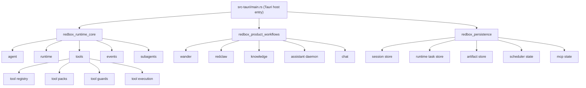

# RedBox Rust Runtime 升级计划

## 1. 文档目标

这份文档用于把当前 `RedBox`/`RedBox` 的 Rust 宿主，升级成一套更接近“可复用 AI 内核”的结构。

它不是 Electron -> Tauri 的迁移文档。
那条迁移线已经基本完成。

这份文档关注的是下一阶段：

- 如何把当前 `src-tauri/src/main.rs` 中偏“单文件宿主编排”的 AI/runtime 能力，重构成更清晰、更稳定、更适合并行 agent 和长期任务的 Rust 内核。
- 如何吸收 `aionrs` 这类更成熟 Rust agent runtime 的分层经验，同时保留 RedBox 现有的产品能力。

---

## 2. 当前判断

### 2.1 当前 RedBox 的优势

当前 Rust 宿主已经具备明显的产品化能力：

- `chat / runtime / sessions / tasks / background` 已有真实路由和本地状态。
- `wander / redclaw / assistant daemon / mcp / workboard / knowledge` 已经进入 Rust 宿主。
- 已经有：
  - runtime task
  - graph
  - checkpoints
  - traces
  - scheduled task
  - long-cycle task
  - artifact 落盘
  - 工作项联动

这些都是很强的产品工作流基础。

### 2.2 当前 RedBox 的问题

当前 AI/runtime 内核仍然偏“软编排”：

- 大量逻辑集中在单个 [main.rs](/Users/Jam/LocalDev/GitHub/RedConvert/RedBox/src-tauri/src/main.rs)
- `intent / role / graph / orchestration / artifacts` 大量依赖 `serde_json::Value`
- runtime、tool runtime、task runtime、MCP runtime 没有清晰分层
- subagent 更像 prompt 角色模拟，而不是真实 child runtime
- 工具系统此前偏碎片化，最近才开始收敛到 `redbox_app_query / redbox_fs`

### 2.3 为什么要升级

后续目标已经不是“一个 AI 对话窗口”，而是：

- 多 agent 并行
- 常驻热启动 agent
- 可恢复长任务
- 更强的 reviewer / repair / save-artifact 管线
- 更可治理的工具权限和 tool pack
- 更稳定的前端事件与 runtime 状态联动

这要求底层必须从“能跑”升级到“可维护、可扩展、可验证”。

---

## 3. 升级原则

本次升级遵守这些原则：

1. 保留现有产品能力，不推倒重来  
   目标是重构内核，不是重写产品。

2. 先拆分内核，再重做长任务  
   如果没有统一 runtime 内核，scheduler/long-task 只会从一个大文件搬到另一个大文件。

3. 强类型替代 `Value` 驱动  
   尤其是 runtime route、graph、checkpoint、artifact、tool result、subagent output。

4. 少量通用工具，按 mode 最小暴露  
   继续沿最近的收敛方向推进，不回到“注入一堆碎工具”的老路。

5. 运行时事件先统一，再优化 UI  
   前端应该消费稳定协议流，而不是不断为后端实现细节打补丁。

6. 所有关键阶段都必须可验证  
   每一阶段都要有明确的完成标准和验收方法。

---

## 4. 目标架构

目标不是把 `aionrs` 整个搬进来，而是形成这样的结构：

```text
RedBox App
  ├─ Product Workflows
  │   ├─ Wander
  │   ├─ RedClaw
  │   ├─ Knowledge
  │   ├─ Assistant Daemon
  │   └─ Workboard / Background
  │
  ├─ Runtime Orchestration Layer
  │   ├─ Agent Runtime
  │   ├─ Task Runtime
  │   ├─ Subagent Runtime
  │   ├─ Artifact Pipeline
  │   └─ Event / Trace / Checkpoint
  │
  ├─ Tool Layer
  │   ├─ Tool Registry
  │   ├─ Tool Pack Resolver
  │   ├─ Approval / Guard / Concurrency
  │   ├─ MCP Bridge
  │   └─ Skill Runtime
  │
  └─ Infra Layer
      ├─ LLM Provider Adapters
      ├─ Session Store
      ├─ Scheduler / Long Task Runtime
      ├─ Persistence
      └─ Observability
```

一句话概括：

- `aionrs` 的价值：交互式 agent 内核分层
- RedBox 的价值：任务编排和产品工作流

最终目标是把两者合起来，而不是二选一。

---

## 5. 分阶段计划

## 阶段 1：拆出统一 Runtime Core

### 目标

把当前分散在 `main.rs` 里的 runtime 关键路径拆出来，形成统一内核。

### 要做什么

新增 Rust 模块或 crate：

- `runtime/agent_engine.rs`
- `runtime/task_runtime.rs`
- `runtime/session_runtime.rs`
- `runtime/types.rs`
- `runtime/events.rs`

首先抽离这些核心类型：

- `RuntimeMode`
- `IntentRoute`
- `RuntimeRole`
- `RuntimeTask`
- `RuntimeGraph`
- `RuntimeNode`
- `RuntimeCheckpoint`
- `RuntimeArtifact`
- `RuntimeTrace`
- `PreparedExecution`

### 当前痛点

目前这些信息大量是：

- `json!({...})`
- `Value`
- 主流程内临时拼装

这会导致：

- 不容易复用
- 不容易验证
- 不容易做 reviewer / repair / save-artifact 的一致性规则

### 交付件

- 独立 runtime core 模块
- `main.rs` 只保留调用入口，不再承载完整 agent/task 逻辑
- `runtime:*` / `tasks:*` / `sessions:*` 改为调用统一 runtime core

### 验收标准

- `runtime:query`
- `tasks:create`
- `tasks:resume`
- `runtime:get-trace`
- `runtime:get-checkpoints`

都通过新的 runtime core 运行，不再直接在 `main.rs` 内部拼 JSON。

---

## 阶段 2：建立 Tool Registry + Tool Pack

### 目标

把当前 `RedBox` 里刚开始收敛的工具层，正式提升为可治理工具系统。

### 要做什么

建立类似 `desktop` 的抽象：

- `ToolKind`
- `ToolDefinition`
- `ToolRegistry`
- `ToolPack`
- `ToolGuard`
- `ToolApprovalPolicy`
- `ToolResultBudget`

建议的 pack：

- `wander`
- `chatroom`
- `knowledge`
- `redclaw`
- `background-maintenance`
- `diagnostics`

### 当前基础

当前已经有好的收敛方向：

- `redbox_app_query`
- `redbox_fs`

这一阶段不是反向拆碎，而是继续做：

- descriptor 化
- pack 化
- kind 化
- guard 化

### 推荐工具结构

优先保留“少量通用工具”：

- `redbox_app_query`
- `redbox_fs`
- `redbox_mcp`
- `redbox_skill`
- `redbox_runtime_control`

而不是回到：

- `redbox_list_spaces`
- `redbox_list_advisors`
- `redbox_list_work_items`
- `redbox_list_chat_sessions`
- 一堆点状 list/search 工具

### 交付件

- `tools/catalog.rs`
- `tools/registry.rs`
- `tools/packs.rs`
- `tools/guards.rs`

### 验收标准

- runtime 根据 `runtimeMode` 选择 pack
- prompt 中只展示当前 pack 可用工具
- 每个工具都能标注：
  - kind
  - requires approval
  - concurrency-safe
  - output budget

---

## 阶段 3：统一 Agent Engine

### 目标

让 `chat / wander / knowledge / redclaw / assistant daemon` 共用同一条 agent 执行内核。

### 要做什么

新增：

- `agent/engine.rs`
- `agent/provider.rs`
- `agent/loop.rs`
- `agent/context.rs`

统一处理：

- provider 调用
- stream / chunk / thought / tool_call / tool_result
- usage / timeout / cancel
- session transcript
- checkpoint
- runtime event

### 当前问题

现在这些路径仍然不完全统一：

- `generate_chat_response`
- `execute_chat_exchange`
- `run_openai_interactive_chat_runtime`
- wander 特化路径
- redclaw 特化路径

### 目标状态

未来应只有一种核心 agent loop：

- 输入：
  - runtime mode
  - task/session
  - system prompt
  - tool pack
- 输出：
  - stream events
  - checkpoints
  - final response
  - tool results

### 验收标准

以下功能必须共享同一条核心 agent 执行循环：

- 聊天
- 漫步
- RedClaw 单轮运行
- knowledge 深度问答
- assistant daemon 收到 webhook 后的回复

---

## 阶段 4：把 Subagent 从角色模拟升级成真实 Child Runtime

### 目标

当前所谓 subagent 主要还是 prompt 角色模拟。要把它升级为真正独立的 child runtime。

### 要做什么

新增：

- `subagents/spawner.rs`
- `subagents/types.rs`
- `subagents/policy.rs`

支持：

- `SubAgentConfig`
- `ForkOverrides`
- `allowed_tools`
- `model override`
- `reasoning effort override`
- `parallel spawn`
- `child trace / child checkpoints`

### 当前问题

现在的 `planner / researcher / reviewer` 更像：

- prompt 分角色
- 顺序输出 JSON

而不是：

- 独立 session
- 独立 tool boundary
- 独立 runtime

### 验收标准

subagent 必须具备：

- 独立 task id
- 独立 tool pack
- 独立 trace
- 可并行执行
- 父任务可汇总子任务结果

---

## 阶段 5：建立 Skill Runtime

### 目标

把“读技能文件给模型看”升级成真正的运行时技能系统。

### 要做什么

新增：

- `skills/loader.rs`
- `skills/runtime.rs`
- `skills/hooks.rs`
- `skills/permissions.rs`
- `skills/watcher.rs`

### 能力目标

- skill discovery
- skill metadata
- skill permission boundary
- inline skill
- forked skill
- hook injection
- prompt/context modifier
- 热更新

### 当前问题

现在 skill 更像：

- 文件读取器
- prompt 拼接器

还不是：

- 运行时能力层

### 验收标准

- skill 可以以统一格式被加载
- runtime 可以基于 skill metadata 决定是否启用
- skill 可以修改 context / prompt / tool pack
- skill 变更后支持重新发现

---

## 阶段 6：重构 MCP Runtime

### 目标

从“每次调用临时初始化”升级到“长连接、多次调用、资源能力统一管理”。

### 要做什么

新增：

- `mcp/manager.rs`
- `mcp/session.rs`
- `mcp/transport.rs`
- `mcp/resources.rs`

### 当前问题

现在 MCP 已可用，但还偏：

- 每次 call 独立握手
- 调用型而非运行时型

这不适合长期任务和多 agent 并行。

### 目标状态

- 一次初始化
- 多次调用
- 统一 tools/resources 能力
- 持续状态可见

### 验收标准

- MCP server 初始化后可复用
- 同一 server 在多个任务间复用连接
- runtime 能直接通过 MCP manager 调工具/资源

---

## 阶段 7：建立真正的 Long Task / Scheduler Runtime

### 目标

把现有 `scheduled_tasks`、`long_cycle_tasks` 从“产品字段 + runner tick”升级成真正可恢复的长期任务系统。

### 当前实现暴露出的结构问题

从当前代码看，这一层还停留在：

- 调度线程直接扫描 `scheduled_tasks / long_cycle_tasks`
- 到期后直接调用 `execute_redclaw_run(...)`
- 执行状态主要回写到任务字段本身
- `background-tasks:list` 仍然是从产品字段派生的展示层数据

这说明现阶段最大问题不是“模块数量不够”，而是：

- 调度定义和执行实例没有分离
- 长任务状态和 UI 展示状态没有统一底座
- 失败 / 重试 / cancel / resume 还没有共享状态机
- app 重启恢复只能恢复“配置”，不能恢复“执行中的实例”

### 要做什么

新增：

- `scheduler/job_runtime.rs`
- `scheduler/lease.rs`
- `scheduler/heartbeat.rs`
- `scheduler/retry.rs`
- `scheduler/dead_letter.rs`

### 这部分不要照搬 `aionrs`

这部分是 RedBox 自己的产品优势，不能简单照抄 agent 框架。

要保留和强化：

- scheduled task
- long-cycle task
- maintenance task
- review / approval hold
- artifact save / retry
- cancel / resume

### 第七步还可以继续优化的方向

这里建议收紧实现目标，不要一开始就把第七步写成一个“大而全的新系统”。

更合理的优化方式是：

1. 先统一 `Job Definition` 和 `Job Execution`

- `scheduled_tasks` / `long_cycle_tasks` 保留为产品输入层
- 新增统一 `job_definitions`
- 新增统一 `job_executions`
- 调度器只负责“生成 execution”，不直接承担完整执行语义

这样后面：

- retry
- resume
- dead-letter
- heartbeat

都会落在 execution 层，而不是继续污染产品字段。

2. 先做单机正确性，再做 lease

`lease.rs` 有必要，但不应该是第七步最先落地的东西。

当前是桌面端单宿主为主，真正更急的是：

- 任务执行实例可恢复
- 状态转换可验证
- 重启后不会重复跑错

所以建议先做：

- execution state machine
- persisted execution record
- scheduler enqueue / dispatch

再做：

- multi-owner lease
- worker 抢占
- 分布式/多实例互斥

否则会把大量复杂度前置，但并不能先解决今天最痛的稳定性问题。

3. `heartbeat` 不要单独抽象成孤立能力

heartbeat 最好只是 execution 的一个字段族，而不是第一个独立子系统。

建议 execution 统一持有：

- `started_at`
- `last_heartbeat_at`
- `heartbeat_timeout_ms`
- `attempt_count`
- `worker_id`
- `worker_state`

然后 heartbeat runner 只是定期更新 execution。

这样比“先做一个 heartbeat 模块，再回头接任务系统”更稳。

4. `dead-letter` 先做成终态，不要先做复杂队列

这一步最容易过度设计。

第一版只需要：

- execution 进入 `dead_lettered`
- 保留失败原因、最后 checkpoint、最后 artifact、最后输入
- UI 可查看、可手动 retry、可归档

不需要一开始就引入复杂的 dead-letter queue 管理器。

5. `background-tasks:list` 不要继续用派生假数据

现在后台任务面板还是从产品字段“推导出来”的。

第七步应该改成：

- 优先展示真实 execution
- definition 只作为来源信息
- UI 读到的是 `job execution snapshot`

否则前端看到的“后台任务”仍然不是真执行器，只是配置镜像。

6. `scheduled task` 和 `long-cycle task` 的差异应该下沉到 trigger / progression，而不是两套执行器

建议抽象为：

- `JobTrigger`
  - interval
  - daily
  - weekly
  - once
- `JobProgression`
  - single_run
  - multi_round
  - maintenance

这样第七步不会变成“两套 scheduler 逻辑 + 两套恢复逻辑 + 两套 retry 逻辑”。

7. `cancel / resume / retry` 应该统一走 execution transition

不要继续出现：

- scheduled task 有自己的 cancel
- long-cycle task 有自己的 cancel
- runtime task 再有一套 cancel

第七步真正优化后，应该统一成：

- `queued -> leased -> running -> succeeded`
- `running -> failed -> retrying`
- `running -> cancelled`
- `failed -> dead_lettered`
- `cancelled/failed -> resumed`

这会直接降低后续前端、日志、运维面板、trace 面板的复杂度。

### 更推荐的第七步拆法

建议把阶段 7 再拆成 4 个小阶段：

#### 7A：统一 Job 数据模型

- 定义 `job_definition`
- 定义 `job_execution`
- 定义统一状态机
- 把现有 `scheduled_tasks / long_cycle_tasks` 映射到 definition 层

#### 7B：调度器只负责 enqueue

- 到期后生成 execution
- 避免 scheduler 线程直接执行模型调用
- execution runner 单独消费 queued execution

#### 7C：补 heartbeat / retry / resume

- execution 有 heartbeat
- execution 可重试
- app 重启可恢复 running / retrying / queued execution

#### 7D：补 dead-letter 与后台面板

- 背景任务面板改读真实 execution
- 失败 execution 可进入 dead-letter
- 提供 retry / inspect / archive

### 推荐的数据模型草案

建议第七步至少先稳定这 3 个核心实体：

#### `job_definition`

用途：描述“这个长期任务是什么、何时触发、属于谁”。

建议字段：

- `id`
- `kind`
  - `scheduled`
  - `long_cycle`
  - `maintenance`
- `title`
- `enabled`
- `owner_context_id`
- `runtime_mode`
- `trigger`
  - `interval`
  - `daily`
  - `weekly`
  - `once`
- `progression`
  - `single_run`
  - `multi_round`
  - `maintenance`
- `payload`
  - prompt / objective / stepPrompt / config snapshot
- `next_due_at`
- `last_enqueued_at`
- `created_at`
- `updated_at`

#### `job_execution`

用途：描述“某一次实际执行实例”。

建议字段：

- `id`
- `definition_id`
- `status`
  - `queued`
  - `leased`
  - `running`
  - `retrying`
  - `succeeded`
  - `failed`
  - `cancelled`
  - `dead_lettered`
- `attempt_count`
- `worker_id`
- `worker_mode`
- `session_id`
- `runtime_task_id`
- `started_at`
- `last_heartbeat_at`
- `heartbeat_timeout_ms`
- `completed_at`
- `last_error`
- `input_snapshot`
- `output_summary`
- `artifacts`
- `checkpoints`
- `created_at`
- `updated_at`

#### `job_dead_letter`

用途：第一版可以只是 execution 的终态视图，不一定单独建表。

如果后面单独拆实体，建议至少保留：

- `execution_id`
- `definition_id`
- `final_error`
- `last_checkpoint`
- `last_artifacts`
- `attempt_count`
- `dead_lettered_at`

### 推荐的状态机约束

建议明确只允许这些状态转移：

- `queued -> leased`
- `leased -> running`
- `running -> succeeded`
- `running -> failed`
- `running -> cancelled`
- `failed -> retrying`
- `retrying -> queued`
- `failed -> dead_lettered`
- `cancelled -> queued`

建议明确禁止这些转移：

- `succeeded -> running`
- `dead_lettered -> running`
- `queued -> succeeded`
- `leased -> succeeded`

这样做的意义是：

- 后台面板显示逻辑会稳定
- retry/resume/cancel 不会各写一套 if/else
- 测试可以直接围绕状态迁移矩阵写

### Scheduler 与 Runner 的职责边界

第七步最值得继续优化的一个点，就是不要把 scheduler 和 runner 混在一起。

建议明确：

#### Scheduler 负责

- 扫描 definition 是否到期
- 生成 execution
- 更新 `next_due_at`
- 避免重复 enqueue

#### Runner 负责

- 消费 `queued execution`
- 创建 session / runtime task
- 发 heartbeat
- 写 checkpoint / artifact
- 更新 execution 终态

#### UI / Query Layer 负责

- 把 execution 聚合成后台任务视图
- 把 definition 聚合成任务配置视图

这样第七步会天然形成 3 层，而不是继续堆在一个 tick 线程里。

### 旧字段到新结构的兼容切换顺序

建议按下面顺序切，不要一步替换：

1. 保留现有 `scheduled_tasks / long_cycle_tasks` 作为输入源
2. 新增 `job_definitions / job_executions`
3. 后台 tick 先只负责从旧字段同步 definition
4. enqueue 改成写 execution，而不是直接 `execute_redclaw_run`
5. UI 的 `background-tasks:list` 先双读，优先 execution，没有再 fallback 旧字段
6. execution 路径稳定后，再把旧字段降级为纯产品配置层

这样可以避免：

- 一次性 cutover 造成后台功能失效
- 升级期间用户已有定时任务丢失
- 前端后台任务面板突然读不到数据

### 与当前代码直接对应的改造优先级

结合当前实现，建议第七步不要平均用力，而是按下面顺序打：

1. 先替换 [`run_redclaw_scheduler`](/Users/Jam/LocalDev/GitHub/RedConvert/RedBox/src-tauri/src/main.rs#L11884)
原因：这里现在既在做调度，也在做执行。

2. 再替换 [`derived_background_tasks`](/Users/Jam/LocalDev/GitHub/RedConvert/RedBox/src-tauri/src/main.rs#L6424)
原因：这里现在还是把产品字段伪装成后台执行态。

3. 最后统一 `background-tasks:cancel` 和 `runner-*` 手动执行入口
原因：cancel / run-now / long-cycle-now 这些入口最后都应该落到 execution transition，而不是直接改产品字段。

### 第七步的非目标

为了避免范围失控，建议明确这一步先不做：

- 多进程 / 多机器抢占式 lease
- 复杂 dead-letter queue 管理后台
- 优先级调度器
- execution 并发配额系统
- 通用工作流 DSL

这些都不是当前瓶颈。
第七步第一目标仍然是：

- 正确
- 可恢复
- 可观察
- 可迁移

### 推荐的第七步验收拆解

建议不要只保留总验收标准，再补一层子验收：

#### 7A 验收

- 能从旧 `scheduled_tasks / long_cycle_tasks` 生成统一 definition
- 新 definition 能完整表达触发规则和执行模式

#### 7B 验收

- 到期任务只 enqueue execution，不直接执行模型调用
- 同一 due window 不会重复 enqueue 多个 execution

#### 7C 验收

- running execution 有 heartbeat
- app 重启后 queued / running / retrying execution 可恢复
- retry 次数与失败原因可追踪

#### 7D 验收

- 后台任务页优先展示真实 execution
- failed execution 可 inspect / retry
- dead-lettered execution 可见且可归档

### 这样优化后的好处

- 第七步风险更小
- 不会把“执行实例”和“产品配置”继续混在一起
- 第八步事件协议会更容易统一
- 第九步测试也能直接围绕 execution state machine 写

一句话总结：

第七步最该优化的，不是“再多加几个模块”，而是先把它从“runner tick 驱动产品字段”改成“definition + execution 驱动的长期任务运行时”。

### 验收标准

- 任务可恢复
- 任务有 heartbeat
- 任务可重试
- 任务可取消
- 任务失败可进入 dead-letter
- app 重启后能恢复关键长期任务状态

---

## 阶段 8：统一 Runtime Event Protocol

### 目标

让前端不再耦合每条 agent 实现细节，而是消费统一 runtime 协议流。

### 统一事件建议

- `runtime:stream-start`
- `runtime:text-delta`
- `runtime:thinking`
- `runtime:tool-start`
- `runtime:tool-update`
- `runtime:tool-end`
- `runtime:checkpoint`
- `runtime:artifact-saved`
- `runtime:task-node-changed`
- `runtime:subagent-started`
- `runtime:subagent-finished`
- `runtime:done`
- `runtime:error`

### 当前问题

现在很多前端页面仍然要知道：

- 具体 page 的自定义事件名
- 某条链是不是发 `wander:progress`
- 另一条链是不是发 `chat:tool-start`

这样会让前端越来越多条件分支。

### 验收标准

- `Chat / Wander / RedClaw / Settings Runtime Panel`
  能统一消费 runtime 事件
- 页面只对 UI 展示做差异化，不对事件协议做硬分叉

---

## 阶段 9：测试与可观测性

### 目标

让 runtime 升级具备可持续验证能力。

### 要做什么

至少建立这些测试：

- `agent_engine_test`
- `tool_registry_test`
- `tool_pack_test`
- `subagent_spawn_test`
- `mcp_runtime_test`
- `scheduler_resume_test`
- `artifact_pipeline_test`
- `wander_runtime_test`
- `redclaw_long_task_test`

### 必须具备的日志能力

建议统一加：

- runtime timing
- turn timing
- tool timing
- model request timing
- checkpoint save timing
- artifact save timing
- scheduler tick timing

### 验收标准

- 关键链路出现慢点时，能在日志里快速定位
- 不再依赖前端肉眼猜测“为什么卡在初始化”

---

## 6. 推荐执行顺序

不要并行重写所有东西。

推荐顺序：

1. 阶段 1：Runtime Core
2. 阶段 2：Tool Registry / Tool Pack
3. 阶段 3：Agent Engine
4. 阶段 4：Subagent Runtime
5. 阶段 5：Skill Runtime
6. 阶段 6：MCP Runtime
7. 阶段 7：Long Task / Scheduler Runtime
8. 阶段 8：Runtime Event Protocol
9. 阶段 9：Tests / Observability

原因很简单：

- 没有统一 runtime core，后面所有层都会继续耦合
- 没有 tool pack，subagent 和 skill 都没有边界
- 没有统一 agent engine，wander/chat/redclaw 会继续各写一套

---

## 7. 里程碑定义

### M1：内核拆层完成

完成后：

- `main.rs` 不再承担核心 runtime 编排
- runtime/task/session 类型基本强类型化

### M2：工具系统统一

完成后：

- 运行时只暴露少量通用工具
- 各 mode 通过 pack 选工具

### M3：统一 Agent Engine 上线

完成后：

- chat / wander / redclaw / knowledge 共用 agent loop

### M4：真实 Subagent 上线

完成后：

- 子代理不是 prompt 角色模拟
- 而是真正 child runtime

### M5：长期任务系统稳定

完成后：

- redclaw / maintenance / long-cycle task 有真正 scheduler/runtime

---

## 8. 风险与注意事项

### 风险 1：过早重写 scheduler

如果在 runtime core 未统一之前先重做 scheduler，只会把复杂度搬家。

### 风险 2：把工具重新拆碎

最近已经开始向 `redbox_app_query / redbox_fs` 收敛，这是对的。
不要为了“更像旧版”重新回到大量点状工具。

### 风险 3：subagent 只做 prompt 分角色

这会继续让“subagent”停留在表面概念，无法支撑并行 agent 和真正隔离执行。

### 风险 4：前端先于协议统一

如果先大改 UI，而 runtime event protocol 还没统一，前端会继续绑定后端细节。

---

## 9. 当前建议

如果现在就开始做，最有价值的第一批工作是：

1. 抽 `runtime core`
2. 抽 `tool registry / tool pack`
3. 让 `wander / chat / redclaw` 三条主链统一到同一 agent engine

这三件事做完后，后面的：

- subagent
- skill
- mcp
- long task
- scheduler

才有稳定基础。

---

## 10. 一句话结论

推荐的升级路径不是“照抄 `aionrs`”，而是：

**用 `aionrs` 的方式重建 RedBox 的 AI 内核分层，再把 RedBox 现有的长期任务和产品工作流架在这个内核之上。**

---

## 11. 模块拆分图

这一节的目标不是一次性把代码库拆成很多 crate，而是先给出稳定边界。

优先边界如下：



### 11.1 第一阶段模块映射

第一阶段先不要做太大跨度 crate 化。先在 `src-tauri/src/` 下拆出模块：

- `runtime/`
- `agent/`
- `tools/`
- `subagents/`
- `scheduler/`
- `events/`
- `persistence/`
- `workflows/`

### 11.2 主机入口保留职责

`main.rs` 只保留这些职责：

- Tauri command 注册
- app state 初始化
- runtime service 预热
- scheduler service 启停
- window / event bridge

不再承担：

- agent loop
- task orchestration
- tool execution 细节
- MCP transport 细节
- artifact 保存策略

### 11.3 产品工作流层保留职责

`wander / redclaw / knowledge / assistant daemon / chat` 这些模块只负责：

- 组装业务输入
- 选择 runtime mode / tool pack
- 选择 artifact 策略
- 解释业务结果

不再自己拥有一套 agent loop。

---

## 12. 建议的 crate / 目录规划

下面不是要求一次性建完，而是建议的最终收敛形态。

### 12.1 近阶段目录规划

建议先做 workspace 内部模块化，不着急拆 crate：

```text
src-tauri/src/
  main.rs
  app/
    state.rs
    bootstrap.rs
    commands.rs
  agent/
    engine.rs
    loop.rs
    provider.rs
    context.rs
    turn.rs
  runtime/
    types.rs
    task_runtime.rs
    session_runtime.rs
    route.rs
    checkpoints.rs
    artifacts.rs
    traces.rs
  tools/
    mod.rs
    catalog.rs
    registry.rs
    packs.rs
    guards.rs
    app_query.rs
    fs.rs
    mcp.rs
    skill.rs
  subagents/
    types.rs
    spawner.rs
    policy.rs
    aggregation.rs
  scheduler/
    job_runtime.rs
    lease.rs
    heartbeat.rs
    retry.rs
    maintenance.rs
  mcp/
    manager.rs
    transport.rs
    session.rs
    resources.rs
  skills/
    loader.rs
    runtime.rs
    hooks.rs
    permissions.rs
    watcher.rs
  events/
    protocol.rs
    emitter.rs
  persistence/
    sessions.rs
    tasks.rs
    artifacts.rs
    scheduler.rs
    settings.rs
  workflows/
    wander.rs
    redclaw.rs
    knowledge.rs
    chat.rs
    assistant.rs
```

### 12.2 中阶段 crate 规划

当模块边界稳定后，再考虑拆成 crate：

```text
crates/
  redbox-runtime-core
  redbox-agent
  redbox-tools
  redbox-subagents
  redbox-mcp
  redbox-skills
  redbox-scheduler
  redbox-events
  redbox-persistence
```

### 12.3 crate 之间的依赖约束

建议遵守这些约束：

- `redbox-product-workflows` 依赖 `runtime-core`，反过来不允许
- `redbox-agent` 依赖 `redbox-tools`，反过来不允许
- `redbox-scheduler` 依赖 `runtime-core` 和 `persistence`，不直接依赖 UI/workflow
- `redbox-events` 只定义协议，不依赖 workflow
- `redbox-mcp` 通过 `tools` 接入，不直接侵入业务工作流

### 12.4 不建议的拆分方式

不要按页面拆 crate：

- `wander-crate`
- `chat-crate`
- `redclaw-crate`

如果这样拆，runtime 内核会再次重复。

---

## 13. 第一阶段实施清单

第一阶段不是“开始重构一点点”，而是要明确哪些事情做了，才算真正开工成功。

### 13.1 目标范围

第一阶段只聚焦：

- runtime core
- 强类型 runtime 模型
- `main.rs` 责任收缩

### 13.2 任务清单

#### A. 类型抽离

- 定义 `RuntimeMode`
- 定义 `RuntimeRole`
- 定义 `IntentRoute`
- 定义 `RuntimeTaskRecord`
- 定义 `RuntimeGraph`
- 定义 `RuntimeNodeState`
- 定义 `RuntimeCheckpointRecord`
- 定义 `RuntimeArtifactRecord`
- 定义 `RuntimeTraceRecord`
- 定义 `PreparedExecution`

#### B. 存量 JSON 清点

需要先清点现有 `main.rs` 中的这些 JSON 入口：

- `tasks:create`
- `tasks:resume`
- `runtime:query`
- `wander:brainstorm`
- `redclaw:*`
- `memory:maintenance-run`

对每个入口做一张表：

- 当前输入 JSON 结构
- 当前输出 JSON 结构
- 新的强类型结构名
- 是否允许保留兼容字段

#### C. 运行路径抽离

把这些函数迁出 `main.rs`：

- route 相关
- graph 相关
- checkpoint 相关
- artifact 相关
- task trace 相关

迁出后 `main.rs` 只保留 command entry。

#### D. 行为锁定

在重构前，先补最小回归验证：

- `wander` 能创建 task / session / history
- `tasks:create` 能生成 route / graph
- `tasks:resume` 能写 checkpoints / artifacts
- `runtime:query` 能产出 stream events / final response

这里不一定先写完整自动化测试，但至少要有脚本化 smoke。

### 13.3 第一阶段完成标准

满足以下条件才算阶段完成：

- `main.rs` 中不再出现大段 runtime graph JSON 拼装
- runtime 核心类型全部有 Rust struct/enum
- 至少 `tasks:create`、`tasks:resume`、`runtime:query` 走统一类型层
- 现有前端页面无需改协议即可继续运行

### 13.4 第一阶段不做什么

刻意不做：

- 不先重写 scheduler
- 不先引入真实 subagent
- 不先重做 MCP manager
- 不先大改前端 runtime 面板

否则范围会失控。

---

## 14. 迁移期兼容策略

这一节很重要。因为 RedBox 现在已经是可运行产品，不是空白框架。

### 14.1 双轨策略

在阶段 1-3 期间，建议使用“双轨切换”：

- `legacy path`
- `new runtime path`

由内部 feature flag 或 mode flag 控制。

例如：

- `wander` 先切到新 runtime core
- `chat` 稳定后再切
- `redclaw` 最后切 scheduler 关联路径

### 14.2 协议兼容原则

前端协议短期内尽量不变：

- 不要一边重构后端，一边重写所有页面事件消费
- 后端新 runtime 内部可以强类型化
- 对外 IPC 和 event payload 先做适配层

这样可以把风险集中在内核，不把 UI 一起拖进来。

### 14.3 数据兼容原则

以下数据结构迁移时要保守：

- `runtime_task_traces`
- `task.checkpoints`
- `task.artifacts`
- `session_tool_results`
- `redclaw_state`
- `memory maintenance status`

建议：

- 新结构写入时保留旧字段镜像
- 至少一个版本内保留向后兼容读取

### 14.4 回滚策略

每一阶段都应该能回滚到：

- 旧 command handler
- 旧 runtime execution path

回滚条件要提前写清楚：

- 新路径导致 wander/chat/redclaw 任一主链不可用
- runtime event 丢失
- task 恢复失败
- artifact 保存错位

### 14.5 可观测性先行

在切换任一路径前，先确保这些 timing 已经存在：

- route timing
- prompt build timing
- model request timing
- tool call timing
- checkpoint save timing
- artifact save timing
- scheduler tick timing

没有这些日志，就不要切主链。

---

## 15. 第二批文档建议

如果这份文档要继续往下细化，建议拆成三份子文档：

1. `runtime-core-prd.md`
- 描述 runtime core 目标、边界、输入输出

2. `runtime-core-checklist.md`
- 按函数/模块列出第一阶段实施清单

3. `crate-layout-proposal.md`
- 只讨论 crate 拆分和依赖方向

这样后续实施和 review 会更清晰。
