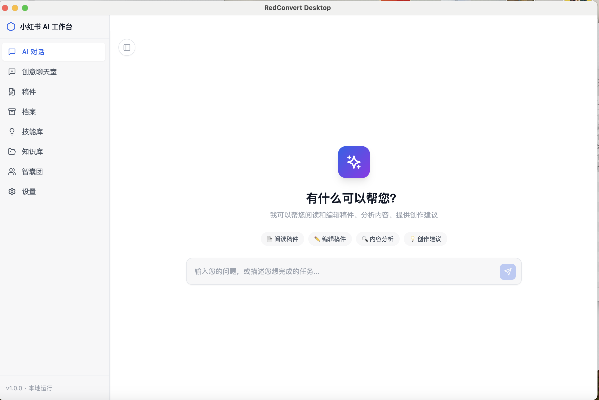
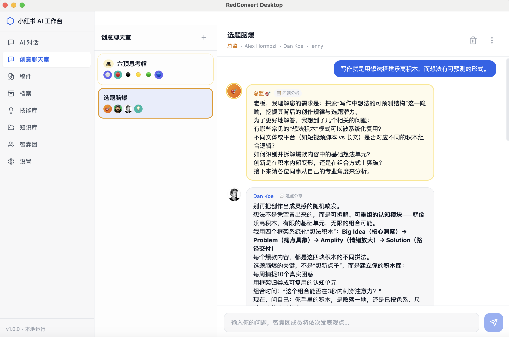
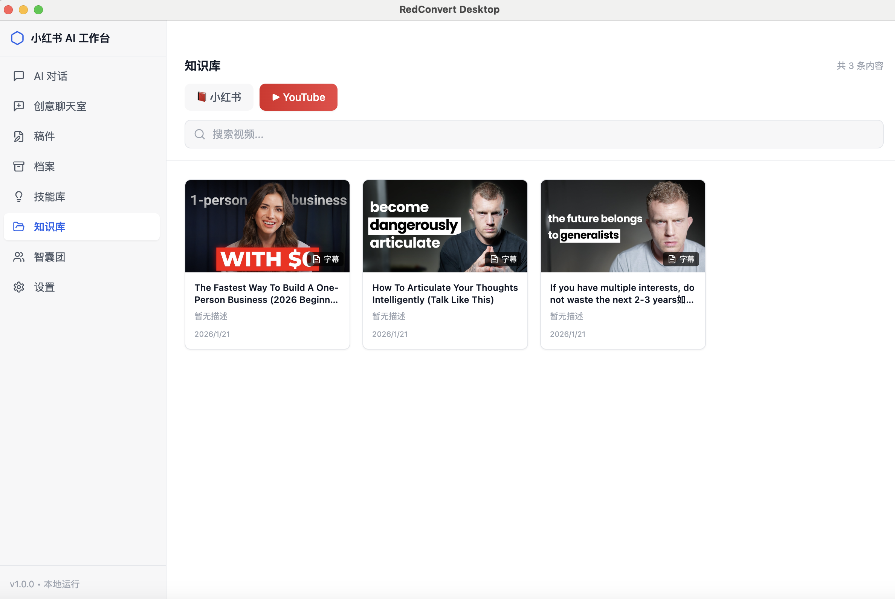
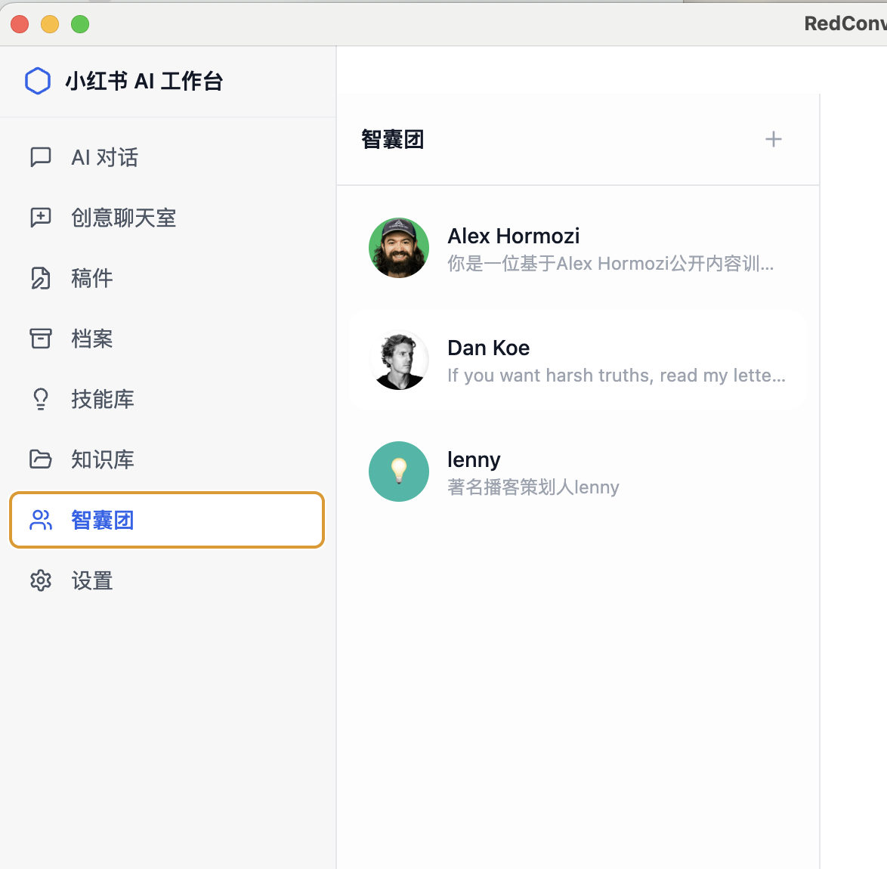
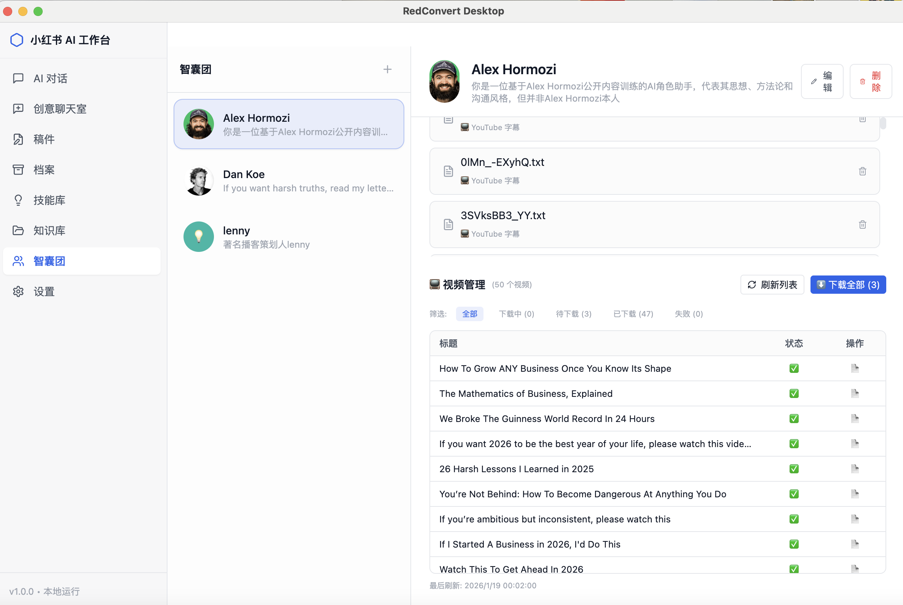
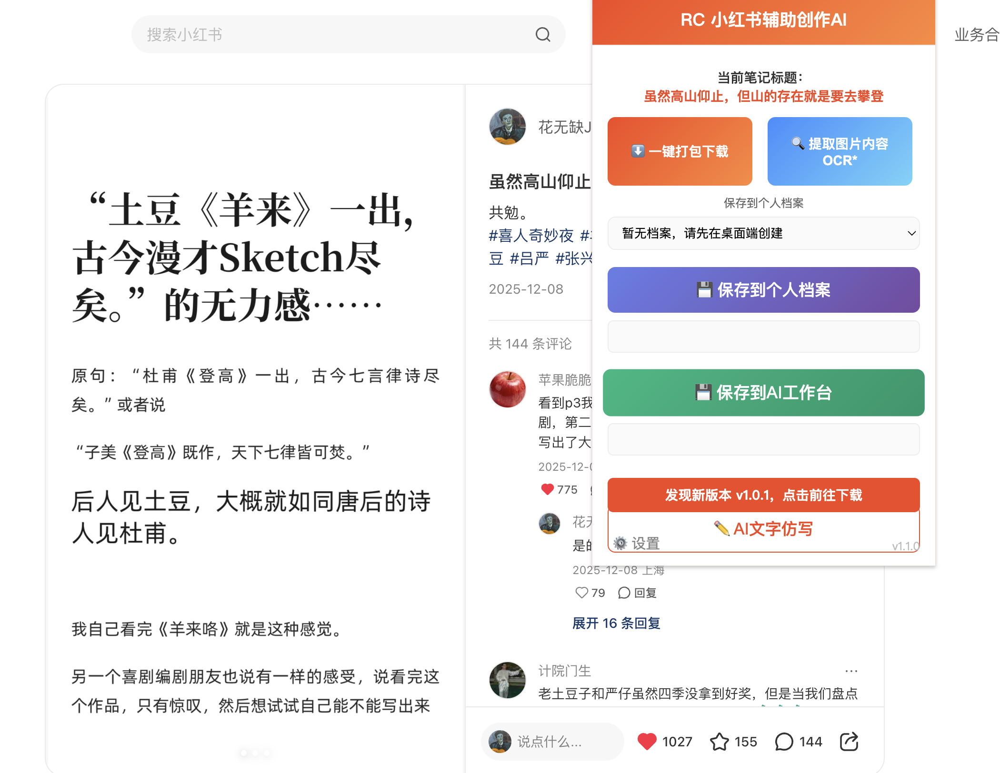

# RedConvert

RedConvert 是一个强大的内容创作辅助工具，由 **桌面端 App** 和 **Chrome 浏览器插件** 组成。旨在帮助创作者高效采集、管理并进行 AI 二创。

## ✨ 核心功能

### 🧩 Chrome 插件 (Plugin)
浏览器插件主要负责素材的快速采集与初步处理：
- **小红书笔记一键保存**：支持下载高清图片、视频、标题及正文内容。
- **YouTube 视频采集**：支持保存 YouTube 视频素材。
- **AI 辅助功能**：内置 AI 仿写与 OCR 文字提取功能，加速内容生产。

### 🖥️ 桌面端 (Desktop App)
桌面端提供更强大的本地化管理与 AI 处理能力：
- **素材库管理**：集中管理采集到的图文与视频素材。
- **AI 深度创作**：基于本地素材进行深度的 AI 改写与创作。
- **工作流整合**：提供从采集到编辑发布的一站式工作流。

---

## 📸 功能预览

### 桌面端 App (Desktop)
RedConvert 桌面端提供了直观的操作界面，方便用户管理内容和进行创作。

| 概览 | 详情 |
| :---: | :---: |
|  |  |
|  |  |
|  |  |

### 浏览器插件 (Extension)

#### 1. 保存 YouTube 视频
插件支持识别并保存 YouTube 视频内容，方便素材收集。


#### 2. 保存小红书笔记
在小红书页面，一键提取封面、图片、标题及正文，支持打包下载。


---

## 🚀 使用指南

### 1. 安装插件
1. 下载最新的插件压缩包并解压。
2. 打开 Chrome 浏览器，访问 `chrome://extensions/`。
3. 开启右上角 **"开发者模式"**。
4. 点击 **"加载已解压的扩展程序"**，选择解压后的插件文件夹。

### 2. 使用插件采集
- **小红书**：打开任意笔记页面，点击浏览器右上角的 RedConvert 图标，即可看到下载或 AI 仿写选项。
- **YouTube**：在视频播放页面点击插件图标进行保存。

### 3. 桌面端管理
- 启动 RedConvert 桌面端应用。
- 导入或同步插件采集的数据（具体依赖 App 同步机制）。
- 使用内置 AI 工具对素材进行二次编辑和创作。

## 📦 开发与构建

**桌面端 Setup:**
```bash
cd desktop
npm install
npm run dev
```

**插件 Setup:**
无需编译，直接加载 `Plugin` 目录即可开发。

---
*Created by RedConvert Team*
