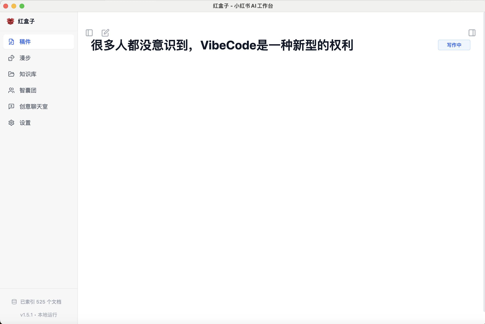
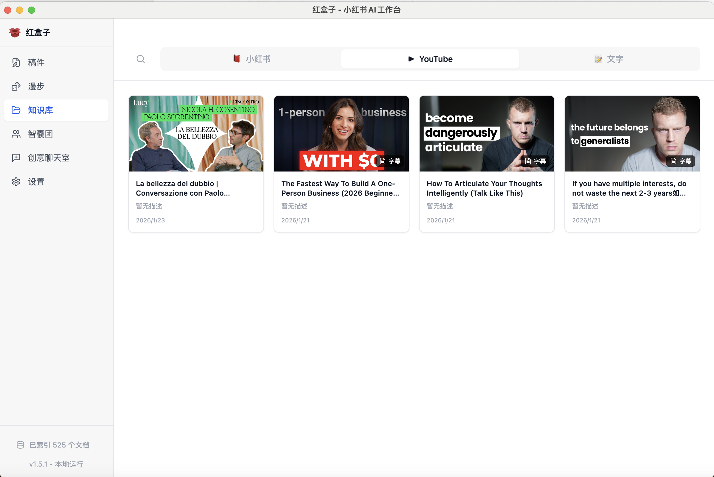
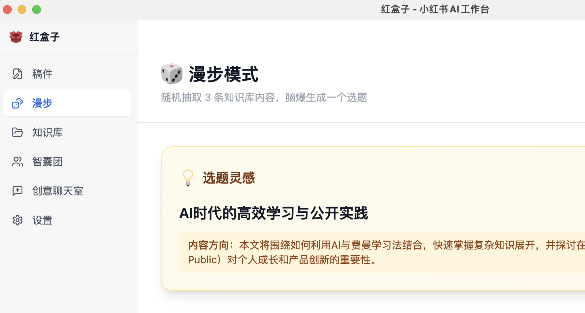
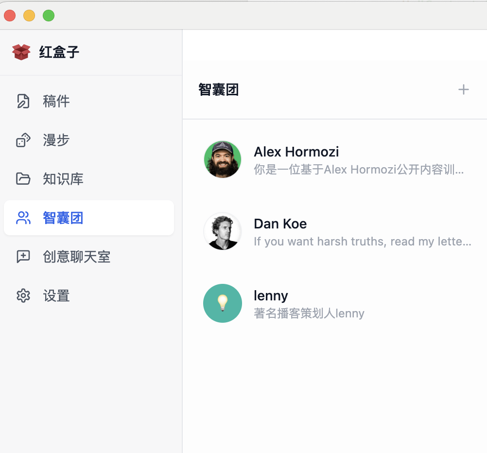
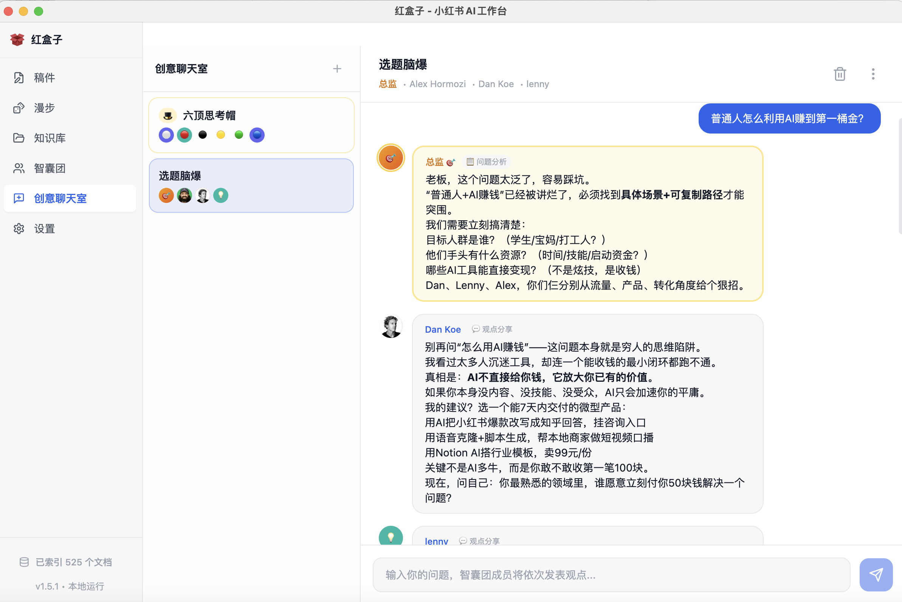
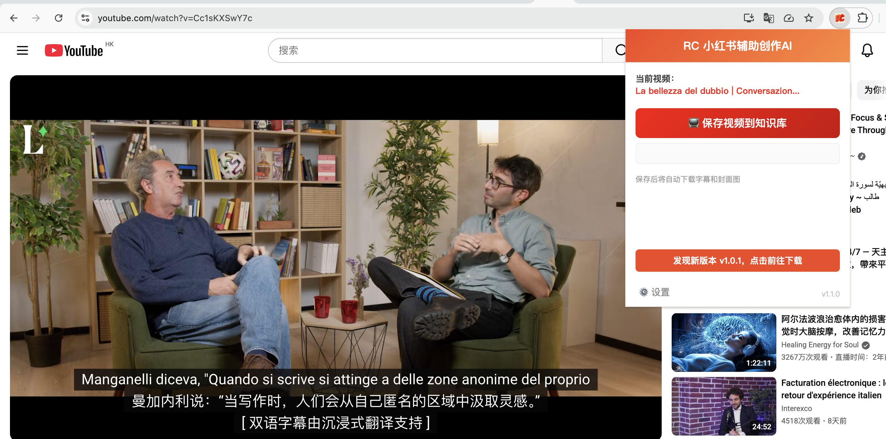

#  RedBox (RedConvert)

**RedBox** 是一个为内容创作者打造的 "第二大脑" 与全流程生产力工具。它由 **Chrome 浏览器插件** 和 **桌面端应用** 组成，打通了从素材采集、灵感激发、辅助思考到稿件创作的完整闭环。

---

## ✨ 核心功能模块

### 1. 📥 全能采集插件 (Browser Plugin)
浏览器插件是 RedBox 的数据触角，负责将互联网内容高效“搬运”到你的本地知识库。
- **小红书笔记采集**：一键保存高清图片、视频、标题及正文，自动提取标签。
- **YouTube 视频采集**：保存视频信息，并支持自动下载封面图。
- **一键存入工作台**：采集的内容自动同步至桌面端知识库，无需手动复制粘贴。

### 2. 🗂️ 本地知识库 (Knowledge Base)
桌面端的知识库是你私有的素材仓库，支持多模态内容管理。
- **多类型支持**：统一管理图文笔记、视频素材和纯文本片段。
- **智能检索**：支持向量相似度排序（实验性），快速找到与当前创作最相关的素材。
- **离线访问**：所有采集的内容均保存于本地，安全且随时可访问。

### 3. 🎲 随机漫步 (Wander Mode)
当你缺乏灵感时，漫步模式能帮你打破思维定势。
- **灵感碰撞**：系统随机抽取 3 条知识库内容，通过 AI 分析其潜在关联。
- **选题生成**：基于抽取的素材，自动脑爆出新颖的创作选题和切入角度。
- **一键创作**：生成的选题可直接转化为稿件草稿，无缝进入写作状态。

### 4. 📝 沉浸式稿件创作 (Manuscripts)
专为创作者设计的 Markdown 编辑器，支持分栏对照写作。
- **分栏视图**：左侧写作，右侧实时查阅知识库素材或与 AI 对话。
- **状态管理**：清晰管理稿件状态（写作中、已完成、已废弃）。
- **即时引用**：写作时可随时调阅、复制知识库中的内容，无需切换窗口。

### 5. 🧠 AI 智囊团 (Advisors)
组建你的专属 AI 顾问团队，辅助决策与创作。
- **角色定制**：创建具有特定人设、专业背景的 AI 顾问（如“爆款分析师”、“选题策划”）。
- **YouTube 学习**：支持导入 YouTube 频道，让 AI 学习博主的风格和观点，化身为该博主的“数字分身”。
- **多维研讨**：在“创意聊天室”中，让多个 AI 顾问针对一个话题展开辩论与研讨（如“六顶思考帽”模式）。

---

## 📸 功能预览

### 稿件创作

### 知识库管理

### 随机漫步 (灵感生成)

### AI 智囊团

### 创意聊天室

### 插件采集 (YouTube)

---

## 🚀 安装与配置指南

### 第一步：下载安装桌面端 App

1.  前往本仓库的 **[Releases 页面](../../releases)** 下载最新版本安装包。
2.  **macOS 用户**：
    *   下载 `.dmg` 文件并安装。
    *   如果提示“无法打开”，请在“系统设置 -> 隐私与安全性”中点击“仍要打开”。
3.  **Windows 用户**：
    *   下载 `.exe` 安装程序并运行。

### 第二步：安装 Chrome 浏览器插件

1.  在 Releases 页面下载 `chrome-plugin-vX.X.X.zip` 压缩包。
2.  解压该压缩包，你会得到一个包含 `manifest.json` 的文件夹。
3.  打开 Chrome 浏览器，访问 `chrome://extensions/`。
4.  开启右上角的 **"开发者模式"** 开关。
5.  点击左上角的 **"加载已解压的扩展程序"**。
6.  选择刚才解压出来的文件夹即可完成安装。

### 第三步：配置 AI 能力 (重要)

RedBox 的核心功能（如随机漫步、智囊团、AI 润色）依赖大语言模型。你需要配置兼容 OpenAI 格式的 API。

1.  启动 RedBox 桌面端，点击左侧边栏底部的 **"设置" (Settings)** 图标。
2.  切换到 **"AI 模型"** 选项卡。
3.  填写以下信息（推荐使用 DeepSeek 或 OpenAI）：

    **配置示例 (DeepSeek):**
    *   **API Endpoint**: `https://api.deepseek.com/v1`
    *   **API Key**: `sk-xxxxxxxx` (在 DeepSeek 开放平台申请)
    *   **模型名称**: `deepseek-chat`

    **配置示例 (OpenAI):**
    *   **API Endpoint**: `https://api.openai.com/v1`
    *   **API Key**: `sk-xxxxxxxx`
    *   **模型名称**: `gpt-4o` 或 `gpt-4o-mini`

4.  点击 **"测试连接"**，显示绿色成功提示后，点击底部的 **"保存配置"**。

---

## 💡 使用流程

1.  **采集素材**：浏览小红书或 YouTube 时，点击浏览器插件图标，一键保存感兴趣的内容。
2.  **查看知识库**：回到桌面端，你的素材已经自动同步出现在“知识库”中。
3.  **激发灵感**：点击侧边栏的“随机漫步”，让 AI 为你碰撞出新的选题方向。
4.  **开始创作**：进入“稿件”页面，左侧写作，右侧打开知识库参考素材，高效完成创作。

---

## 📋 更新日志

### v1.6.3 (2026-02-06)
- **自动更新增强**：补全了 macOS 更新所需的 ZIP 产物，修复了更新失败的问题
- **全局更新提醒**：新增右下角实时更新浮窗，支持下载进度展示与一键安装
- **启动自检优化**：优化应用启动时的更新检查逻辑，确保新版本即时触达

### v1.6.1 (2026-02-06)
- **双轨记忆机制**：AI 现在会主动识别对话中的关键信息（身份、偏好、目标等）并静默记忆，无需用户显式指令
- **Tool-Loop 模式**：AI 调用工具后会继续生成自然语言回复，用户体验更完整
- **流式输出优化**：回复内容实时流式展示，无需等待生成完成
- **极简状态指示器**：简化处理状态 UI，只显示"正在思考..."等友好文案，完成后自动隐藏
- **稳定性修复**：修复多处 undefined 访问导致的崩溃问题

---

*Created by RedBox Team*
