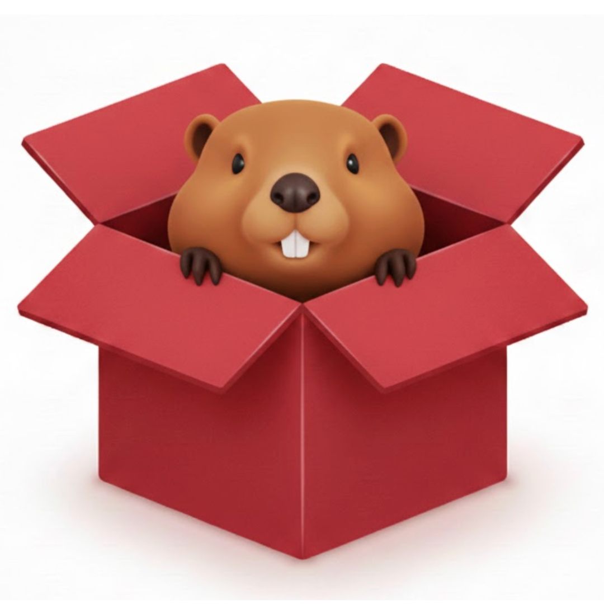
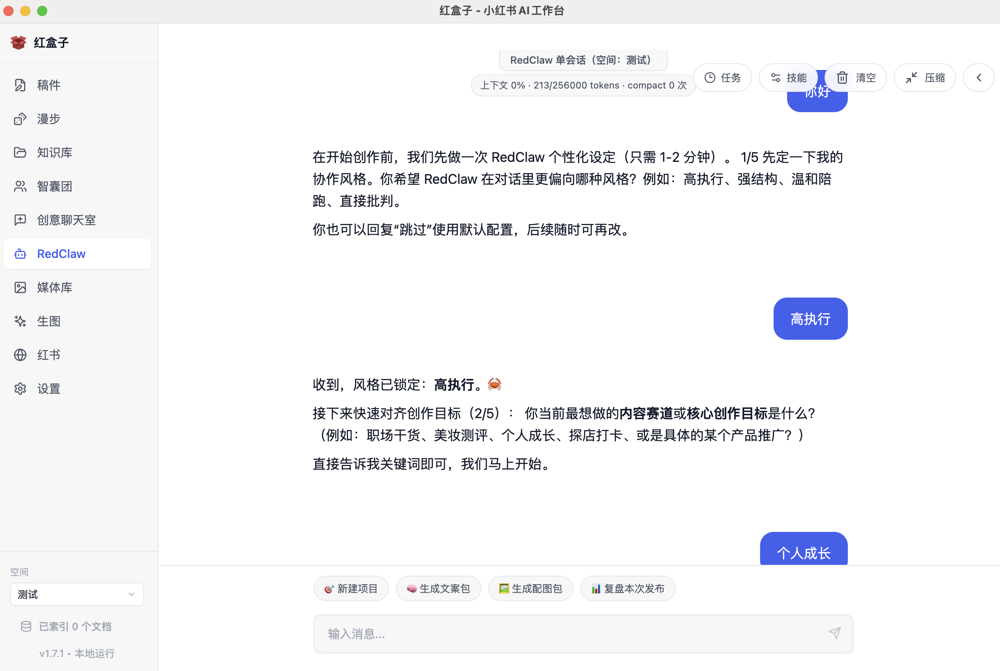
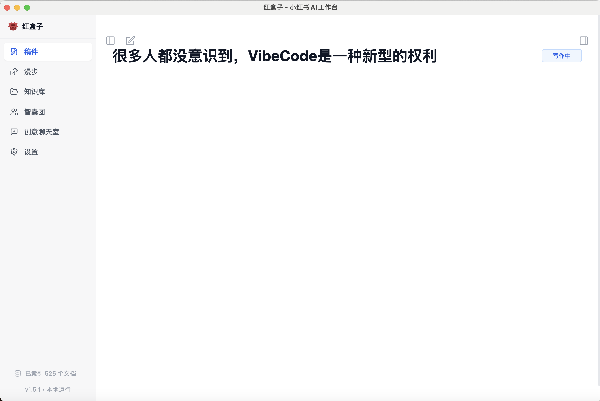
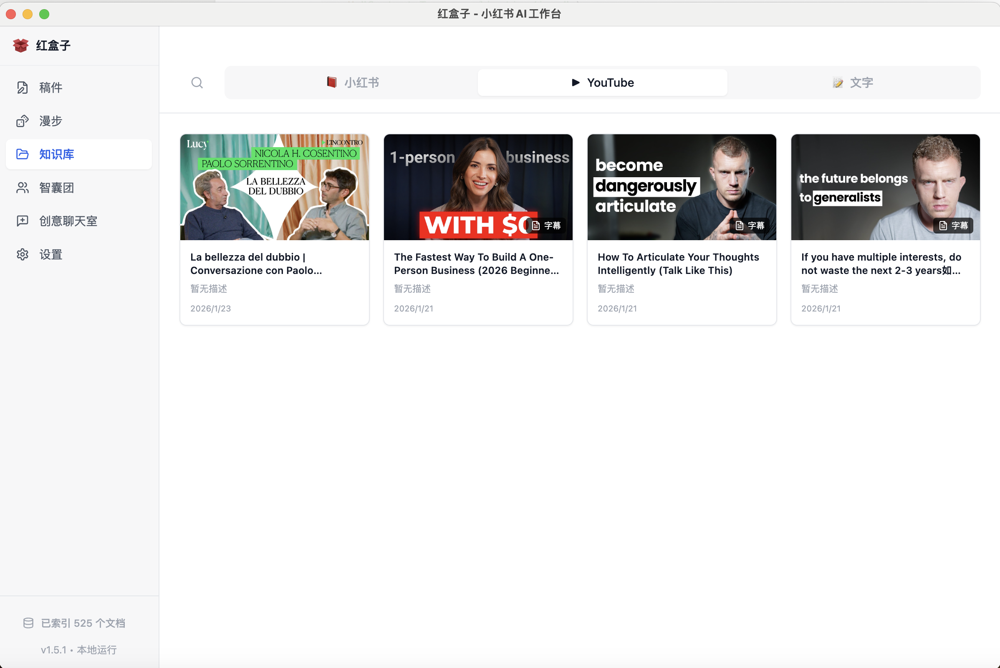
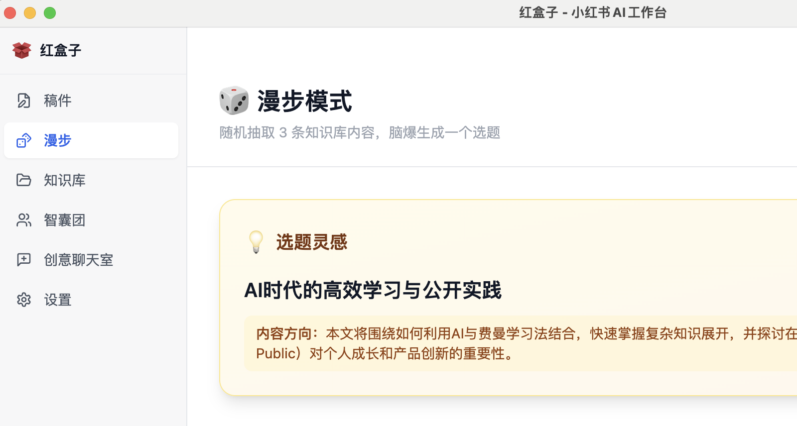
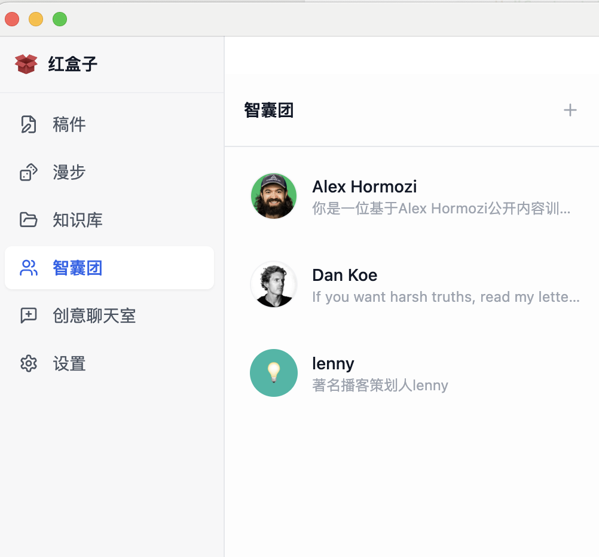
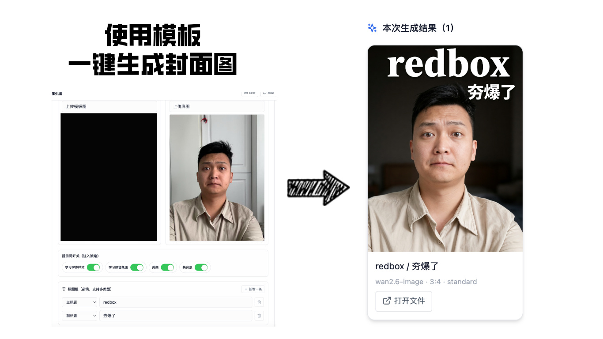

  

  
  &nbsp;
  
  &nbsp;
  

---

  <strong>Espacio de trabajo local con IA para creadores de Xiaohongshu</strong> 
  <em>Captura de conocimiento | Generación de ideas | Automatización con RedClaw | Flujo entre borradores e imágenes | Tareas en segundo plano</em>

  

  <a href="./readme_en.md">English</a> | <a href="./README.md">简体中文</a> | <a href="./readme_tw.md">繁體中文</a> | <a href="./readme_jp.md">日本語</a> | <a href="./readme_ko.md">한국어</a> | <strong>Español</strong> | <a href="./readme_pt.md">Português</a> | <a href="./readme_tr.md">Türkçe</a>

---

## Navegación rápida

[Resumen](#resumen) ·
[Funciones principales](#funciones-principales) ·
[Capturas](#capturas) ·
[Inicio rápido](#inicio-rápido) ·
[Comunidad](#comunidad)

## Resumen

**RedBox (RedConvert)** es un espacio de trabajo de IA para escritorio centrado en el flujo de creación de Xiaohongshu: captura, base de conocimiento, redacción, automatización y gestión de medios.

Esta versión de código abierto usa **proveedores de IA configurados por el usuario**. No incluye inicio de sesión alojado, facturación ni credenciales gestionadas por plataforma.

## Funciones principales

1. Navegador integrado de Xiaohongshu y captura con un clic
2. Base de conocimiento local y búsqueda
3. Aislamiento por espacios de trabajo
4. Modo de exploración aleatoria para generar ideas
5. Editor de manuscritos con asistencia de IA
6. Panel de asesores y colaboración en chat grupal
7. Consola de automatización RedClaw por sesión
8. Generación de imágenes conectada a la biblioteca multimedia
9. Generación de portadas con imagen plantilla + imagen base + grupo de títulos
10. Ejecución programada y de larga duración en segundo plano

## Capturas

### RedClaw

### Manuscritos

### Base de conocimiento

### Exploración aleatoria

### Asesores de IA

### Chat grupal

### Generación de portadas

## Inicio rápido

1. Descarga el instalador desde la [página de descargas de RedBox](https://redbox.ziz.hk/download).
2. Abre `Configuración -> AI`.
3. Configura tu propio Endpoint / API Key / Model.
4. Prueba la conexión y guarda.
5. Empieza desde `Browser -> Capture -> Knowledge Base -> Manuscripts / RedClaw`.

## Comunidad

- [GitHub Issues](https://github.com/Jamailar/RedBox/issues)
- [GitHub Discussions](https://github.com/Jamailar/RedBox/discussions)
